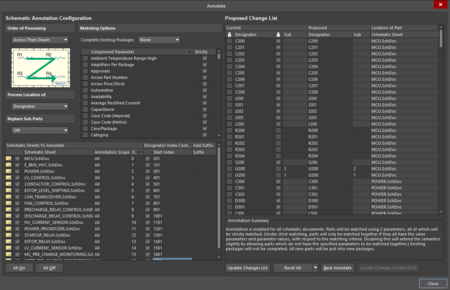
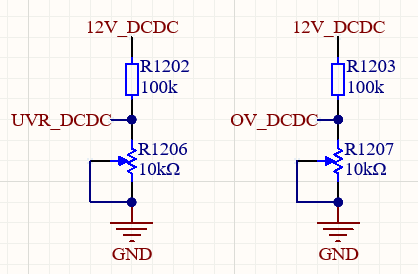
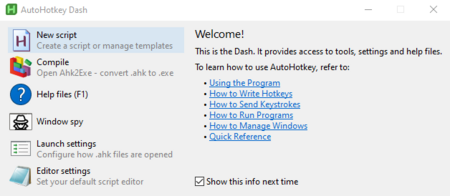
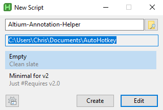
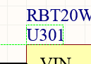
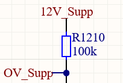
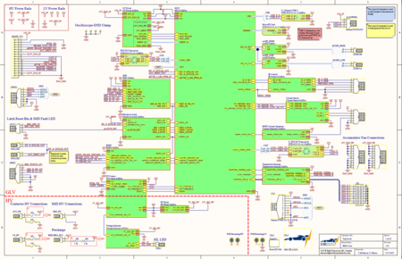

# Automatically Naming Schematic Symbols

**Author:** Christopher Kalitin

**Date:** Dec 2025

**Automatically Naming Schematic Symbols**

This is a simple guide on getting Altium to automatically annotate schematics in a hierarchically designed PCB by adding designators to all symbols. Eg. "C1.1" or "U6.3".

The goal is to have designators of the form "R1.2" where:
- R is the reference designator for the given part
- 1 is the sheet number (eg. if MCU is sheet 1, all parts on that sheet get "X1.Y"
- 2 is the index of a given part on its sheet (eg. if you have 5 resistors, you'll get "RX.5")

I'll show you:
1. How to automatically rename components according to position in the "R102" format
2. Tell you to add the dot between 1 and 2 manually "R1.2"
3. Give you an AutoHotKey script to accelerate adding the dot

**1. Suboptimal Altium Naming**

1.1. From the top tool bar, select Tools > Annotation > Annotate Schematics

1.2. Configure symbol naming

Next, you should see this screen:



In the box in the bottom left, you must set the start index of each part on a given schematic sheet. Ensure the check mark to the left of start index is checked for all entries.

In my screenshot above, the first part on the MCU page will be "201". The next part will be "202", then "203", "204", etc. Later, we will simplify these designators so they are "2.1".

The parts of labelled using the Order of Processing shown in the top left, which increments across then down by default. Ie. Top left is counted first (eg. "201"), then top right (eg. "202"), then bottom left (eg. "203"), finally bottom right (eg. "204").

1.3.

Click "Update Changes List" then "Eccept Changes (Create ECO)" then "Execute Changes" and your schematic should be updated.

**2. Making Altium's Naming Slightly Nicer

**



Now we're left with part names like "C1201" which was not the format we were going for ("C12.1" would be nicer!).

After 3 hours of effort at ~1500 PPM CO2 in my room (I beg you to buy a CO2 monitor) I couldn't find an automated way to do this. Altium has no inherent support for this naming scheme, and it has checks against you manually editting the binary .SchDoc files.

Either live with "C1201" or manually add the dot to every schematic symbol designator in your project. Live with the relief that you didn't pursue elegant designators to the extent that you had to do this on the HVC (many hundreds of components).

**3. Adding The Dot Faster With AutoHotKey
**
I'll now give you a script that will automatically add the dot to each schematic designator when you double click it and then click F2.

[AutoHotKey](https://www.autohotkey.com/) is a tool that allows binding a given key stroke to a more complex key stroke. Eg. you can map "F10" to "We should rename the DRD to Driver User Interface (DUI)" if you happen to type out that particular phrase very often.

[Tom Scott made a great video](https://youtu.be/lIFE7h3m40U?si=aQNVYeyPkmQXd-Tf&t=170) a decade ago in which he describes using AutoHotKey to automatically deploy a skydrivers parachute.

3.1.
[Install AutoHotKey at this link](https://www.autohotkey.com/) and once installed click "New script"



Take note of where your script will be saved, here it's in Documents/AutoHotKey.



3.2.

Copy and paste this script into the script.

```
; Script: Right, Left, Shift+Left, Period Sequence
; Trigger: Press F2
; Action: Sends {Right}, {Left}, {Shift Down}+{Left Arrow}, {.}

F2::
Send {Right}
Send {Left}
Send {Backspace}
Send .
return
F4::
Send {Right}
Send {Left 2} ; Move left twice
Send .
return
```

If AutoHotKey doesn't open the script for you in your editor of choice automatically, right click the script, select "open with", select "choose another app", select Notepad. I'm on Windows 10 maybe this changed for you.

3.3.

Double click your script in the file explorer (or manually open with AutoHotKey) and it's now active.

3.4.

To use the script:
1. Double click a symbol designator (eg. "U301") so it's highlighted in green



2A. If the part index (in this case "1") is one digit, click F2
2B. If the part infex (in the case below "10") is two digits, click F4



3. Click in any empty space on the schematic to save the change
4. Repeat

This script simply clicks the right arrow, to select move the text cursor all the way right. Then, it either replaces the 0 in the schematic designator with a period, or inserts a period if the schematic designator is 2 digits.

Note that if you want to do this process (starting from step 1) over again, you probably have to click "Reset All" in the annotation screen and redo step 3 manually.

---

# Untitled

**Author:** Christopher Kalitin

**Date:** Oct 2025

The update will cover project organization and timelines.

For IMD Mischa attempted to implment a standard on Solar for schematic block numbering, where the first page is the title of the board ("HVC"), page 2 is power, page 3 is MCU, and all successive pages cover various board functionality. I'll follow this for HVC.

There are a few schematic blocks that I can tackle immediately:
3. MCU
4. Contactor Control
5. LV System Control
6. LVS Current Sensor
7. ESTOP Level Shifting (12V -> 3.3V)
8. CAN Transceiver

There are three schematic blocks that are dependent on other projects:
- Pre/discharge relays (control board design / routing)
- Wires outputting to Junction Board (need to perfectly define wires PAS wants out of the pack, and Junction board functionality)
- Precharge Checking circuitry (Christopher Lazzari's project)

Other items require a good amount of research but can be worked on immediately (in this order):
- Current Sensor
- Swap Relay vs. Power Prioritizer
- Overcurrent faulting circuitry
- DCDC Selection & Mounting
- Startup Circuitry + Supp Low Relay
- Connector Selection

Over the next 2 weeks I'll complete the basic schematic blocks and do component selection. After this, I'll tackle each item that requires a non-trivial amount of research. Finally, when blocking items are complete, I'll integrate / complete schematic block of those items.

> **Aarjav Jain** (Oct 2025)
>
> Nice! As you complete each separate schematic dont forget to make an update and link the Altium. This will let us review it in parallel to you working on it for peak efficiency.

---

# Untitled

**Author:** Christopher Kalitin

**Date:** Oct 2025

For the HVC we'll use hierarchical design where we begin with the microcontroller as the source node, and every non-trivial circuit / IC gets its own schematic block branching off of the core MCU block.



*Formula E's BMS Core Schematic*

[Schematic PDF__No Variations_-5.pdf](https://ubcsolar26.monday.com/protected_static/25620279/resources/2459693297/Schematic%20PDF__No%20Variations_-5.pdf)

We'll base the schematic styling / organization roughly off the Formula E schematic above. Notice each connector is defined on the primary highest-level page of the schematic, schematic blocks don't have physical connector schematic elements inside them. Exceptions can be made for test points, as these aren't fundamental to the operation of the PCB ("test" is in the name).

UBC Solar has our

page on Altium that covers hierarchical design.

As a general principle, each IC should get its own schematic block.

New list of schematic blocks:

1. MCU

2. Power

3. Contactor Control

4. LV System Control

5. Startup

6. Pre/discharge Relays

7. HV Current Sensor

8. Overcurrent faulting

9. LVS Current Sensor

10. ESTOP Level Shifting (12V -> 3.3V)
1.1 CAN Transceiver
12. Indication (Additional LEDs)

Some additional schematic pages (not schematic page != schematic block) can be used, eg. mechanical page for screw holes.

Schematic Block connectors:
MCU:
- SWD / JTAG
- BMS Comms
Fans

- Power / PWM Connector
CAN:

- 1 or 2 CAN connectors (not decided which connector yet
ESTOP:
- ESTOP In / Out
Pre/discharge relays:
- Connector for each relay coil power wire
Startup:
- Startup Switch / Motor Discharge
Contactor Control:
- Coil power wires
Current sensor:
- Vref / Vout / GND wiring harness

> **Krish D** (Oct 2025)
>
> I'm assuming when you refer to BMS comms, that this is electrical connections between BMS and ECU (GPIOs)?

> **Christopher Kalitin** (Oct 2025)
>
> @Krish D Yes

> **Aarjav Jain** (Oct 2025)
>
> Looks good @Christopher Kalitin!

---

# Untitled

**Author:** Krish D

**Date:** Sep 2025

This step involves designing the circuitry of each divided section of the HVC's schematic (referred to as schematic blocks).

The current list of schematic blocks to go through are as follows:

1. Startup

2. Power

3. MDU discharge

4. In-pack contactors

5. MCU

6. LV control

7. HV Contactors
8. Estop

9. Fans

10. Hardware over-current faulting

**Note: ** Many sections mentioned will have their circuitry taken from the previous ECU, and changes to that circuitry should be documented on Monday.

> **Aarjav Jain** (Sep 2025)
>
> CC:@Christopher Kalitin.

> **Samuel Shin** (Sep 2025)
>
> Just a reminder @Christopher Kalitin @Hemat Wander We will be using hierarchical design for the new schematics; I know slaveboard testing PCB was a small board as well as distribution board, so I have no problems with them. I'm mentioning this on here as I think the blocks can be each page and the schematic can be designed with more clarity this time!

> **Krish D** (Sep 2025)
>
> Adding on to Sam's point, a good example of hierarchical design is FEEDBACK slaveboard schematic. It is insult the V4 BMS Google drive for reference!

---

