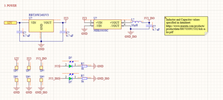

# Untitled

**Author:** Christopher Kalitin

**Date:** Nov 2025

PAS chose a standard DCDC to use, so I replaced the buck + LDO circuitry with it.

Also, the ISO_3V3 DCDC was moved to the power page from the current sense amplifier schematic page, as ISO_3V3 is required both for precharge check and current sense.

See Museok's update about the DCDC:
[https://ubcsolar26.monday.com/boards/9565348340/pulses/9650915685/posts/4645974720](https://ubcsolar26.monday.com/boards/9565348340/pulses/9650915685/posts/4645974720)

> **Krish D** (Nov 2025)
>
> @Christopher Kalitin Great to see standardization between PAS and BMS circuitry. Good catch!

---

# Untitled

**Author:** Christopher Kalitin

**Date:** Oct 2025

Options for step downs:

DCDC:
[TSR 1-2450](https://www.digikey.ca/en/products/detail/traco-power/TSR-1-2450/9383780) (92% efficient) - $9
[VR20S05](https://www.digikey.ca/en/products/detail/xp-power/VR20S05/13147720) (92% efficient) - Out of stock

Buck:[AP63205](https://www.digikey.ca/en/products/detail/diodes-incorporated/AP63205WU-7/9858424) (3.8V - 32V input, 90% +/- 5% efficient) - $1.15

LDO:[AP2114H-3.3](https://www.digikey.ca/en/products/detail/diodes-incorporated/AP2114H-3-3TRG1/4470756) (~70% efficient) - $0.41

PAS has been using DCDCs for their 12V -> 5V step down. On ECU rev 2.0 we used a buck converter.

The buck converter requires a few passive components (caps and inductors) that cost an additional ~$1.

The buck converter had models that output either 3.3 V or 5 V. On ECU rev 2.0 we used the 5 V output with a 12 V input.

We need 5 V and 3.3 V on the HVC, the 3.3 V is used for all logic (eg. STM32) and 5 V is used by our CAN transceiver.

To determine whether we should use DCDCs, Bucks, or LDOs, we can consider the costs and efficiencies of each option.

With the current ECU design we use a buck, then LDO for 12 V -> 5 V -> 3.3 V. Multiplying efficiencies, we get 0.92 * 0.7 = 0.644 = 64.4%.

If we used a DCDC or a Buck converter to do 12 to 3.3 V directly, we could get 90% efficiency.

The difference between a DCDC and Buck is mainly cost and passive components. DCDC is ~$9, Buck is ~$2 total (including passives). Buck requires some more routing for the passive components.

I've come to the conclusion that using two buck converters for 12 to 5 and 12 to 3.3 V is optimal. This uses slightly more space (maybe a square centimeter), costs ~$4 total, and gets us ~90% efficiency.

> **Aarjav Jain** (Oct 2025)
>
> @Christopher Kalitin another consideration I would like to see is noise from the components you chose (2 bucks) and see how it affects your board. Consider what benefits there are to using an LDO for 5 to 3.3V. Another thing to explain here is also the expected power loss due to the inefficiency. A 65% efficiency on an extremely small power draw may be more effective than higher efficiency with other drawbacks (name these).
> 
> Great start to comparing options and its good that you explained reasoning and came to a decision! Another thing, these chains of reasoning are perfect to **link **in a PCB design notes doc so you can say "U1.1: See monday update explaining why".

> **Christopher Kalitin** (Oct 2025)
>
> Looking online, STM32s can tolerate ~50 mV of ripple voltage, and a buck will give ~ +/- 30 mV.
> 
> Using a buck down to 5 V than an LDO seems to be a very standard design to get a low-ish noise supply for microcontrollers.
> 
> Another note is that STM32s have internal LDOs for all logic, to ensure power is even steadier. The reason for all the decoupling capacitors around a chip is that lots of current is consumed on each clock edge, and no LDO or buck can respond fast enough without the smaller caps.
> 
> Given this is a fairly industry standard design decision, I’ll go with buck to LDO. The alternative is including both LDO and Buck to get down to 3.3 V and testing if buck can be used, though this is getting too in the weeds for this project.
> 
> With 100mA on 3.3 V, were loosing an extra 0.19 W at 64.4% efficiency. Over the entire car we’re losing about 1 W.
> 
> To save ~1 W over the entire car we could use DCDCs for 12->3.3 V on every board at the expense of ~$50. We should consider something like this.
> 
> https://community.st.com/t5/stm32-mcus-products/how-much-current-ripple-is-allowable-in-a-vdd-and-or-vdda-3-3v/td-p/233819
> 
> https://www.reddit.com/r/AskElectronics/comments/1ex00nl/is_powering_a_microcontroller_off_a_buck/

> **Aarjav Jain** (Oct 2025)
>
> Sounds good @Christopher Kalitin . Ensure that the LDO you use has a sufficiently low output ripple (< 50mV).

---

