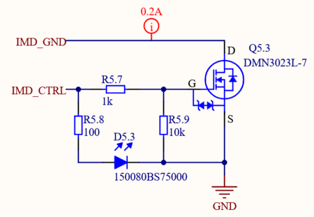
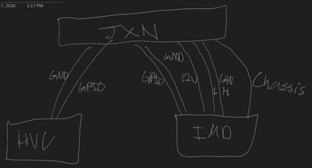
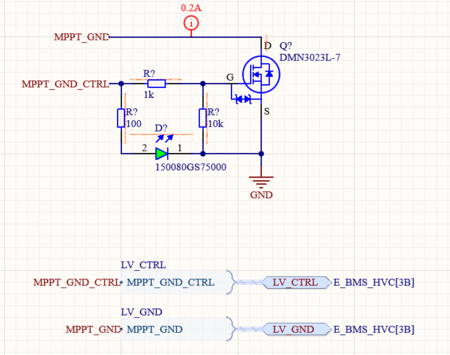

# IMD Interface

**Author:** Christopher Kalitin

**Date:** 17d

**IMD Interface**

We luckily realized during the meeting last Saturday that we forgot to include functionality for powering or getting a GPIO from the IMD on the HVC.

Adding circuitry to toggle power to it was farily simple

The image above shows the topology of the IMD and HVC.

Because the IMD is safety critical, it will have a GPIO going directly to the HVC that goes low if it ever detects the chassis is shorted to POS or NEG.

This GPIO will be read by the HVC's MCU.

Note that this GPIO is pulled low on the HVC to protect against the case in which the IMD is not connected. The IMD must pull the GPIO high for the HVC to allow closing of the contactors.

The GPIO and toggled ground are the extent of the IMDs connection to the HVC. The rest of the connections to the IMD do not involve the HVC (12V, CAN, Chassis connection).

> **Hemat Wander** (16d)
>
> @Christopher Kalitin
> Is the IMD output going to trigger faulting, and if so why not have a hardware connection instead of reading from the HVC MCU? For example, connecting to contactor enable through an NFET similar to the master board will have?
> 
> Is an GPIO connection to the HVC MCU sufficient?

> **Christopher Kalitin** (15d)
>
> @Hemat Wander
> 
> Good idea.
> 
> We could replace IMD_GPIO_IN with an open-drain active-low line that goes directly to the contactors.
> 
> One issue is that if we wanted to include a GPIO as well, the pin count for the junction board connector would have to increase to 24 from 20 (no 22 pin version exists), and we'd have 3 unused pins.
> 
> This is solved by only reading IMD status over a CAN message.
> 
> At this point I'm slightly skeptical of all this hardware-focused faulting. I believe MCUs are mostly trustworthy, especially in our case, and that I've over corrected in the direction of hardware faulting.

> **Krish D** (14d)
>
> @Christopher Kalitin Please CC this in the IMD thread for posterity and to ensure who is designing the IMD is aware of this topology!

---

# Untitled

**Author:** Christopher Kalitin

**Date:** Oct 2025

Currently the only LV system we have to control from the HVC is MPPT power.

Another system we could toggle is masterboard ground, I can think of two reasons we shouldn't do this:
1. If we are debugging we would still see masterboard CAN messages but not HVC CAN messages. This could be useful for knowing the battery is in a safe state.
2. If the give the masterboard hardware control of the contactors, it will be able to provide an override to keep them closed even if we get erroneous behaviour out of the HVC. (Eg. put another NMOS on the coil power line).

Very small lonely schematic page:

Previously all of our LEDs were 0603s, to make assembly slightly easier I'm switching it all to 0805s (Mischa suggested this a year ago iirc).

> **Aarjav Jain** (Oct 2025)
>
> @Christopher Kalitin
> 
> 1. Could you explain how point **1 **justifies not powering the MPPT and masterboard through HVC? For point 2 I agree why not to **toggle** power masterboard from HVC. *Toggle being different from using a part of the HVC to provide power to the masterboard. * *Toggle implies MCU control.*
> 
> 2. I did not understand why MPPTs should not be powered by HVC? Why not and what will power the MPPTs 12V instead?
> 
> 3. Fully agree for the LEDs. Please do 0805s.

> **Christopher Kalitin** (Oct 2025)
>
> @Aarjav Jain
> 
> MPPT power should be toggled by HVC, masterboard should not be.
> 
> Masterboard power should not be toggled because there are cases when you want it to be active even if there is an issue with the HVC's MCU. Eg. to get battery info on memorator (we should make provisions to keep memorator powered if HVC is not active). Or, so we have redundacy for battery faults opening contactors.

> **Samuel Shin** (Oct 2025)
>
> @Christopher Kalitin
> 
> 1. I agree, but why not see HVC messages? Is it because it's going to stay at fault anyways?
> 
> 2. Not sure I understand. You are saying that if we give masterboard the control of contactors, it's going to be better in a case where HVC is acting weird?
> 
> 3. I **love **that we are switching the LEDs.

> **Christopher Kalitin** (Oct 2025)
>
> 1.
> 
> If HVC microcontroller is fried, we should keep masterboard on to get data on battery health.
> 
> 2.
> 
> Giving masterboard hardware control over contractors is a further safety feature we can discuss. Not 100% sure but that’s the general idea. I’d be interested in consulting Mischa / Ezzat.

> **Aarjav Jain** (Oct 2025)
>
> @Christopher Kalitin thanks for clearing that up. I agree with powering masterboard separately. Feel free to reach out and come to a conclusion about contactor control via the masterboard **and **HVC and propose the solution on monday!

---

