# Untitled

**Author:** Krish D

**Date:** 9d

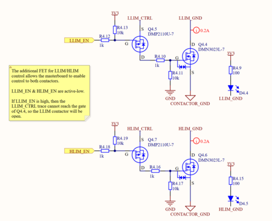

@Christopher Kalitin

If you are testing the HVC on bench, LLIM_EN and HLIM_EN must be pulled low, otherwise you won't be able to actuate the contactors. Is this a problem?

---

# Untitled

**Author:** Christopher Kalitin

**Date:** Jan 11

After speaking with @Hemat Wander, I've redesigned the CONTACTOR_ENABLE circuitry.

**Previous Issue
**

The previous iteration was described in [this update](https://ubcsolar26.monday.com/boards/9702086049/pulses/18080995210/posts/4770869948) and included series diodes on the inputs to the CONTACTOR_EN trace.

These series diodes posed some issues when CONTACTOR_EN is 3.3V but the input itself is supposed to be GND. The forward voltage of the diode meant the input could be pulled up to CONTACTOR_EN - 0.3 V, which poses issues with the MCU identifying which input is controlling CONTACTOR_EN.

**Solution: MOSFETs
**
Inspired by internal GPIO logic in microcontrollers, the new solution toggles a MOSFET to pull CONTACTOR_EN low, and otherwise keeps the NMOS open so the output is in a high-impedance state (not pulled to any voltage, ie. floating).

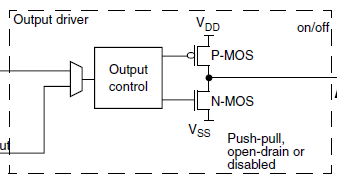

STM32 microcontrollers have two MOSFETs that pull a GPIO to VDD or VSS, depending on if it's a 1 or 0.

This follows the functionality I want, either pull the output down, or leave it floating (so we don't use the PMOS for pull-up).

This greatly simplifies the required mental model to understand the circuitry, and doesn't use any more components

**Schematics

**Note that a truth table has been added to every input to CONTACTOR_EN to make functionality clear.

Diagrams beat paragraphs every time.

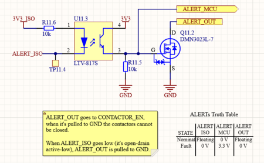

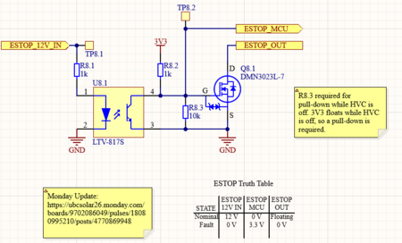

> **Krish D** (Jan 12)
>
> @Christopher Kalitin Can you provide more clarity on what this new FET circuitry protects against, and how the previous design did not account for this? (Adding a diagram would be preferred here).

> **Christopher Kalitin** (Jan 12)
>
> @Krish D
> 
> At a high level, there are many edge cases in which the diodes (described in the previous update under this card) would start conducting and pull the MCU sense line up.
> 
> Here's an example:
> 
> First, note that ESTOP_OUT, ALERT_OUT, and MASTER_BOARD_FAULT_OUT are all connected to CONTACTOR_EN. These nets are all equivalent.
> 
> ESTOP_MCU and ALERT_MCU are tra
> 
> ces that the MCU uses to determine which source is pulling CONTACTOR_EN low.
> 
> If CONTACTOR_EN is pulled to 3V3, then the ESTOP_MCU line will be pulled to 3V because of the series schottky diode. See the image below for a previous iteration of the design.
> 
> 
> 
> I've actually just realized this is fine, as a logic level high is a nominal state and GND is a fault state, so if the optocoupler is pulling the net to 3V3 or the diode is, it doesn't matter as both are nominal states. We'll still be able to pull to GND in a fault state.
> 
> Either way, the circuitry took way too much thought and is an order of magnitude easier to explain if it's MOSFETs, meaning it's also easier to debug (especially for the poor soul who may have to fix this at 5 am at comp).

---

# Untitled

**Author:** Christopher Kalitin

**Date:** Dec 2025

**1. Contactor Enable NFET**

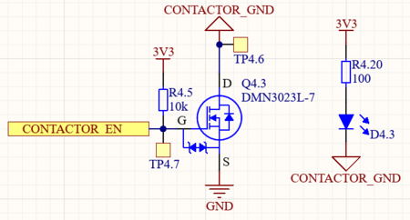

To give the INA228 shunt current sense amplifier control over the
contactors, I added an NFET in series with Contactor Ground, so that
when the INA228 Fault pin goes low (it's open-drain active-low) this FET
opens and none of the contactors have power.

**2. INA228 Current Sense Amplifier Alert Pin**

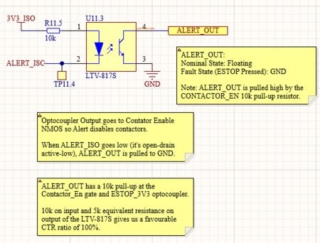

Above you can see how the open-drain active-low ALERT_OUT pin functionality is implemented.

When ALERT_ISO is pulled low (signifying an INA228 detected current fault), the ALERT_OUT pin is pulled to GND.

ALERT_OUT is connected directly to CONTACTOR_EN, which has a 10k pull-up resistor. So when the optocoupler is conducting, CONTACTOR_EN is pulled to GND.

**3. ESTOP Optocoupler**

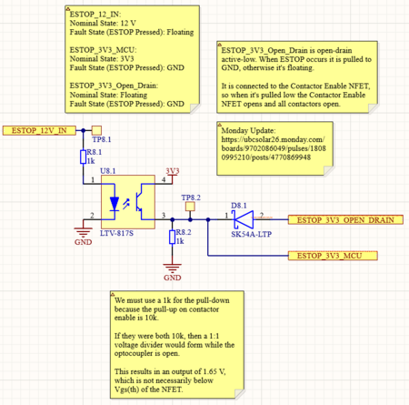

ESTOP_12V_IN is default 12V and becomes floating when ESTOP is pressed.

Hence, the output of the optocoupler is 3V3 by default and pulled to GND when ESTOP is pressed.

To ensure the 3V3 here can't directly short to the INA228 optocoupler Ground, a schottky diode is used. This ensures the output is in fact active-low open-drain and never goes high.

We do still need to have a method of the STM32 reading the value of ESTOP_3V3, so we create a separate port before the schottky diode that does go between 3V3 and GND instead of floating and GND.

> **Krish D** (Dec 2025)
>
> @Christopher Kalitin Can you explain how the output of the INA228's OC (ALERT OUT) and ESTOPS OC (ESTOP 3v3)interact with each other, and through which net?
> 
> I'm a bit confused with which logic levels constitute a fault and idle state respectively.
> 
> Also, isn't the fault condition here supposed to be that alert_iso goes high?
> 
> 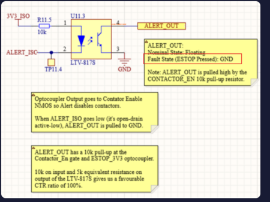

> **Christopher Kalitin** (Dec 2025)
>
> 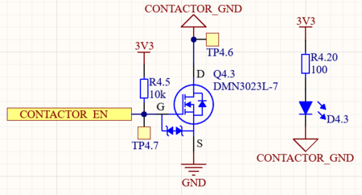
> 
> CONTACTOR_EN is meant to be powered by active-low open-drain inputs. Ie. inputs that are usually floating, but are pulled to ground in a fault condition.
> 
> So, if any net is pulled to GND, it's a fault state. (This is the meaning of "active-low")
> 
> INA228 ALERT_OUT and ESTOP_3V3_OPEN_DRAIN connect directly to that CONTACTOR_EN trace.

> **Krish D** (Dec 2025)
>
> Sounds good. I see you redid the HVC schematic homepage. This is more clear now for showing how these signals converge to contactor_en.

> **Hemat Wander** (Dec 2025)
>
> @Christopher Kalitin  Looks good. A few questions:
> 
> 1. Why is the contactor enable net being set to the master board? Are we also going to give the master board contactor control as well? So its either E-STOP OR current sense OR master board connected to this net?
> 
> 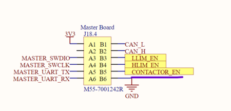
> 
> Side note: Why don't you use the input/output symbols for ports?
> 
> 2. Why do we need a pull-up at all if E-STOP normally pulls up the contactors? The reason I say this is because the NFET should normally be pulled to GND (open) so that the contactors are open, UNLESS everything is safe. Or alternatively make it pulled to GND normally.
> 
> 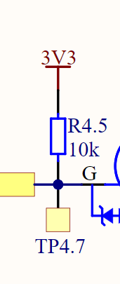
> 
> 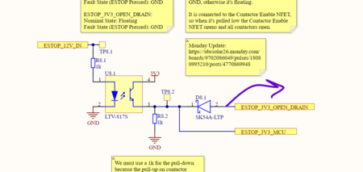
> 
> 3. Is ALERT_ISO pulled up internally?
> 
> 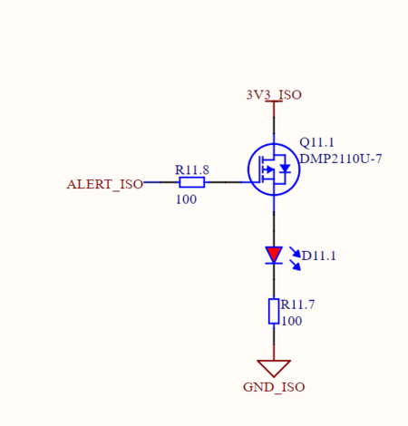

> **Hemat Wander** (Dec 2025)
>
> Nevermind you already answered first question here:
> 
> 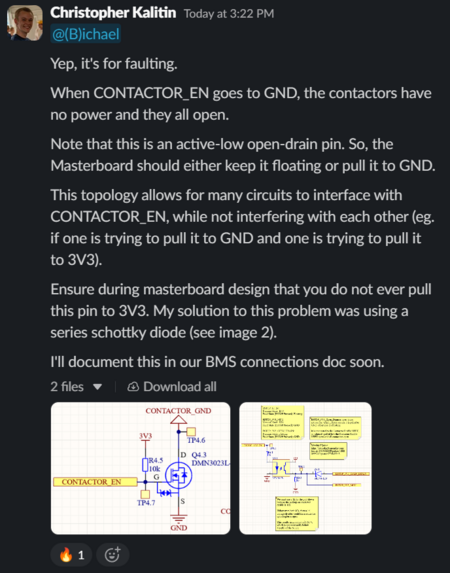

> **Christopher Kalitin** (Dec 2025)
>
> @Hemat Wander
> 
> 1.
> Will make all ports inputs / outputs for clarity.
> 
> 2.
> ESTOP_3V3_Open_Drain never pulls it up.
> 
> 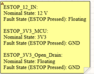
> 
> The purpose of the CONTACTOR_EN NFET is to give faulting control to a couple of circuits. This is similar functionality to our ESTOP Relay on the ECU, where it should always be closed, unless ESTOP occurs. So, we pull it up.
> 
> 3.
> Good catch, added a pull-up.
> 
> 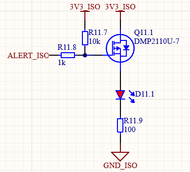

> **Hemat Wander** (Dec 2025)
>
> @Christopher Kalitin
> Is the ESTOP_3V3_OPEN_DRAIN normally floating and not pulled high because of the diode? Otherwise the opt isolator would be pulling it up to 3.3V right?
> 
> Why not remove the diode and replace it with a resistor, so the e-stop opt isolator normally pulls the CONTACTOR_EN pin high unless e-stop is pressed?

> **Christopher Kalitin** (Dec 2025)
>
> @Hemat Wander
> 
> Yes floating because of the diode.
> 
> I think your design would work and it does remove a part from the overall system, I can think of only 2 suboptimal points:
> 1. The pull-up resistor is farther from the gate of the MOSFET
> 2. It doesn't follow the standard open-drain active-low topology
> 
> So, if we think there are no fundamental issues with my implementation I'm going to keep it.

---

# Untitled

**Author:** Christopher Kalitin

**Date:** Nov 2025

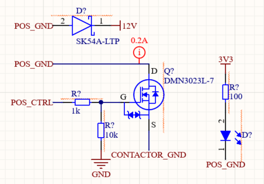

Above is the standard block for contactor / precharge relay control.

It contains:
- An NMOS to toggle current flow controlled by an STM32 pin
- A flyback schottky diode for the reverse voltage spike when current stops flowing through the contactor/relay coil
- An LED to show the contactor is active

Improvements over ECU rev 2.0:
- Using a schottky diode instead of a standard 0.7 V Vf diode
- LED not powered by STM32, instead directly from 3.3 V

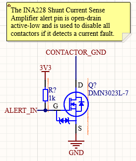

Note that all contactor/relay coil currents go through this NMOS. This way, the current sensor can manually open all contactors if it detects an overcurrent fault.

---

