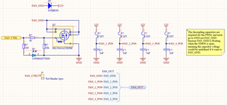
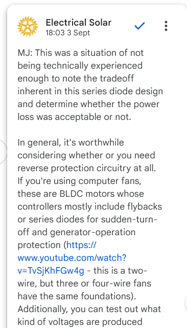

# Untitled

**Author:** Christopher Kalitin

**Date:** Oct 2025

This is the final of the initial 8 schematic pages that are essentially copy and pasted from ECU rev 2.0.

This one has a few minor changes:
1. Flyback diode for fans instead of series diode
2. 1uF decoupling capacitors go to board GND instead of FAN_GND (differing from previous ECU design)

The use of a flyback instead of series diode increases the voltage the fans see (now 12 V instead of 12 V - forward voltage drop of the diode).

The 1uF capacitors used to go to FAN GND, which if the fans are disable (NMOS open), would have one end connected to positive 12 V and the other would be floating. This means the voltage across the capacitors would be undefined and could float to any given value.

The NMOS used is the same as the one on ECU rev 2.0, it has an 8.3 A current limit so should be sufficient. The current V3 pack has 4 1.25 A fans.

> **Samuel Shin** (Oct 2025)
>
> 1. Do you know why we had series diodes before? I am wondering what was the reason behind it.
> 
> 2. What problems could be caused if the capacitor's voltage is undefined and be floating?
> 
> 3. Have you looked into using a different NMOS? From slack @Deev Shah mentioned that each fans take around 1.25A. 4 in parallel means 5A.

> **Christopher Kalitin** (Oct 2025)
>
> @Samuel Shin
> 
> 1. Mischa said this was an incorrect design decision, they just didn't think enough about it.
> 
> [https://docs.google.com/document/d/1QM3zkZ5lr_cZ472EEUCi2zeDzIvVOQBL3wgIkjYbXAc/edit?tab=t.0](https://docs.google.com/document/d/1QM3zkZ5lr_cZ472EEUCi2zeDzIvVOQBL3wgIkjYbXAc/edit?tab=t.0)
> 
> 
> 
> 2.
> If it's floating it could go to any given value due to EMI, potentially something dangerous. It's just a good design practice to not let this happen.
> 
> 3.
> 8.3 A > 5 A so we should be fine.

> **Samuel Shin** (Oct 2025)
>
> @Christopher Kalitin
> 
> 1. I understand. From what he is saying, however, is tht there is already a flyback or series diodes inside the fans, why do we need to add more?
> 
> 3. I understand that we are fine, I meant as in lower performance from 8.3 A to something closer to 5A which will save a little bit (probably not sufficient) cost.

> **Christopher Kalitin** (Oct 2025)
>
> @Samuel Shin
> 
> 1.
> Some fans BTM could choose have internal flyback diodes. When they decide on one we'll have to reevaluate this circuitry. Or, keep the diodes in (~$1) for good measure in case we want to swap out the fans in the future.
> 
> 3.
> The cost difference would be tens of cents per FET, a few dollars for the whole board. So, I didn't put too much effort into finding another option. We've also got good margins with this FET.

> **Aarjav Jain** (Oct 2025)
>
> @Christopher Kalitin @Samuel Shin good to check if the fans have an internal flyback. If you can show this then lets add it to an update. Additionally consider using a **Schottky **diode. See the [Driver Fan Board](https://ubc-solar.365.altium.com/designs/1D270496-DEEE-4245-8B1E-CFA33C9CBAB5?variant=[No+Variations]&activeView=SCH&activeDocumentId=E_PAS_DFB1.1.SchDoc&location=[1,95.68,26.62,35.19]#design) as an example.

> **Christopher Kalitin** (Oct 2025)
>
> @Aarjav Jain
> 
> I replaced it with a Schottky diode. Contractor control also didn't have any flyback diodes so I've added those in.
> 
> I was using the same diode as ECU rev 2.0, so none of the flyback diodes on ECU were schottky's. I'll attribute this to Mischa's most common answer in such cases, that they were junior designers (but Nic Ricci too? Come on!).

---

