# Differential + Common Mode Capacitors

**Author:** Christopher Kalitin

**Date:** Dec 2025

**Differential + Common Mode Capacitors**

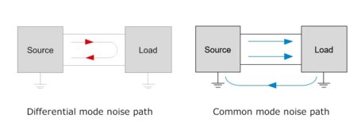

First, I'll give some background on differential vs. common-mode noise. Differential noise is between two sense lines, and common-mode noise is between a sense line and ground. Both are protected against by using capacitors / RC filters, with the filter either between both sense lines or an individual sense line and ground. Read [this article](https://www.allaboutcircuits.com/industry-white-papers/emc-basics-common-mode-vs-differential-noise/) for more info.

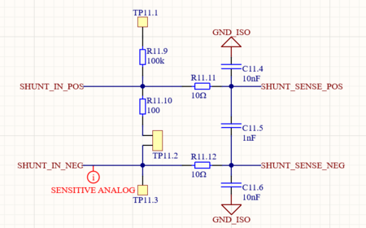

I've added differential and common mode capacitors the shunt resistor sense lines. These are meant to eliminate noise of a particular frequency.

Here are the formula for finding differential / common-mode capacitor values as a function of series sense line resistance (10 ohms in our case) and cutoff frequency.

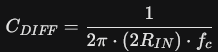

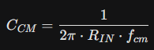

I chose a 10 ohm series resistance (R_IN) on each input line because such a small resistor will have a very low voltage drop over it. The INA228 shunt current sense amplifier has a 2.5 nA max bias current (ADC pin input current). V=IR, 2.5 nA * 10 ohm = 25 nV.

Our shunt resistor will have a 6 mV max voltage drop across it, so 25 nV error is fairly insignificant. Also note this is max bias current, the nominal value is 0.1 nA, 25x lower.

The internet tells me selecting common mode cutoff frequency higher than differential cutoff frequency is best practice.

So, I selected:
Differential Cutoff Frequency = 10 kHz
Common-mode Cutoff Frequency = 1 MHz

This gives these capacitors:
Diff Cap: 0.796 nF
CC Cap: 15.9 nF

I chose to use the closest standard values to these capacitances, 1 nF and 10 nF.

Note that adding capacitors will increase the amount of time it takes for a measurement to settle. This is an issue if we want to detect a fault current extremely quickly.

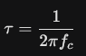

The time constant of our RC filter is a function of its cutoff frequency. At 10 kHz, the time constant is 15 us. To get to 5 tau will take us 75 us. This is still fast enough that we'll likely detect a short before the fuse blows, but if I chose a 10x lower cutoff frequency, this may not be true.

> **Krish D** (Dec 2025)
>
> @Christopher Kalitin The justification for the addition of common mode **and **differential noise filters makes sense. I also agree with your reasoning of choosing a 10ohm  One question I have as well is why are you choosing a differential cutoff frequency as 10khz? I'd suggest referencing other circuits across the car to check what their cutoff frequency as a point of comparison.
> 
> Also, note that the capacitors you spec-ed out for the common mode noise rejection are **50V tolerant**. I'd suggest using the 200V tolerant ceramic capacitors on digikey as an alternative.

> **Christopher Kalitin** (Dec 2025)
>
> @Krish D
> 
> Most of the reason for choosing a cutoff frequency of 10 kHz is that if we get lower we increase response time. Are there any other circuits in the car that are filtered in a similar way?
> 
> I think the 50V tolerant capacitors should suffice because the shunt is on the low-side of the battery. This is the same principle as the current sense amplifier IC only being rated for 80 V.
> 
> It also simplifies the BOM to use a standard capacitor.

> **Krish D** (Dec 2025)
>
> @Christopher Kalitin
> 
> I agree with using 10khz given your tau calculation. I gave you a bad tip, I originally thought the PVA (since it has a differential pair output that is susceptible to common mode noise & differential noise) might have this filtering, however since it is a line that sends a quick changing (dv/dt >= 1v/s) signal (can treat this effectively as data), adding caps would be counter intuitive. I can't think of any other parts on the car that use this type of filtering, but I agree with your calculations.
> 
> Ah, thanks for correcting me with mentioning that the shunt is on the low side. You are correct, the 50V tolerant capacitors will suffice.
> 
> Well done on catching these details!

---

# System Overview

**Author:** Christopher Kalitin

**Date:** Oct 2025

[Altium page link](https://ubc-solar.365.altium.com/designs/39582840-6999-40D9-89D8-9774BDE86C17?activeView=SCH&activeDocumentId=CURRENT_SENSING.SchDoc(9)&variant=[No+Variations]&location=[1,94.16,28.36,35.59]#design)

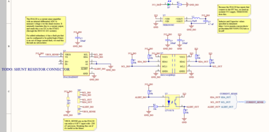

@Aarjav Jain @Krish D @Hemat Wander Please look over this schematic for any issues or mistakes.

For future reference, find current sensor research under [this Monday card](https://ubcsolar26.monday.com/boards/9565350285/pulses/18164045278). This update is a high-level overview. All competent selection notes are in the research card.

Shunt Current Sensor Datasheet:
[https://www.digikey.ca/en/products/detail/riedon-products-by-bourns/RSB-500-50/4967074](https://www.digikey.ca/en/products/detail/riedon-products-by-bourns/RSB-500-50/4967074)

**System Overview**

**1. INA228 - Current Sense Amplifier**

[Datasheet](https://www.ti.com/lit/ds/symlink/ina228.pdf?ts=1761932938428&ref_url=https%253A%252F%252Fwww.ti.com%252Fproduct%252FINA228)

The INA228 is a current sense amplifier which senses the voltage over our 100 micro ohm [shunt resistor](https://www.digikey.ca/en/products/detail/riedon-products-by-bourns/RSB-500-50/4967074), then amplifies this voltage before reading it through an internal differential delta-sigma ADC.

Because V=IR, any voltage reading can be translated into a current reading by using the resistance as a conversion factor.

The INA228 communicates over I2C and must be configured every time it turns on. So, a configuration packet consisting of full-scale range, current fault thresholds, etc. will be sent during the startup sequence of the HVC.

We use the fault pin on the INA228 in case I2C or our STM32 fails (eg. bus hangs due to misconfigured peripheral, pull-up resistor improperly soldered, infinite while loop in firmware, etc). This pin can be configured to be pulled low (it's default high with a 10k external resistor) whenever we get an out of range current fault.

We can wire this fault pin[like we currently wire the DOC_COC pin on ECU rev 2.0](https://docs.google.com/document/d/1QM3zkZ5lr_cZ472EEUCi2zeDzIvVOQBL3wgIkjYbXAc/edit?tab=t.0#heading=h.ga3334jxacjk), where it disables power to all contactors if a fault occurs. The INA228 has a latching mode for faults ([see section 7.6.1.12 bit 15](http://7.6.1.12)), so we don't need external CMOS latch circuitry (like is present for over current faulting currently).

**2. NEK0303SC - Isolated DCDC**

[Datasheet](https://www.digikey.ca/en/products/detail/murata-power-solutions-inc/nke0303sc/1926989)

Because the INA228 differential inputs touch the shunt resistor, it is in contact with high voltage and must be isolated from the rest of the HVC.

To isolate power, we use the NEK0303SC DCDC converter which takes in a 3.3 V input and outputs isolated 3.3 V.

Note that this component doesn't exist in Altium Manufacturer Part Search so I had to make it manually, while triple checking footprints.

**3. ISO1541**** - I2C Isolator**
[Datasheet](https://www.ti.com/lit/ds/symlink/iso1540-q1.pdf?HQS=dis-dk-null-digikeymode-dsf-pf-null-wwe&ts=1761945132950&ref_url=https%253A%252F%252Fwww.ti.com%252Fgeneral%252Fdocs%252Fsuppproductinfo.tsp%253FdistId%253D10%2526gotoUrl%253Dhttps%253A%252F%252Fwww.ti.com%252Flit%252Fgpn%252Fiso1540-q1)

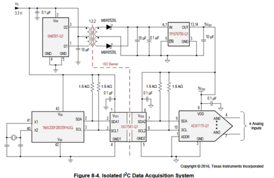

In the same vain as the NEK0303SC, we need to isolate the I2C output of the INA228. TI makes the ISO1541 for this purpose, and it seems like a relatively plug and play chip.

The typical application circuit shows an isolated power source (like our DCDC), 100 nF capacitors on each power pin, and 1.5k pull up resistors.

I only differed from this by using 10k pull up resistors. If this

**4. LTV-817S - Optoisolater for Fault Pin
**[Datasheet](https://www.digikey.ca/en/products/detail/liteon/LTV-817S-TA1/388451)

I am using the same optoisolater for the fault pin as for ESTOP on HVC. 10k current limiting resistor for the LED side, pull down for STM32 side.

> **Aarjav Jain** (Nov 2025)
>
> @Christopher Kalitin:

> **Christopher Kalitin** (Nov 2025)
>
> @Aarjav Jain
> 
> 1.
> Good point. I've just checked over the INA228 datasheet again and confirmed that all values are reset to 0 or default values on power cycles. Ie. it's all volatile memory.
> 
> 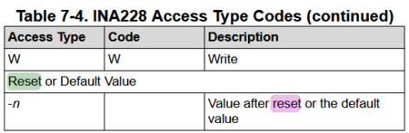
> 
> 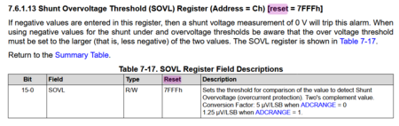

> **Hemat Wander** (Nov 2025)
>
> Some notes about the schematic:
> 
> - For the LV control schematic, I think we should include an extra control for the low voltage going to the distribution board on the other side of the car. i.e. the GND we feed them is not actually directly GND, but rather a GND controlled through a MOSFET. I'm not sure if you got to that yet.
> - Is the e-stop LED supposed to have have 100 ohms of resistance? Some of the other ones have 1000 ohms?
> -  I'm not entirely sure how this works, but you might want to check the current transfer ratio of the current alert isolator, because the datasheet it can be anywhere from 50%-300%. If you want saturation at the output of the isolator (3.3V) you need a roughly 200% CTR as the input resistance is double the output resistance?
> - How did you select 10K for the pull-resistances for the I2C lines? In the datasheet there's an example going as low as 1K, which allows for a faster communication rate. Again I'm not sure how fast the communication rate is going to be set to be, but you might want to check if that's fine.
> Also, I'm not sure exactly how you were going to connect this to the STM32, but if you also use pull-up resistors on the STM32 side, make sure that the resistor values is parallel are under the current limit of each component?
> 
> Otherwise looks really pretty kind of sort of maybe good

> **Krish D** (Nov 2025)
>
> @Christopher Kalitin  @Aarjav Jain Some notes for feedback from your current sensor schematic:
> 
> - I don't see scrutineering circuitry incorporated into this. I came up with a general concept and would love to see if you can make this better and improve on it. Note that the net's aren't labelled and usage of separated polygons could be minimized if routed well. Please let me know what you think.
> 
> 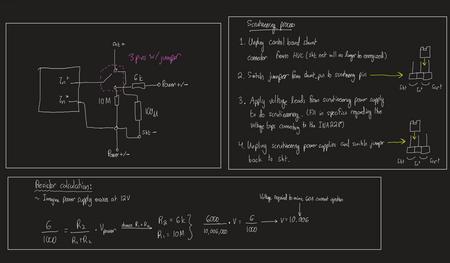
> 
> - Can we include a 2 position connector to use the hall effect as a backup? This would be our first time using the shunt. Wiring and control board integration **may** show that it is not feasible. Including this back up 2 pos connector and 1.8V reference circuitry doesn't seem like a bad idea in the case the shunt current sensor circuitry is rendered ineffective. Thoughts here.

> **Christopher Kalitin** (Nov 2025)
>
> @Krish D
> 
> 1.
> Added the voltage divider for scrutineering, it's about the same circuit as what you drew just formatted for Altium.
> 
> 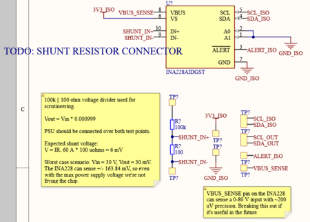
> 
> 2.
> I'll be breaking out unused GPIO pins on the HVC (like a Nucleo does) so we'll have the ability to add in a hall effect if shunt doesn't work.

> **Krish D** (Nov 2025)
>
> Sounds good. Thanks Chris!
> 
> Also if you are planning to do 100 and 100k, your expected voltage to mimic 60A would be 6.006V. Do you think is important to use a larger voltage range in the case the voltage source used at comp has a smaller voltage-toggling precision, thereby limiting it's ability to show incremental steps?
> 
> Please justify this when choosing the resistor values.

---

