# Untitled

**Author:** Christopher Kalitin

**Date:** 3d

**Resolving LTC4421 Shutdown Issues**

Two issues, one critical:
1. INTVCC is near its current max
2. INTVCC is 0 V when the shutdown (SHDN) pin is low

**Issue 1:**

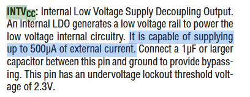

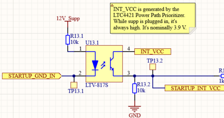

Reading the datasheet, I found that the INTVCC pin can only supply up to 500 uA of current. The current design uses INTVCC on the output of an optocoupler with 10k resistor providing the current through the transistor.

3.9 V (INT_VCC voltage) / 10,000 ohms = 390 uA

This would likely work, but I doubt its how INT_VCC is meant to be used. It's likely only a method of specifying a logic level, and not meant to provide any current.

**Issue 2:**

As described [in this update](https://ubcsolar26.monday.com/boards/9702086049/pulses/18080990623/posts/4773895719), the current plan for startup of the car is to wake up the LTC4421 power path prioritizer, and then it'll start supplying 12V_Supp to the HVC, which then goes through the usual startup sequence.

The previous plan was to tie INT_VCC to the SHDN pin of the LTC4421. This way, when the optocoupler shown in the previous section conducts, the SHDN pin is pulled up to INT_VCC and the LTC4421 turns on.

However, when SHDN is low the LTC4421 is in a low-power state meant to minimize quiescent current (~6 uA), so the LDO that provides INT_VCC is disabled.

Hence, there is no source of voltage to pull SHDN high, and the LTC4421 can't turn on, so the car won't turn on.

**Solution
**
Connect SHDN to 12V_SUPP_TOGGLED (after checking voltage tolerance of the pins) instead of INT_VCC.

Functionality is the same, SHDN goes to >1 V while the startup switch it toggled on.

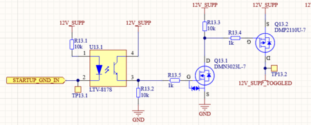

---

# Untitled

**Author:** Christopher Kalitin

**Date:** Jan 5

I found out what the RC Snubber circuit is for from this [Monday Update](https://ubcsolar26.monday.com/boards/9702086049/pulses/18080990623/posts/4654467464).

Essentially, the purpose of an RC Snubber circuit is to reduce the voltage spike due to parasitic inductance of traces and wires. A capacitor is added to reduce the spike, and a resistor is added to reduce the amplitude of the oscillations of the RLC circuit that results.

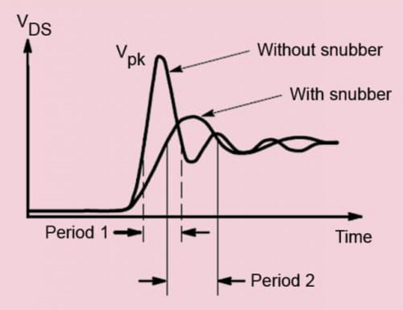

All our traces and wires have parasitic inductance. [Gemini estimates](https://gemini.google.com/share/6ff3db138302) 150 nH for 15 cm of PCB trace + wire going to our DCDC, using a rule of thumb of 1 nH per millimeter.

Our [SIJA58DP MOSFETs](https://www.vishay.com/docs/76203/sija58dp.pdf) used with the Power Path Prioritizer have a fall time of ~25 ns.

Using
the fundamental equation of an inductor, we can find what kind of
voltage is induced when the MOSFET open (eg. swapping to Supp from
DCDC).

Assuming current is 5 A:
V = L * di/dt
150 nH * 5 A / 25 ns = 30 V

30 V is a high voltage spike which we should avoid to not stress the MOSFET or DCDC.

I'm
skeptical that this is actually an issue because our MOSFETs are rated
for 40 V and the DCDC must have some protection circuitry, but if the
datasheet recommends it I'll listen. We'll follow industry standards
here.

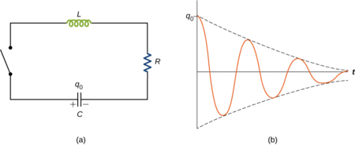

If we just add a capacitor, we get an oscillating LC circuit without any damping (aside from trace resistance). This means the spikes are slightly smaller and stay around for a while.

The frequency of this oscillation is determined by:

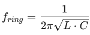

The Snubber Capacitor on the HVC is current 1 uF, this results in an oscillation frequency of 411 kHz.

To ensure this noise doesn't stay around too long, we add a 1 ohm resistor in series to damp the system.

The resistor is sized so that the system is critically damped, using the usual equations we all certainly remember from PHYS 158.

[This video](https://www.youtube.com/watch?v=wgNMepGIrTk) (very good video) shows a method for sizing the capacitor and resistor:
1. Determine inductance and current
2. Equate inductor energy to capacitor energy and solve for capacitance given a chosen V_capacitor_max value.
3. Solve for resistance using R = V/I where V = V_cap_max

1.
Inductance = 150 nH
Current = 5 A (Fine value to use for our LV system)

2.
E_ind = 1/2 * L * I^2 = 0.5 * 0.00000015 * 5^2 = 1.875 uJ (yes, micro joule)

V_cap_max = 12 V (arbitrary value that feels nice as our LV system operates at 12 V)

E_cap = 1/2 * C * V^2
E_cap = E_ind

E_ind * 2 / V^2 = C

C = 0.000001875 * 2 / 12^2 = 26 nF

3.
R = V/I = 12/5 = 2.4 Ohms

This capaitance and resistor of 26 nF and 2.4 ohms is much lower than what the LTC4421 datasheet recommends, 1 uF and 1.21 ohms. They must have assumed a far higher parasitic trace/wire inductance value.

I'll update Altium with 100 nF and 1 ohm, this seems to meet our expected inductance value better than 1 uF and 1 ohm.

> **Aarjav Jain** (2d)
>
> @Christopher Kalitin what about considering that Gemini suggested values that do not apply in our case and the datasheet was tailored based on their own testing? So your method of choosing 100nF if the range is 26nF to 1uF is mostly arbitrary and I couldn't see a reason not to continue with what the datasheet recommends (which again comes from their engineers actually testing this out).
> 
> Also, I cannot view your Gemini link to scrutinize what Gemini proposed.

> **Christopher Kalitin** (2d)
>
> @Aarjav Jain
> 
> Fixed the link.
> 
> Here's an [inductance calculator](https://www.allaboutcircuits.com/tools/wire-self-inductance-calculator/) that gives a similar result of 170 nH for 1mm diameter wire (18 AWG) and 15 cm.
> 
> 
> 
> 100 nF is chosen not because it's in that range, but because it's far closer to 26 nF. The 150 nH number could be off by an order, and we'd still be at 260 nH which is closer to 100 nF than 1000 nF.
> 
> So, the rule of thumb 1nH/mm could be way off and we're still closer to being right than with a 1 uF cap.
> 
> I'd argue that using a rule of thumb and doing the calculations yourself to justify a part choice is far closer to being a competent engineer than *blindly* trusting the datasheet.
> 
> I found an [application note](https://assets.nexperia.com/documents/application-note/AN11160.pdf) that details the process of RC Snubber component selection in some more detail. On page 4 it gives a few conditions to check to ensure peak voltage is kept low enough (among other points), and my selected components meet these conditions.
> 
> Eg.
> (This is derived from equating the capacitors energy to the inductors energy)
> 
> 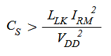
> 
> 100 nF > 150 nH * 5^2 / 12^2
> 1e-7 > 2.6e-8

---

# Redesigning Startup Circuitry

**Author:** Christopher Kalitin

**Date:** Dec 2025

**Redesigning Startup Circuitry**

**DCDC Power Path Prioritizer Design Flaw**

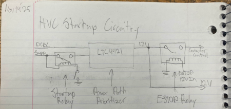

While in the shower yesterday I discovered a design flaw in my implementation of the LTC4421 Power Path Prioritizer.

The LTC4421 has two inputs and it sources current from the highest priority input that is at a valid voltage.

We set the DCDC as the highest priority voltage, and only use the Supplemental before we've connected the POS and NEG contactors, after which point the DCDC 12V output enters its nominal range (12V instead of 0V) and the LTC4421 switches to it.

Notice that our startup relay in the hand drawn schematic shown above is on the supplemental battery input. So, when the car is off the LTC4421 is unpowered, then the supplemental is connected, then we switch to DCDC.

After we've swapped to DCDC, it will remain a valid source of voltage until POS and NEG are closed. However, POS and NEG will not close when the Startup Relay open, and the DCDC will stay a valid source of LV power.

So, after the startup switch is turned off, the car will continue running off the DCDC.

Pretty major design flaw, we have no way of turning off the car.

**Solution: SHDN Pin**

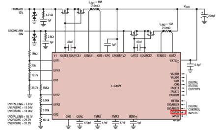

The LTC4421 must be commanded to stop supplying DCDC 12V after the startup switch is turned off.

It has a Shutdown (SHDN) pin that will turn off the IC if the voltage on the SHDN pin is below ~1 V.

So, the solution to the design flaw is to connect the Startup Switch to the SHDN pin.

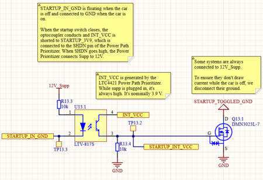

I achieved this by using an optocoupler to translate the STARTUP_IN_GND net (floating while car is off, shorted to GND while car is on) into the STARTUP_INT_VCC net which is pulled to GND when the car is off, and connected to INT_VCC when the car is on.

INT_VCC is generated by the LTC4421 and is meant as the input to the SHDN pin.

**Deleting The Startup Relay**

While the Power Path Prioritizer is turned off, the car will have no 12V source.

This is the same purpose as our startup relay, to ensure the car has no 12 V source while the car is off.

So, we can delete the startup relay and use the Power Path Prioritizer in place of it, as it serves the same exact purpose.

Effectively, the startup relay is now replaced by the startup optocoupler.

**Supplemental Battery Quiescent Current**

One possible issue with not having a start up relay, is that SUPP_12V will always be connected to a few circuits on the HVC.

While the car is off, 12V is disconnected from everything, but raw 12V_Supp voltage is used by a few systems.

These circuits are:
1. Discharge Relay Control
2. Startup Optocoupler
3. Supp Voltage Sense
4. Power Path Prioritizer Voltage Dividers

The discharge relay always has 12V_Supp connected but has ground disconnected, so no current can flow.

The Startup Optocoupler high-side is always connected to 12V_Supp, but current only flows when STARTUP_IN_GND is shorted to GND, ie. the car is on.

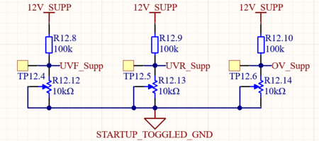

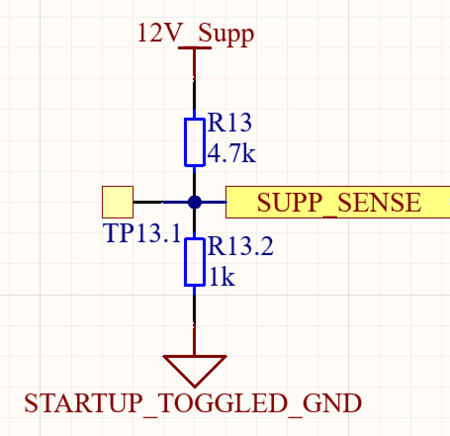

Supp Voltage Sense and the Power Path Prioritizer voltage dividers are a more complicated case. They are always connected to 12V_Supp, and their negatives would always be connected to GND, allowing current to flow even if the car is off.

To solve this problem, we add a a net for STARTUP_TOGGLED_GND. This is controlled by an NFET so that it is disconnected from GND while the car is off, and connected to GND when the car is on.

This way, we've eliminated all sources of quiescent current on 12V_Supp.

**Deleting ESTOP Relay**

ESTOP and contactor disconnection circuitry is explained in more detail in [this Monday Update](https://ubcsolar26.monday.com/boards/9702086049/pulses/18080995210/posts/4770869948).

After I removed the Startup Relay, I reevaluated whether we need the ESTOP Relay.

The purpose of the ESTOP Relay is to disconnect 12V from the contactors when ESTOP occurs. This is a hardware redundancy to ensure the HV battery is disconnected from the car when ESTOP is pressed

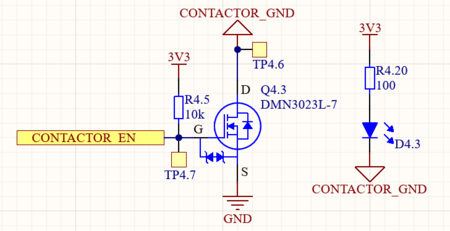

I realized that I had already implemented this functionality with the Contactor Enable NFET. This NFET disconnects all Contactors Grounds when CONTACTOR_EN is pulled to GND, disconnecting the HV batteries from the car.

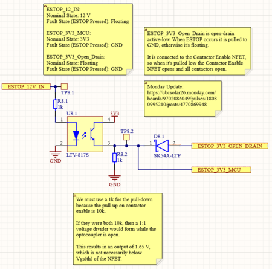

I made slight changes to the ESTOP Optocoupler so that it would be compatible with the CONTACTOR_EN pin.

Now, by tying the ESTOP_3V3_OPEN_DRAIN pin to CONTACTOR_EN, we give ESTOP direct hardware control to open all contactors when its pressed.

By extension, we can delete the ESTOP relay because it's now redundant.

> **Krish D** (Dec 2025)
>
> @Christopher Kalitin
> 
> This is a great summary of your changes, it makes a lot of sense!
> 
> Is there any reason you didn't want to simply replace the startup relay with a double-pole single-throw relay to toggle both the supp and the DCDC as inputs to the LTC4421? This would effectively do the same thing, and to me this seems as the most direct way to ensure there is no power coming into the car. Your circuit optocoupler circuit is still serving the same purpose as the startup relay.
> 
> I'm a bit confused regarding the implementation of the STARTUP_TOGGLED_GND. What is the purpose of the NFET to connect this to GND? The startup switch itself is already acting to toggle if the supp's GND is connected to the rest of the HVC, so is this FET not redundant?
> 
> If there is an edge case here that I didn't see, please let me know!

> **Hemat Wander** (Dec 2025)
>
> @Christopher Kalitin  Everything seems to make sense, but adding onto @Krish D 's point, I don't see why an optocoupler is required for the startup? Why not just have the startup switch short INT_VCC and STARTUP_INT_VCC?
> 
> If startup_GND is being used somewhere else and so is required anyways, why not have this be an NMOS instead of an optocoupler.
> 
> 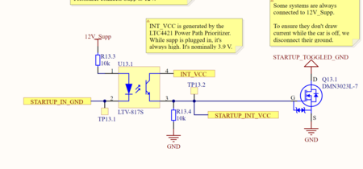
> 
> Also why not just have STARTUP_TOGGLED_GND just be STARTUP_IN_GND?

> **Christopher Kalitin** (Dec 2025)
>
> @Krish D
> 
> Have a DPDT Relay would be redundant as we've already got the back-to-back MOSFETs serving the same purpose.
> 
> Back-to-back MOSFETs are a farily standard design in industry, so I'm not too worried about it.
> 
> Here's a link to the E-Bike BMS I posted in Slack a while ago that uses back-to-back NFETs:
> [https://github.com/nhallsny/faraday-rescue](https://github.com/nhallsny/faraday-rescue)
> 
> @Krish D @Hemat Wander
> 
> Using an optocoupler for STARTUP_IN_GND follows the same logic as ESTOP_12V_IN. It's a wire that's going all over the car, so is susceptible to EMI.
> 
> To prevent potential issues with the stability this ground, I use it to toggle STARTUP_TOGGLED_GND, which only lives on the HVC and doesn't go all over the car.
> 
> This is the same reason why I don't want to be INT_VCC on the driver startup switch line.

> **Krish D** (Dec 2025)
>
> @Christopher Kalitin
> 
> Isolating grounds makes sense, but note that the stability should be negligible since the GND polygon on the ECU is literally the entire board (except for the discharge relay), and therefore is less of an issue. The principle of toggling grounds here makes sense as a design principle, however I don't believe it is necessary. I'll let you decide whether this is still a requirement or not. Please justify this with a small note on the HVC as you've done with the described signals aswell!
> 
> I more so meant that the DPST can be used for toggling off both the DCDC converter and the supp as inputs to the LTC4421. This to me serves as the most direct way to ensure there is no power inputs (If startup switch is turned off, LTC4421 can not switch to either of the inputs).

> **Christopher Kalitin** (Dec 2025)
>
> @Krish D
> 
> In the case of STARTUP_IN_GND, the ground is not the entire PCB. The ground is sourced from the PCB, but then goes on a long path all around the car and picks up noise along the way.
> 
> Will add a note.
> 
> Yep DPST is a way to be certain that both supp and DCDC can't provide power, but back-to-back NFETs are also an industry standard way to achieve this.

> **Krish D** (Dec 2025)
>
> @Christopher Kalitin
> 
> I see your point. This was never an issue on V3, since the GND plane was considered highly stable, but this is definetly a more robust way to prevent any form of noise from distributing through the HVC.
> 
> I meant using the DPST to ensure that the car turns off after being turned on. The double NFET doesn't prevent the DCDC from still being a valid source (as you mentioned in your update).  I think that using a DPST relay avoids the need to use the SHDN functionality as well.

> **Christopher Kalitin** (Dec 2025)
>
> @Krish D
> 
> 1.
> 
> Slight correction to your wording:
> 
> The PCB ground plane isn't an issue, it is highly stable!
> 
> The issue is that STARTUP_GND_IN is not the ground plane, and has gone all over the car before it's gotten back to the HVC, hence why we put it through an optocoupler and toggle an NFET instead of using it directly.
> 
> 2.
> 
> Put another way, using the SHDN pin avoids the need to use a DPST. I'm biased towards the solution that uses fewer components.
> 
> Note that the DPST also doesn't prevent the DCDC from being a valid source, but opening it means the contactor coils have no power, hence the DCDC has no HV source. Same principle as the NFETs.

> **Krish D** (Dec 2025)
>
> @Christopher Kalitin
> 
> Sounds good. I'm a bit confused with the exact purpose of the back to back NFETs, if you could clear this up that would be appreciated!
> 
> Do you think it is also worth reading from startup gnd from the MCU? (This way if the car if startup switch us turned off, the MCU can also toggle POS and NEG, alongside the power path pritoizer toggling the SHDN pin. This makes of firmware and hardware as redundancies. Since keeping the car off when it is supposed to be is safety critical, I think this would be fair to implement.
> 
> CC: @Aarjav Jain @Hemat Wander

> **Christopher Kalitin** (Dec 2025)
>
> @Krish D
> 
> 1.
> 
> 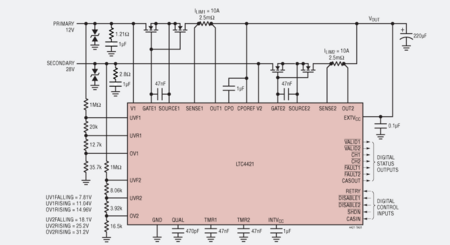
> 
> Ah, the back-to-back NFETs serve exactly the same purpose as a DPST relay would. Literally exactly the same outcome (no current flow in both directions), just a different method. Should've made this clearer.
> 
> In the typical application above you can see how we have a pair of back-to-back NFETs on each LV input.
> 
> This is functionally identical to having an SPST on both inputs, except that because they're semiconductors their switching time is far faster than a mechanical relay.
> 
> 2.
> 
> Reading STARTUP_GND_IN is an interesting idea, I'll think about it.
> 
> If STARTUP_GND_IN is floating, there will be no power so the MCU will be off. But as a redundancy there's some merit.

> **Krish D** (Dec 2025)
>
> @Christopher Kalitin
> 
> I see, this makes more sense now. Your justification for a relay vs the back to back NFETs is clear.
> 
> I'll point out that this logic only works if the SHDN pin of the LTC4421 functions as expected. <- I know this sounds obvious, but I'd like you to consider if there any other failure modes of the circuit that are accounted for with a relay.
> 
> Otherwise, this makes sense.

---

# Reading The Supplemental Valid Pin

**Author:** Christopher Kalitin

**Date:** Nov 2025

[@Museok Seo](https://ubcsolar26.monday.com/users/66935094-museok-seo) [@Michelle Hu](https://ubcsolar26.monday.com/users/66782803-michelle-hu) [@Aarjav Jain](https://ubcsolar26.monday.com/users/66722948-aarjav-jain) [@Krish D](https://ubcsolar26.monday.com/users/66710612-krish-d)

An LED and GPIO input needs to be added to the DRD because of changes to the startup circuitry. This updates describes required changes.

**Reading The Supplemental Valid Pin**

As discussed in the final section of [this update](https://ubcsolar26.monday.com/boards/9702086049/pulses/18080990623/posts/4654467464), there is a pin on the LTC4421 Power Path Prioritizer that tells us if the supplemental is in its nominal voltage range.

If the LTC4421 is outside of its nominal voltage range, it will not be connected to the output. In this case, even after the driver has flipped the startup switch the car will not turn on because the supplemental is at too low a voltage.

For this contingency, we need to connect the valid pin of the supplemental to an LED so we are aware it is outside its nominal range. This LED must be present both on the HVC for debugging and on the DRD so the driver knows the status of the car.

The supp valid pin of the LTC4421 is pulled low if it is outside its nominal range. So, a PMOS can be used on the HVC to invert the signal to activate an LED.

For labelling, we can call this LED Supp Invalid.

Next Steps:
1. Implement PMOS on HVC to invert the GPIO

2. Implement Supp Valid LED on HVC
2. Output inverted Supp Invalid pin to DRD (Through the junction board, across the car)
3. Implement Supp InvalidLED on DRD

What will change on DRD:
1. Instead of reading one GPIO from HVC, read two (Fault and Supp Invalid)
2. Add another LED for Supp Invalid

Note that this Supp Invalid is not like our previous Supp Low LED. Supp Low was a warning when the Supplemental was below 10.5 V, but we would still run the car. Supp Invalid means the car will not start up, and we're turning on this LED so it's clear why we're not turning on, making debugging simpler.

@Museok Seo
Furthermore, because the DRD will not be powered in the Supp Invalid case, the connector supplying the LED power needs to include a ground wire.

If the car doesn't startup, the DRD will not be on but we still need to activate the Supp Invalid LED. So, we need to supply both power and ground in a separate wiring harness.

Ie. the current schematic for the FLT LED would not work for this. The Supp Invalid LED input must power the LED, and the ground must not be board ground, but a ground specific to the Supp Invalid LED.

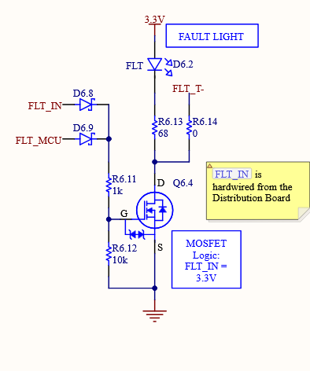

---

# Startup Circuitry Relays

**Author:** Christopher Kalitin

**Date:** Nov 2025

**Startup Circuitry Relays**

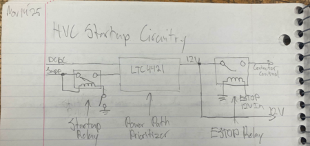

With the power prioritizer schematic block done, now we need to find the relays involved in the startup circuitry.

Relay requirements:
- >10 A current rating

- Low coil current (30mA or less, going off current ECU relays)
- 12 V coil voltage

I put these requirements into Digikey part search and found this relay:
[PR9-12V-200-1A](https://www.digikey.ca/en/products/detail/same-sky-formerly-cui-devices/PR9-12V-200-1A/16752656)

Current rating: 16 A
Coil current: 16 mA
Coil voltage: 12 V

It's also relatively cheap ($1.61) and has a 10 ms operating time and 5 ms release time.

In the [HVC DR0](https://docs.google.com/document/d/1IN_0Pcg9eEbxtUkUSTO_Nc7S2LKmDKqyU20G1GsCJE0/edit?tab=t.0#heading=h.jhe8s63mkmtz) I arbitrarily set a requirement that we respond to ESTOP within 10 ms,  which is being met.

I imported the Altium component and got this schematic component:

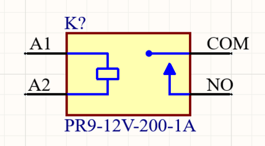

It's not entirely clear what A1, A2, COM, and NO (normally open pin) are.

I found this source that specifies how to connect each pin:

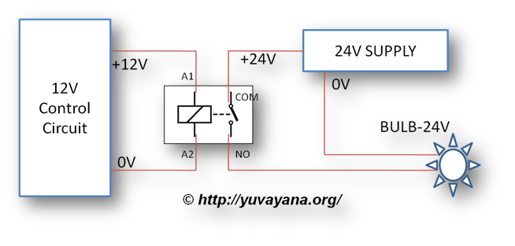

[Image Source](https://er.yuvayana.org/relay-logic-circuit-rlc-relay-contactor-switch-and-timer/)

Now I just need to translate my sketch to Altium.

8 minute monday update speedrun.

---

# Untitled

**Author:** Christopher Kalitin

**Date:** Nov 2025

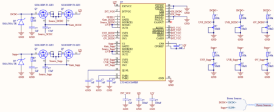

Schematic is complete: [link](https://ubc-solar.365.altium.com/designs/39582840-6999-40D9-89D8-9774BDE86C17?variant=[No+Variations]&activeDocumentId=STARTUP.SchDoc(10)&activeView=SCH&location=[1,165.1,-367.02,-213.65]#design)

Notes:
- Tying retry pin to INT_VCC makes it retry connecting a source after it has had an over current fault. We have no current sensing shunt resistor, so this is mostly useless for us. If there is an edge case where it detects current, in this case we'll be able to keep driving the car.
- Tying Disable to INT_VCC means both sources are enabled
- SHDN tied to INT_VCC means we never shut down
- CASIN tied to INT_VCC means we're not stringing many LTC4421's together (we're only using one).

I used the [SIJA22DP-T1-GE3](https://www.digikey.com/en/products/detail/vishay-siliconix/SIJA22DP-T1-GE3/13540658?curr=usd&utm_campaign=buynow&utm_medium=aggregator&utm_source=octopart) as the NMOS instead of the one the datasheet suggested, because I didn't want to make a footprint and this one had one on Altium.

Also used the [SMAJ30A-TR](https://www.digikey.com/en/products/detail/stmicroelectronics/SMAJ30A-TR/2873847?curr=usd&utm_campaign=buynow&utm_medium=aggregator&utm_source=octopart) TVS diode because I could find an Altium model for it, this was was pretty difficult to find a model for was pretty annoying.

---

# Designing LTC4421 Power Path Prioritizer Circuitry

**Author:** Christopher Kalitin

**Date:** Nov 2025

**Designing LTC4421 Power Path Prioritizer Circuitry**
[LTC4421 Datasheet](https://www.analog.com/media/en/technical-documentation/data-sheets/LTC4421.pdf)

Essentially what I'm doing in this update is taking this typical application circuit and tailoring it for our purposes.

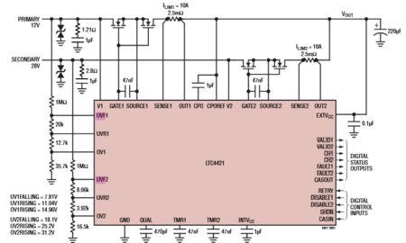

Sections:
1. Choose Supp/DCDC UVR, UVF, OV resistors

2. TMR Capacitors
3. Cout selection

4. NMOS Selection
5. Snubber Circuit Exploraton
6. Zener Diode
7. Reading GPIO outputs

**UVR, UVF, OV Threshold Voltages & Voltage Dividers**

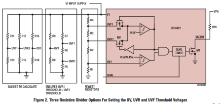

The LTC4421 has three pins that manage the overvoltage (OV) and undervoltage (UV) threshold voltages for each source.

1. UVF (Undervoltage falling): If a source falls below this voltage, it is labelled invalid
2. UVR (Undervoltage rising): Once a source is UV Invalid, it must rise above the UVR voltage threshold to be considered valid again, this provides for some hysteresis.
3. OV (Overvoltage): Simple, if you go above this voltage you are an invalid source.

Notice we're missing an overvoltage falling value, one that a source would have to drop below to be considered valid again (hysteresis). Internal to the IC, the OV falling threshold is set as 10% below the OV rising threshold. Eg. if OV rising threshold is 10 V, the source must return to below 9 V to be considered valid again. See the "Setting Valid Operating Voltage Range" Section of the datasheet.

We configure these voltages with a voltage divider. If any "rising" fault pin goes above 0.5 V, the IC detects a fault. If any "falling" pin goes below 0.5 V, the IC detects a fault. Eg. For a 10 V over voltage fault threshold, we use a 20-to-1 voltage divider, so that if the input is 10 V, the OV pin sees 0.5 V and triggers a fault.

**DCDC Voltage Threshold Values**

The DCDC has a nominal operating voltage of 12 V, and I'll assume +/- 1 V is a tolerable range. So, we set UVF to 11 V, UVR to slightly greater than 11 V (11.5 V), OV to 14 V. Because OV is 14 V, the internal OVF threshold is 12.6 V.

DCDC UVF: 11 V
DCDC UVR: 11.5 V
DCDC OV:   14 V

It's important to consider the overvoltage falling (hysteresis for invalid source) edge case because we want the DCDC to return to operation after an overvoltage event. If I picked 13 V, then the DCDC would have to return to 11.7 V to be operational again, and this is not its nominal value.

**DCDC Resistor Values**

Now with voltage values, we can pick resistors:

V_OV_bus = 14 V (over voltage bus voltage)
V_OV_trigger = 0.5 V (OV trigger voltage)
Voltage divider factor: 14/0.5 = 28x

V_UVF_bus = 11 V
V_UVF_trigger = 0.5 V
Voltage divider factor: 11 / 0.5 = 22x

V_UVR_bus = 11.5 V
V_UVR_trigger = 0.5 V
Voltage divider factor: 11.5 / 0.5 = 23x

Figure 2 of the datasheet (shown above) gives 3 topologies for defining fault voltages, I'll use the first option (farthest left) which is simply three voltage dividers. This is easiest to configure and change.

We notice all options require secondary resistor ~20x smaller than the primary resistor, so I'll baseline use of a 100k resistor and 10k trimmer potentiometer.

Note that we don't purely use a potentiometer because we want precise control of the very low end of the voltage range (ie. 0-1 V, not 0-12 V).

**Supp Voltage Thresholds & Resistors

**The exact voltages can be debated, I'll skip most of the math for now. Note that if supp is outside the nominal range, we'll have no way to startup the car as there'll be no connected 12 V source, so we should give a reasonably wide range.

Supp UVF: 9 V
Supp UVR: 9.5 V
Supp OV:   15 V

Voltage divider factors:
UVF: 18
UVR: 19
OV:   30

Again, a 100k + 10k trimmer pot will work.

**Current Faulting + Fault Time Capacitors**

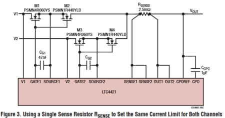

The LTC4421 has the ability to current fault individual sources through using shunt resistors. We'll have an LVS current sensor so don't need to use the LTC4421 for this purpose.

To disable current faulting ability, we'll just tie the sense lines on both sources to output voltage, so voltage drop over them will always be zero and the IC will always be detecting 0 A.

TMR stands for "current fault timer" (see datasheet page 9) and configures how long a source can be in an overcurrent state before being considered invalid, and the chip falls back to a difference source.

Datasheet lists a value of 83ms/uF for fault time, and you'd choose a capacitor accordingly. We'll just put a 1 uF on both TMR1 and TMR2.

**Output Capacitor Selection**

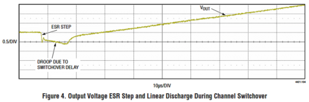

Above you can see that there's around a 10 us switching time between sources (notice the time from voltage drop to rise on the left of the chart).

This means we only need to sustain voltage using a capacitor for about 10 microseconds (great improvement from 2-3 ms with a relay!).

"Typically, using 10μF to 50μF of output capacitance
per Ampere of maximum load current achieves a reason-
able trade-off." (datasheet page 16)

Going off this datasheet recommendation and an expected max current draw of 6 A, I'll choose a 100 uF capacitor.

What's also important to optimize for is ESR (Equivalent series resistance) of the capacitor. When a source switches off and we start pulling energy from the capacitor, we're essentially adding a resistor in series with the LV system of the car. This resistor has a voltage drop which we have to consider, and choose a component with low ESR.

Voltage drop due to capacitor ESR:
V_drop = I * R_esr

With I = 6 A as the expected max, we see that an ESR of 100 milliohms would result in a voltage drop of 0.6 V. This is a reasonable value to aim for, [here's a capacitor on Digikey](https://www.digikey.ca/en/products/detail/rubycon/50ZLH100MEFC8X11-5/3563386) with C=100 uF and impedance=74 mohms.

**NMOS Selection**

Requirements:
- >6 A current rating
- Low on-resistance
- Vgs(th) < 5 V (limit of the LTC4421, hopefully we're well below)

The datasheet recommends the PSMN4R0-60YS with a current rating of 74 A and on-resistance of 4 milliohms. It's also out of stock on Digikey.

Note that most FETs at very low on-resistances also have very high current ratings, which is why we're going well above that requirement.

Digikey suggested the [RJK0653DPB](https://www.digikey.ca/en/products/detail/renesas-electronics-corporation/RJK0653DPB-00-J5/2772898) as a replacement at 45 A, 4 milliohms, Vgs(th)=2.5 V, and $5.71 per FET with 3,816 in stock. Good option, if this has an Altium footprint I'll use it.

**Snubber Circuit**

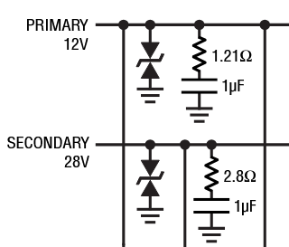

The datasheet reccomends a ~1 ohm resistor and ~1 uF capacitor on the input of both sources as a snubber circuit that dampens oscillations so that peak current is limited in transient events (eg. switching source)>

I don't fully understand this but will trust the datasheet and will go with 1 ohm + 1 uF.

At some point in the next few weeks I'll certainly be nerd snipped into asking the LLMs about this for an hour while on the bus.

**TVS Diode**

You can also see in the image above that a TVS diode is recommended on each input for overvoltage protection (eg. release of inductive energy supply-side). I'll again just trust the datasheet on this one and use the [SMDJ36A](https://www.digikey.ca/en/products/detail/littelfuse-inc/SMDJ36A/1835327) TVS diode with a 58.1 V clamp voltage. This feels pretty high, but it's what's recommended for a 12 V source on the datasheet (page 13).

**What's Next?**

All non-trivial circuit elements are defined with possible parts to use from Digikey, all other circuit elements are simple capacitors. Now just to implement this in Altium, then probably run into some fun trouble routing all of this in a month.

**Which Output Pins Should The STM32 Read?**

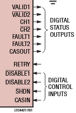

One last thing, the LTC4421 has 6 output pins (open-drain GPIOs) we can read:
Valid pins: Pulled low if a source is outside it's specified voltage range
Channel pins: Pulled low when a given source is active
Fault pins: Pulled low when an overcurrent fault occurs

Fault pins are useless to use because we're not using the current sensing shunt resistor.

The Supplemental's valid pin is useless because we'd have no way to read it if the supplemental is not powering the PCB.

The DCDCs valid pin could be useful to know if it's voltage isn't where we expect. In practice however, I expect that if we see we aren't switching to DCDC we'll get far more information debugging by probing DCDC voltage manually, so there isn't a case where this pin is very useful.

The channel pins are very useful to us to know if we are in an expected state or not. Eg. while the car is driving we always want to be on DCDC and not Supp so we don't drain it. By observing both channel pins and adding a flag in firmware, we'll know if we're erroneously draining supp while driving. Otherwise, we'd be slowly seeing supp be drained and find out about the problem 30-60 minutes after it started.

> **Krish D** (Nov 2025)
>
> Great update here, @Christopher Kalitin! This is a great in-depth explanation regarding the implementation details of the chip. The sectioning makes it quite easy to follow and the added calculations are easy to follow. Keep it up!
> 
> **Here are some technical notes and questions I thought of while looking more into the chip:**
> 
> - Regarding the Supp voltage thresholds, it's worth noting that our [current supp](https://www.batteryspace.com/NiMH-Battery-Pack-12V-5000mAh-CUJAS155.aspx) will be at a maximum of 14.5V when fully charged, so it's good that you choose 15V at the supp_OV. You also mention that all voltage thresholds "can be debated". What needs to be done to finalize the respective values? An analysis of edge cases should be conducted to make this more concrete/justifiable <- Assuming the values you chose are what you think we should use.
> 
> - In person we also mention adding a secondary current sensor as the full check that determines if supp is being drained? (In the edge case that the PMOS-es conduct despite the logic not functioning as expected?) This may be more advantageous than reading the channel pins don't directly tell you if current is being drawn or not. Is this still necessary?

> **Christopher Kalitin** (Nov 2025)
>
> @Krish D
> 
> 1.
> -15 V max seems like a good value then. All that's left to be determined is the minimum voltage threshold, for which 10 V seems reasonable.
> 
> From datasheet: "Please don't discharging the battery pack below 10V  ( 1.0 V / cell)  Deep discharging may damage NiMH battery pack."
> 
> The only potential issue is that this is a circuit that'll disable the car from starting up, currently without any indication of this, potentially making debugging more annoying for future BMS members.
> 
> We could add an LED on the Supp Valid pin so that we can know if it's outside its nominal range. Otherwise, we'd flip the startup switch and nothing would happen and we'd be left guessing.
> 
> 2.
> If the LTC4421 tried to switch to a different source and it didn't work (and if it didn't fall back to the other source), then the LV system of the car would have no power and it would shut down. So there's no use in taking current measurements in our last 100 ms of operation before an inevitable power cycle.
> 
> For my own future reference: the datasheet recommends pull-downs on the NMOS sources but doesn't show it in the typical application circuit:
> 
> 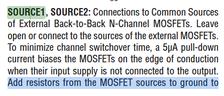

> **Christopher Kalitin** (Nov 2025)
>
> Quick note: The LTC4421 powers itself using an internal LDO that supplies current from either the output voltage, input source 1, or input source 2.
> 
> 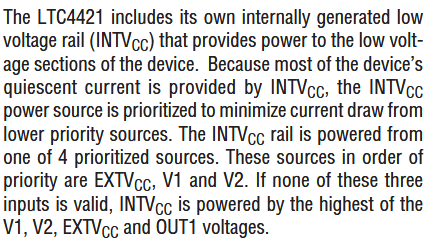

---

# Supp-DCDC Swap Circuitry

**Author:** Christopher Kalitin

**Date:** Nov 2025

**Supp-DCDC Swap Circuitry**
**
Current ECU Design**

We currently swap between DCDC and Supp with a relay that is driven by the STM32. After the POS and NEG contactors close, we swap the 12 V source from Supp to DCDC.

The issue with this setup is that while the relay is swapping between it's contacts, there is no connection from board 12 V to any 12 V source. While this occurs, we're discharging a 1000 uF capacitor to have a voltage source for the 2-3 ms switching period.

Charging this 1000 uF capacitor at startup induces a current spike, which we'd like to avoid.

There's a section and comments in [this monday update](https://ubcsolar26.monday.com/boards/9565350285/pulses/9721351653/posts/4389304604) on this topic for more info.

**Possible Solution: Power Prioritizer
**
A Power Path Prioritizer is a type of IC that selects from a few input voltage sources to drive an output. This way, we can hook up the DCDC and Supp and let the IC do the switching for us in microseconds, necessitating a much smaller capacitor and hence a smaller current spike.

Most Power Path Prioritizers assign a priority to each input and use the highest priority input that is at a nominal voltage. In our case, this means use the DCDC if it's in the range of 11-13 V, otherwise, use the supplemental if it's in the range of 9 to 15 V, otherwise, do nothing (supp is way outside the nominal range).

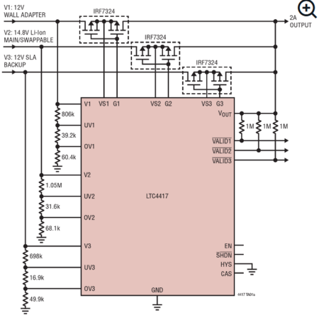

The nominal voltage ranges are defined by voltage dividers as you can see in the LTC4417 typical application above.

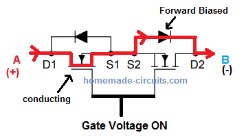

Above is the two back-to-back P-channel MOSFETs all power path prioritizers use to toggle current flow. With just one MOSFET, you can always conduct backward through the body diode, including two means current flow back into a source is prevented. [Read this for more info](https://www.homemade-circuits.com/bidirectional-switch/).

**Power Path Prioritizer IC Options**

Our requirements for a power prioritizer are:
- 0 to 15 V input range
- >6 A current max
- Requires relatively small capacitor (eg. not >100 uF)
- Hand solderable (in case pins are shorted, so we can rework it)

IC Options:
- [LTC4417](https://www.analog.com/en/products/ltc4417.html)
- [LTC4418](https://www.analog.com/en/products/ltc4418.html)
- [LM74800](https://www.ti.com/lit/ds/symlink/lm7480-q1.pdf)
- [LTC4421](https://www.analog.com/en/products/ltc4421.html)

The LTC4417 has 3 input channels (we only need two), comes in an SSOP package (reasonably hand solderable), and has GPIO outputs that tell us if each input is in its nominal range of not.

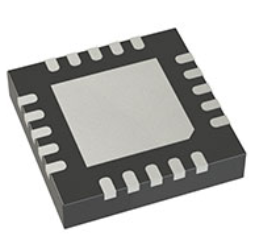

LTC4418 QFN Package

The LTC4418 is what Waterloo uses. It has two input channels (more ideal for us), but only comes in a QFN package which is not hand solderable. Using a QFN means we must reflow / heatgun the IC to remove / place it, and will have more trouble with short. Reworking becomes significantly more difficult, so I'm discounting this option.

@Michelle Hu said Mischa said the LM74800 is what Tesla uses. In her first year on the team she design (didn't bring up) [this board](https://ubc-solar.365.altium.com/designs/9D893F0C-FCB9-49FD-B305-6A68F37502B3?variant=[No+Variations]&activeDocumentId=NMOS_PP_Schematic.SchDoc&activeView=SCH&location=[1,95.43,94.52,66.68]#design) with it. It uses one IC per voltage supply with a nominal voltage range, it's not immediately clear to me how it ensures only supply doesn't feed into another (eg. Supp "Charging" DCDC).

For future reference:

[Michelle_LM74800_Notes.pdf](https://ubcsolar26.monday.com/protected_static/25620279/resources/2541955973/Michelle_LM74800_Notes.pdf)

The LTC4421 is the most feature rich IC of all I checked. It has the ability to disable source in over current conditions (with a 2.5 mohm shunt), it has 2 inputs (ideal for us), valid pins (like LTC4417, that tell us if a source's voltage is in the nominal range).

The big difference with the LTC4421 is that it has pins that tell us which input is currently driving the output (supp or DCDC), these are called CH1 and CH2.

Krish and I spoke and decided that we want a way of knowing which source (Supp or DCDC) is driving the output. If the DCDC isn't driving the output in normal operation, we have a problem and are draining supp when we don't want to be.

Possible solutions:

- Read back-to-back P-channel gate voltage

- Put a current sensor on DCDC and Supp (read by STM32)

- Read valid pins (if source voltage is in specified optimal range), and assume the IC switches

- (For LTC4421) read CH1 (channel 1 active) pin

Reading gate voltage is slightly difficult because for N-channel MOSFETs a charge pump is used to boost gate voltage above source voltage (eg. 12 V -> 17 V). So, we need to also read source voltage to know the delta.

Using another current sensor adds another component, so is suboptimal.

Reading valid pins places complete trust into the power path prioritizer IC, assuming that if a higher-priority source is valid that it'll switch to it. So, this doesn't fully check what's going on (eg. maybe the FETs are broken).

The LTC4421 makes this check extremely easy, we just read a GPIO and know which source is active.

Given all considerations, I have two options:

:

It has all features we need except knowing which source is active, so we'll need to add current sensors in series with each source to know which is active as a redundacy.

:

It foregoes the need for an additional current sensor, but is 32 pins instead of 24 and costs $2 more.

Both have similar stock on Digikey (200-1000, depending on model).

This investigation has shown that using a faster acting swap relay is a far easier solution than a power path prioritizer. I'll look for one of these and if I can't find one I'll use the LTC4421 (for the benefit of knowing which source is active).

> **Christopher Kalitin** (Nov 2025)
>
> 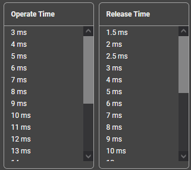
> 
> [https://www.digikey.ca/en/products/filter/power-relays-over-2-amps/188?s=N4IgjCBcoGwJxVAYygMwIYBsDOB...](https://www.digikey.ca/en/products/filter/power-relays-over-2-amps/188?s=N4IgjCBcoGwJxVAYygMwIYBsDOBTANCAPZQDaIALGGABxwDsIAuoQA4AuUIAyuwE4BLAHYBzEAF9CMegFZEIFJAw4CxMiADMNAAwaATNuZtOkHv2FjJ4KoegK0WPIRKRyMAAQBBEIXpefIPQAdDL%2BhDRh4NqRYHoxeiExFDGh3oRgHmngflkG-iwgHFwAqkIC7ADyqACyuOjYAK58uBJWeurNmOgAnsziQA)
> 
> No relays exist on Digikey that have an operating time less than the existing swap relay on ECU (EX1-2U1S), and that one is out of stock. Seems Mischa / Nic Ricci already chose the best available relay, there's no room for improvement in this domain.
> 
> Our original goal was to lower the size of the capacitor used while the armature swings by lowering the operating time of the relay, we can't do this with a relay so I'll implement the LTC4421.

---

