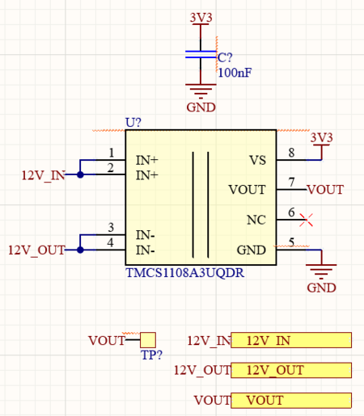
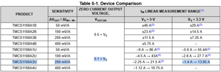
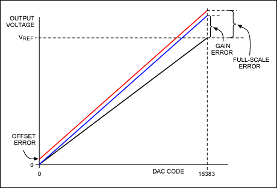
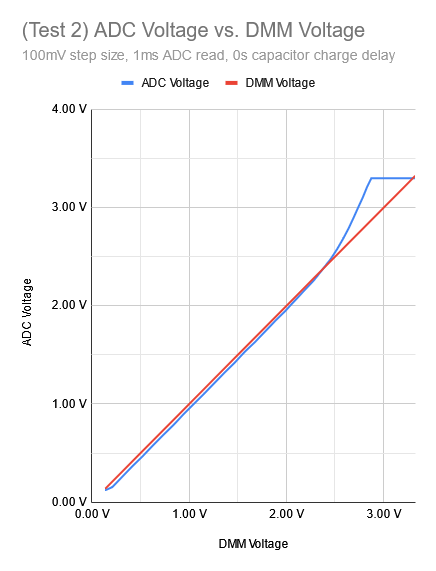

# Finding A Current Sensor

**Author:** Christopher Kalitin

**Date:** Nov 2025

**Finding A Current Sensor**

Requirements for LV current sensor:
- 3.3V input
- Can handle >=10 A (to have margin above our expected 3-6 A current draw)
- Voltage output proportional to current (eg. Vout = 100 [mV/A] * current [A])
- Optimize sensitivity (mV/A) for precise readings.

I chose the [TMCS1108A3U](https://www.digikey.ca/en/products/detail/texas-instruments/TMCS1108A3UQDR/13692795), which has these specs:
- 3 to 5.5 V input
- -1.4A to 13.85 A current range
- 200 mV/A sensitivity

Note that with the 200 mV/A sensitivity and an STM32 with voltage sensing precision of 0.8 mV, we get a current sensing precision of 4 mA.

The datasheet chart above shows the current sensor IC has a zero current output voltage (ie. reference voltage) of 0.1 * V_supply. This means that at 0 A through the sensor, the output will be 0.1 * 3.3 V = 0.33 V.

We only expect positive current over this current sensor, so we aren't using the usual 0.5x reference voltage (1.65 V). We can bias the sensing range to be inclusive of more positive current, ie. using a 0.1x reference voltage.

Because our sensing range is 0.33 to 3.3 V, we can chose a pretty high sensitivity. We chosen IC has a sensitivity of 200 mV/A. For our ~3 V range this means out max observable current value is 3 [V] / 0.2 [V/A] = 15 A.

**A Note On More Precise Sensing**

Note that the IC generates the zero-current output voltage using a voltage divider internally:
"The TMCS1108 zero-current output voltage is derived from VS using a resistor divider"

This means that the zero-current output voltage is referenced to the supply voltage. Our STM32's ADC is also referenced to its supply voltage (3.3 V, VDDA). This means that our zero-current output voltage can be specified in ADC bits instead of volts.

Ie. use 4095 * 0.1 = 409.5 adc bits as the reference.

In the other case, we'd have to be assuming a zero-current output voltage as a constant in code. Ie. 0.33 V hardcoded. This means that if the supply voltage drifts (eg. to 3.28 V as we've often seen), our 0.33 V hardcoded value would be incorrect (we'd have to make it 0.33 * 3.28/3.3), but using raw ADC bits we're already accounting for supply voltage drift as both the source and sensor are referenced to the same supply voltage.

With this setup, we've eliminated the constant error of having an incorrect reference voltage, but still have gain error:

See gain vs. offset error here:

**Is The ADC Range Fine?**

For the [main pack current sensor characterization last year](https://ubcsolar26.monday.com/boards/7524367629/pulses/7524367868/posts/3786316479), I characterized the ECU's STM32s ADC and got this expected vs. experienced value graph (subtract both and you get error):

We see that after our 0.3 V reference starting point, we're mostly linear. However, above ~2.5 V our error is non-linear and gets bigger.

We can predict if our sensor will get up to 2.5 V using our expected current and voltage sensitivity to current.

With a max current of 6 A (this value is greater than what we now expect) and a sensitivity of 200 mV/A and a reference of 0.3 V, we get:
Vout(6 A) = 0.3 V + 6 A * 0.2 V/A = 1.5 V

We're not getting to the inaccurate range of the ADC (only up to 1.5 V) so we're fine.

> **Krish D** (Nov 2025)
>
> Hey @Christopher Kalitin,
> 
> One question, where did the 4095 * 0.1 expression come from?
> 
> Also I found[this](https://www.melexis.com/en/product/mlx91231/smart-ivt-shunt-interface-current-sensor)current sensor from Melexis (same brand as the old LV current sensor from the ECU). It has a gain error of 0.2% and communicates over UART. Perhaps worth considering if you think greater accuracy is required.

> **Christopher Kalitin** (Nov 2025)
>
> The 0.1x reference voltage comes from the datasheet, this makes it more optimized for sensing positive currents than negative currents (which is what we want).
> 
> 
> 
> Greater accuracy than 4 mA isn't required here. That IC is also for a small shunt resistor, would be cool but added complexity isn't worth it (esp. with UART vs. just an ADC).

---

