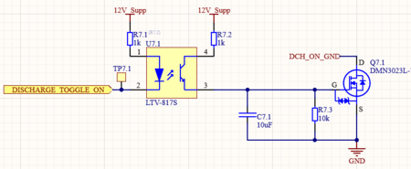
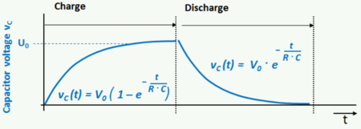
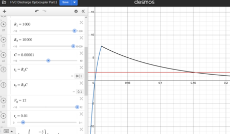
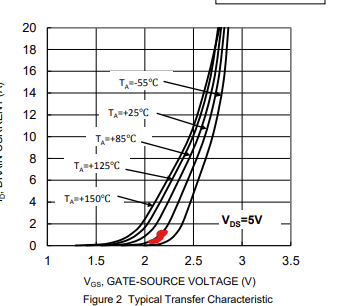
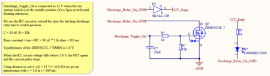
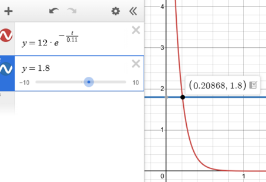
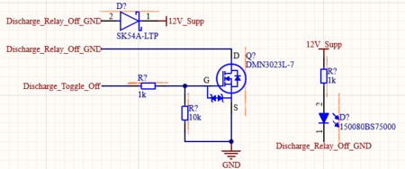

# Untitled

**Author:** Christopher Kalitin

**Date:** 17d

As discussed in [this update](https://ubcsolar26.monday.com/boards/9702086049/pulses/11002723643/posts/4850567143), the Discharge Toggle circuitry has to be redesigned to work with a GND input instead of 12 V input.

I also came to the conclusion that because the discharge toggle line is going all the way to the driver (on the other side of the car from the battery), we should use an Optocoupler on it. The reasoning for this is described in [section 5.2 of ECU Rev 2.0 Design Documentation](https://docs.google.com/document/d/1QM3zkZ5lr_cZ472EEUCi2zeDzIvVOQBL3wgIkjYbXAc/edit?tab=t.0#heading=h.aqtqd6p6ctx5).

This design uses an optocoupler with a togglable ground with an RC circuit to extend the pulse time of DCH_TOGGLE_ON.

The optocoupler isolates DCH_TOGGLE_ON from the rest of the circuitry.

The RC circuit is charged with a 1k resistor and discharged with a 10k resistor. To a first approximation, this extends the pulse of DCH_TOGGLE_ON by 10x.

As shown at the [end of this update](https://ubcsolar26.monday.com/boards/9702086049/pulses/10044512386/posts/4497053922), we could see a pulse as low at 5 ms on DCH_TOGGLE_ON if the driver slams the switch really fast. The Discharge relay requires a 15 ms pulse to latch, 5 < 15 so we need to extend the DCH_TOGGLE_ON pulse.

Using the equations we learned in PHYS 158, we can model the charging and discharging of our RC circuit to figure out how long we extend the pulse.

I modelled this in [Desmos](https://www.desmos.com/calculator/w9izcrqo83).

The above graph shows the voltage at the gate of the MOSFET for a charging pulse of 10 ms.

Notice that for a 10 ms charging time, the RC circuit discharges to below 1.8 V after 150 ms. Note that 1.8 V is the Vgs(th) of our NFET.

Varying the values in Altium, I found that a charge pulse of 2 ms is required for ~15 ms above 1.8 V.

This means the minimum pulse time is 2 ms, which is less than the 5 ms minimum pulse time we saw during testing.

> **Hemat Wander** (16d)
>
> Just want to note that the Vgs(th) is a voltage at which the NFET would be conducting a very small amount of current (in the microamps) so we need to be "a lot" above that depending on what current the latching relay requires.
> 
> However, "a lot" in this case probably just means something like 2V, since the latching relay only requires milliamps. Given that we only need a 2ms pulse time, this is likely fine.
> 
> 

---

# The Discharge Relay Problem On Brightside

**Author:** Christopher Kalitin

**Date:** Nov 2025

**The Discharge Relay Problem On Brightside**

[During testing on Brightside](https://ubcsolar26.monday.com/boards/9702086049/pulses/10044512386/posts/4497053922) we found that there's a case in which the startup switch will only pulse the discharge relay's SET coil for 5 ms.

The discharge relay is a latching relay, so requires at least a 15 ms current pulse to change state (once its state is set, it keeps it, see [section 9.2 of ECU rev 2.0 design documentation](https://docs.google.com/document/d/1QM3zkZ5lr_cZ472EEUCi2zeDzIvVOQBL3wgIkjYbXAc/edit?tab=t.0#heading=h.xx8u71po48cm)).

This is the primary edge case I considered in designing discharge relay control circuitry for HVC.

**Using An RC Circuit To Extend Latching Time**

For uninitiated members, knowledge of Phys 158 / 2nd year circuit analysis courses may be useful.

To extend the time the latching relay's SET coil (it enables motor discharge) has current flowing through it, I used an RC filter that is charged when the startup switch is in it's middle position (it's a 3pos switch and we use pos1 for off, pos3 for on, hence why we're in pos2 for such little time).

This RC filter has a time constant of 110 ms and is charged up to 12 V directly from the supplemental battery (ie. it'll be charged up even if the HVC is off, we're skipping the startup circuitry and wiring directly into the supplemental battery).

Plotting v(t) = 12*e^-(t/0.11s) in desmos we find that we cross Vgs(th)(max) for the MOSFET after 209 ms.

This means that for an arbitrarily short charging time (eg 1 ms), the discharge relay's SET coil will have current going through it for 209 ms.

**Latch Off Circuitry **

Since we don't need this circuitry for turning the discharge relay off (which is done by the STM32), we use a more standard NMOS controlled by a GPIO.

**LEDs + SOP**

Note that both the latch on and off control circuits have LEDs that show when they're active. This way, we'll see a ~100 ms flash whenever discharge is enabled or disabled.

This can be worked into the SOP when using the battery, because if you don't see the flash when the car turns off the motor controller is still charged at 134 V, and is dangerous to work on.

---

