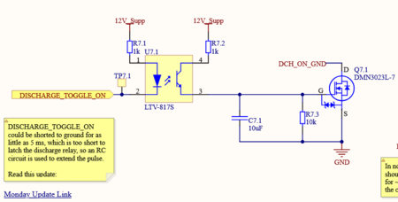
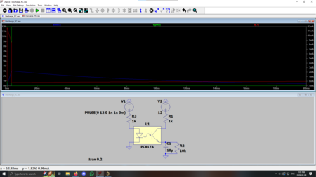
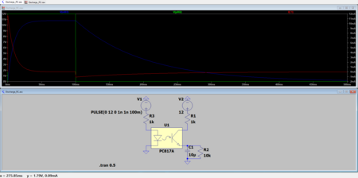
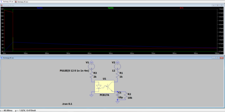
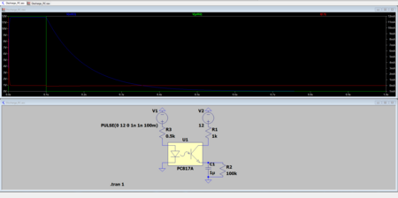
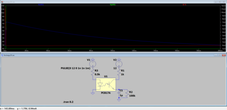

# Untitled

**Author:** Christopher Kalitin

**Date:** 11h

**Simulating Optocoupler Discharge Pulse Extension Circuitry**

Similar to the [previous Optocoupler update](https://ubcsolar26.monday.com/boards/9702086049/pulses/18080991742/posts/4906276781) this morning.

LTSpice sims are [on the drive](https://drive.google.com/drive/folders/1xq5AAaea6qMs2BM9x8qGFx1eYjlmUg9Y?usp=drive_link).

Conclusion:
- Use a 1uF instead of a 10uF for RC circuit (and change 10k to 100k to keep time constant the same)
- Use ~500 ohms on optocoupler input
- This makes the charging time constant 100x lower than the discharge time constant, for optimal pulse extension

**The Concern**

As explained in [the previous update](https://ubcsolar26.monday.com/boards/9702086049/pulses/18080991742/posts/4906276781), I was concerned about the NPN BJT in the optocouplers being limiting the current in some circuits.

In the case of the RC pulse extender circuit, this could mean not charging the capacitor fast enough, meaning the charging pulse is artificially shortened. In a worst case, this means not latching the discharge relay.

I decided to simulate the circuit in LTSpice to confirm functionality.

**Simulation 1**

Parameters:
- Input Pulse: 3 ms
- RC Capacitor: 10 uF
- Input Resistor: 1k

This simulation is a worst-cast scenario for the RC pulse extender circuit with a 3 ms charging time.

We see that with the existing components, the voltage output spends ~50 ms above 1.8 V (Vgs(th) of the NFET), so we successful latch the discharge relay (15 ms required).

This means my concerns over the NPN limiting the charging current to the capacitor weren't too important.

Assuming the Optocoupler has a CTR of ~100%, 12 V and 1k on the input translates to a max current of 12 mA on the output.

Since there's also 12 V and a 1k on the output, this system is well balanced, and the NPN and 1k output resistor both limit current to a similar degree.

However, issues come up with CTR < 100% or if the pulse is even shorter.

**Simulation 2**

Parameters:
- Input Pulse: 100 ms
- RC Capacitor: 10 uF
- Input Resistor: 1k

This simulation shows a best case scenario. The output voltage is >1.8 V for ~250 ms for an input charging pulse of 100 ms.

Note that my cursor was at the 1.8 V crossing for all screenshots, and you can see coordinates in the bottom left.

**Simulation 3**

Parameters:
- Input Pulse: 4 ms
- RC Capacitor: 10 uF
- Input Resistor: 2k

My next idea was to test if CTR < 100%. I did this by putting a 2k resistor on the input and keeping the 1k resistor on the output of the optocoupler. Now, the NPN will deliver 12V/2k = 6 mA, while the resistor is trying to pull 12V/1k = 12 mA.

We see that the current is limited to a little over 6 mA, as expected.

This results in a minimum pulse length of 4 ms required to latch the relay, which is just on the edge of our requirement of 5ms latching the relay (as discussed in previous updates).

**Simulation 4**

Parameters:
- Input Pulse: 100 ms
- RC Capacitor: 1 uF
- Input Resistor: 0.5k
- Low-side RC circuit resistor: 100k

I decided to lower the capacitor to 1 uF so that it would be charged faster. Also, to ensure optimal CTR, I lowered the input resistor to 500 ohms.

I kept the high-side resistor the same, so the charging time constant is now 10x lower. I made the low-side resistor of the RC circuit 100k instead of 10k, so its time constant is equal.

This results in a much faster charging time. Notice the almost instant charging pulse on the left of the graph.

**Simulation 5**

Parameters:
- Input Pulse: 1 ms
- RC Capacitor: 1 uF
- Input Resistor: 0.5k
- Low-side RC circuit resistor: 100k

Next I tested the 1 uF RC circuit in a worst case scenario of a 1 ms charging pulse.

Notice that even with the 1 ms charging pulse the pulse is extended to ~130 ms!

> **Aarjav Jain** (3h)
>
> @Christopher Kalitin : Suppose the current components you have chosen do not meet the 5ms charging time requirement. Then can you confirm that you would only need to swap out resistors and caps to find a combination that achieves the 5ms requirement? Or would we be in a situation where the board needs to be reprinted because the circuitry may completely not work (new IC needed)?
> 
> Same logic goes for **all other uses of the Optocoupler.**

> **Christopher Kalitin** (1h)
>
> Yes, it’s all just dependent on component value choice.
> 
> There are 3 things to control for:
> 
> 1. LED input current (input resistor)
> 
> 2. Charging time constant (output high side resistor and capacitor)
> 
> 3. Discharge time constant (output low side resistor and capacitor)
> 
> Unless something is fundamentally wrong with the circuit (unlikely given the LTSpice sim worked), we’ll be able to adjust components in case the current combination doesn’t work.
> 
> My concern after talking to Saman was that a low side resistor is a topology that won’t work and can’t be fixed by changing the resistor value, and the sim in the previous update confirmed this isn’t the case. The topology is fine, just resistor values have to be chosen carefully.
> 
> Previous update:
> 
> https://ubcsolar26.monday.com/boards/9702086049/pulses/18080991742/posts/4906276781

---

# Untitled

**Author:** Christopher Kalitin

**Date:** 20d

As discussed in [this update](https://ubcsolar26.monday.com/boards/9702086049/pulses/11002723643/posts/4850567143), the Discharge Toggle circuitry has to be redesigned to work with a GND input instead of 12 V input.

I also came to the conclusion that because the discharge toggle line is going all the way to the driver (on the other side of the car from the battery), we should use an Optocoupler on it. The reasoning for this is described in [section 5.2 of ECU Rev 2.0 Design Documentation](https://docs.google.com/document/d/1QM3zkZ5lr_cZ472EEUCi2zeDzIvVOQBL3wgIkjYbXAc/edit?tab=t.0#heading=h.aqtqd6p6ctx5).

This design uses an optocoupler with a togglable ground with an RC circuit to extend the pulse time of DCH_TOGGLE_ON.

The optocoupler isolates DCH_TOGGLE_ON from the rest of the circuitry.

The RC circuit is charged with a 1k resistor and discharged with a 10k resistor. To a first approximation, this extends the pulse of DCH_TOGGLE_ON by 10x.

As shown at the [end of this update](https://ubcsolar26.monday.com/boards/9702086049/pulses/10044512386/posts/4497053922), we could see a pulse as low at 5 ms on DCH_TOGGLE_ON if the driver slams the switch really fast. The Discharge relay requires a 15 ms pulse to latch, 5 < 15 so we need to extend the DCH_TOGGLE_ON pulse.

Using the equations we learned in PHYS 158, we can model the charging and discharging of our RC circuit to figure out how long we extend the pulse.

I modelled this in [Desmos](https://www.desmos.com/calculator/w9izcrqo83).

The above graph shows the voltage at the gate of the MOSFET for a charging pulse of 10 ms.

Notice that for a 10 ms charging time, the RC circuit discharges to below 1.8 V after 150 ms. Note that 1.8 V is the Vgs(th) of our NFET.

Varying the values in Altium, I found that a charge pulse of 2 ms is required for ~15 ms above 1.8 V.

This means the minimum pulse time is 2 ms, which is less than the 5 ms minimum pulse time we saw during testing.

> **Hemat Wander** (19d)
>
> Just want to note that the Vgs(th) is a voltage at which the NFET would be conducting a very small amount of current (in the microamps) so we need to be "a lot" above that depending on what current the latching relay requires.
> 
> However, "a lot" in this case probably just means something like 2V, since the latching relay only requires milliamps. Given that we only need a 2ms pulse time, this is likely fine.
> 
> 

---

# The Discharge Relay Problem On Brightside

**Author:** Christopher Kalitin

**Date:** Nov 2025

**The Discharge Relay Problem On Brightside**

[During testing on Brightside](https://ubcsolar26.monday.com/boards/9702086049/pulses/10044512386/posts/4497053922) we found that there's a case in which the startup switch will only pulse the discharge relay's SET coil for 5 ms.

The discharge relay is a latching relay, so requires at least a 15 ms current pulse to change state (once its state is set, it keeps it, see [section 9.2 of ECU rev 2.0 design documentation](https://docs.google.com/document/d/1QM3zkZ5lr_cZ472EEUCi2zeDzIvVOQBL3wgIkjYbXAc/edit?tab=t.0#heading=h.xx8u71po48cm)).

This is the primary edge case I considered in designing discharge relay control circuitry for HVC.

**Using An RC Circuit To Extend Latching Time**

For uninitiated members, knowledge of Phys 158 / 2nd year circuit analysis courses may be useful.

To extend the time the latching relay's SET coil (it enables motor discharge) has current flowing through it, I used an RC filter that is charged when the startup switch is in it's middle position (it's a 3pos switch and we use pos1 for off, pos3 for on, hence why we're in pos2 for such little time).

This RC filter has a time constant of 110 ms and is charged up to 12 V directly from the supplemental battery (ie. it'll be charged up even if the HVC is off, we're skipping the startup circuitry and wiring directly into the supplemental battery).

Plotting v(t) = 12*e^-(t/0.11s) in desmos we find that we cross Vgs(th)(max) for the MOSFET after 209 ms.

This means that for an arbitrarily short charging time (eg 1 ms), the discharge relay's SET coil will have current going through it for 209 ms.

**Latch Off Circuitry **

Since we don't need this circuitry for turning the discharge relay off (which is done by the STM32), we use a more standard NMOS controlled by a GPIO.

**LEDs + SOP**

Note that both the latch on and off control circuits have LEDs that show when they're active. This way, we'll see a ~100 ms flash whenever discharge is enabled or disabled.

This can be worked into the SOP when using the battery, because if you don't see the flash when the car turns off the motor controller is still charged at 134 V, and is dangerous to work on.

---

