# Masterboard Mounting

**Author:** Christopher Kalitin

**Date:** Dec 2025

**Masterboard Mounting**

We've decided to mount the Masterboard onto the HVC this simplifies the connection between the two of them and the next Masterboard will be very small so it won't take up much space on the HVC.

Connection option 1:
[M55-6001242R](https://www.digikey.ca/en/products/detail/harwin-inc/M55-6001242R/8537555)

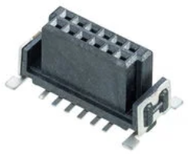

Connector Option 2:
[Mini-Fit BMI](https://www.molex.com/en-us/products/part-detail/438790027)[438790027](https://www.molex.com/en-us/products/part-detail/438790027)

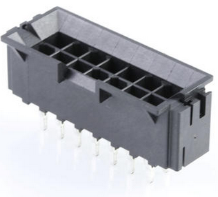

The Mini-Fit BMI is very similar to the current connector we use for the DCDC.

One issue with the Mini-Fit BMI is that it's soldered through-hole, and that means a significant portion of the masterboard will just be soldered pins. Depending on how small the Masterboard is (currently thinking ~2x6 cm) it could be the majority of the board.

This is mainly due to the wide pin pitch of 4mm. Giving a connector that's ~3-4 cm long in total.

So, for this reason, I'm going with the M55-600 connector. It is surface mount soldered, meaning PCB space on the top layer will not be a concern.

The pins are smaller, but given proper handling when putting the board in and out of its connector socket this is not an issue.

Also, I have confidence that a surface mount soldered connector will be strong. I watched [this video](https://youtu.be/faXiy0wyiH8?si=tKo3LPgQ4EjQly36&t=121) last night of a guy trying to kill a similar connector and it was fine.

**Updated HVC Junction Board Interface**

First, we need to figure out the HVC to Masterboard connections, and then which of these impact the HVC to Junction Board connection.
**
Masterboard Connections:**

- 3.3 V
- GND
- CAN H
- CAN L
- Fan PWM
- FLT
- HLIM
- LLIM
- SWD I/O
- SWD CLK
- UART TX
- UART RX

Of these, the ones that are routed to the junction board are CAN H, CAN L, SWD I/O, SWD CLK, UART TX, UART RX.

A quick note:
HLIM and LLIM have direct override control over the contactors. Ie. if HLIM or LLIM are not high, the contactors cannot be closed. This is implemented in hardware as well.

We already have CAN H, CAN L going from HVC to Junction Board because the HVC MCU's. We just have to add the SWD / UART lines.

The HVC to Junction Board Connector becomes:
1. 12 V
2. 12 V Supp (for supp fuse, making sure it's externally accessible)
3. GND
4. Can H
5. Can L
6. Dist GND (Destination: Distribution board)
7. MPPT GND (Destination: MPPTs)
8. Fault (general) (Destination:DRD)
9. Supp Fault (Destination: DRD)
10. ESTOP 12V In (Destination: ESTOP connectors)
11. Startup (Destination: Driver Startup Switch)
12. Discharge (Destination: Driver Startup Switch)
13. HVC SWD I/O
14. HVC SWD CLK
15. HVC UART TX
16. HVC UART RX
17. Masterboard SWD I/O
18. Masterboard SWD CLK
19. Masterboard UART TX
20. Masterboard UART RX

Exactly 20 pins!

> **Krish D** (Dec 2025)
>
> @Christopher Kalitin Thank you for clarifying the exact connections. This makes the signal topology between masterboard, HVC and the rest of the system quite clear!
> 
> One piece of feedback I'd like you to include for next time is to @ the relevant stakeholders. Deciding on a connector for the masterboard is directly correlated to the work that @Michael Lin needs to do for the layout, and since the DR0 is still being made, it should be made more clear that you are **asking for input** in case your connector choice clashes with a requirement.

> **Aarjav Jain** (Dec 2025)
>
> @Christopher Kalitin: I haven't gone through this with a fine toothed comb yet. However some things that jumped out

> **Krish D** (Dec 2025)
>
> @Christopher Kalitin After re-reading this, I realized some points of confusion.
> 
> It is not immediately clear which connections are going to other parts of the car from the junction board. Can you add a section detailing what are the tentative destinations for each signal?
> 
> CC: @Aarjav Jain

> **Christopher Kalitin** (Dec 2025)
>
> @Krish D
> 
> Added little notes about wire destinations.
> 
> @Aarjav Jain
> 
> - On JTAG vs. ST-Link:
> 
> - BMS doesn't have too much use for JTAG.
> - JTAG only provides 5 V, which we would need to add an extra Buck / DCDC for
> - If optimizing for a good connector, we can get a nice connector for SWD as well
> - The SW DIO, SW CLK, GND, 3V3 pins are now in the same order as they are on Nucleo's so we'll be able to use a straight 4-pin female jumper wire, minimizing risk of wiring falling out.
> 
> Overall, I don't see too much benefit to using JTAG. Not quite sure why PAS did this in the first place, how useful is hardware verification code anyway? Just so you don't spend 5 minutes manually checking for shorts with a multimeter?
> 
> 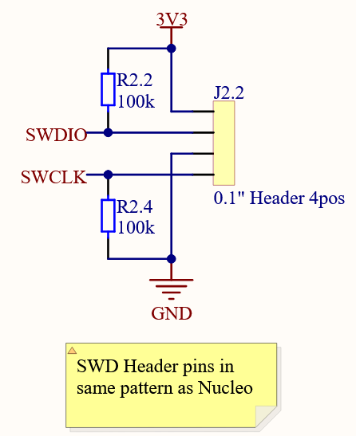
> 
> - Masterboard will have mounting screws + standoffs.
> 
> - Requirement set as "up to 60x60 mm" in Masterboard DR0.

> **Aarjav Jain** (Dec 2025)
>
> The alternative purpose of using JTAG is that we have devices which support JTAG through a standard connector as opposed to FF wires. Using FF has been a headache for EMD and BMS for the last 3 years. There is a 6pin and a 20 pin option for JTAG.

> **Christopher Kalitin** (Dec 2025)
>
> Is PAS adding a 5 V buck / LDO to all boards just for JTAG?
> 
> Embedded doesn’t need UART if they have JTAG right?

> **Krish D** (Dec 2025)
>
> @Christopher Kalitin This is much more clear. Great job!
> 
> @Aarjav Jain
> 
> Some notes regarding the destination section.
> 
> 1. For the fault & supp fault lines/wires, I believe it makes sense for the line to be directly routed to DIST, and DRD can then access the net from DIST.
> 
> I believe this would be a good idea since these nets being driven high can ensure that all LV systems are turned off immediately by directly driving the FETs/FET low on the dist to toggle off all LV systems.
> 
> Additionally another LED can be driven or blinked on the dist to ensure that if the driver more visibility during debugging.
> 
> Do you have any thoughts here?

> **Christopher Kalitin** (Dec 2025)
>
> @Krish D
> 
> If were in a fault we shouldn’t turn off all LV systems, eg. TEL should always be telling us what’s going on.
> 
> So, I’m not sure there’s purpose in routing either fault to Dist except for PAS routing reasons.
> 
> Also, if supp fault is high all LV systems are off anyway, no power source for anything.
> 
> For a DRD Supp Fault LED, we could add one but this would increase Supp current draw while it's already extremely low so it might be wise not to include it.

> **Krish D** (Dec 2025)
>
> @Christopher Kalitin I meant this should be the case for the supp_lo_fault. If the supp reaches the an extremely low value, it makes sense that we should limit all current consumption as much as possible.
> 
> Depending on what is deemed as an effective form of communication to the team that the supp is low, we could continue to let LEDs draw the current (on DIST, HVC, & DRD) and/or have TEL get direct access to the supp_fault and send this as over radio.
> 
> Would love to hear your thoughts on the tradeoffs here.

> **Christopher Kalitin** (Dec 2025)
>
> @Krish D
> 
> The definition of SUPP_FAULT is that it occurs when the Power Path Prioritizer can't output anything from Supp because it's voltage is out of the nominal range.
> 
> In such a case, no LV system (eg. TEL) can be active.
> 
> So, our only form of communication of such a fault is the SUPP_FAULT LED on the DRD & HVC.
> 
> While we're debugging we'll be able to see the HVC LED, and if the car is on the track the driver will be able to see the LED on the DRD. So, I don't think it's too useful to have a DIST SUPP_FAULT LED.

---

# Naming Convention

**Author:** Christopher Kalitin

**Date:** Nov 2025

**Naming Convention**

Header: PCB-side connector

Receptacle: Wire-side connector

I've been confused by this in the past and I think the rest of solar has. Above is what the LLMs say is the industry standard naming convention.

Note that "Housing" is reserved for the part that contains the crimps.

Examples:

Header:

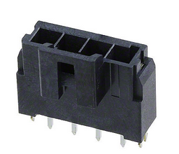

Receptacle (also a housing, since it houses the crimps):

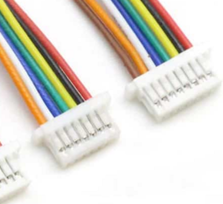

**Connector Requirements**

First, how many pins are required for each connectors:
- 2 pins: DCDC, Supp, Current Sensor, MPPT Precharge, Motor Precharge
- 6 pins: Both contactor / relay control harnesses
- 8 pins: Masterboard
- 12 pins: Fans
- 16 pins: Junction Board Harness

Simple things
- Must have reasonable per-pin current ratings (6 A is the max we need)
- Connector must be robust (eg. not too tiny with tiny pins)
- Must have reasonable stock on Digikey

Idiot proofing connectors so they can't be plugged in incorrectly is also a requirement. Having connectors with different pin counts is the easiest way to do it, obviously you won't plug a 12 pin connector into an 8 pin header.

Otherwise, connectors with the same number of pins near each other on the PCB need to have different models (eg. DCDC and Supp connectors should not be able to be plugged into each other).

One thing I'd like is that each connector header (PCB-side) has exposed pins. This way, while testing we'll be able to probe the pins.

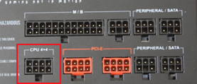

Standard ATX Power Supply connectors are a great example of this. All of those pins you could probe with a multimeter, without accidentally slipping the probe onto another pin and shorting something.

**12-pin Connectors**

I've spent some time on Digikey and put together a list of suitable 12 pin connectors. I assume most of these are also available in 6, 8, 16 pin variants, this is just a general exploration of connector space.

[Molex 0901 12POS 2.54mm](https://www.digikey.ca/en/products/detail/molex/0901301112/760948)

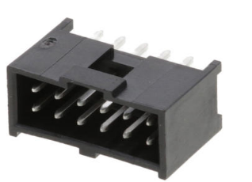

[Molex 0559 2mm](https://www.digikey.ca/en/products/detail/molex/0559171210/3263360)

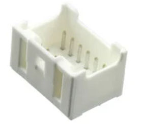

[Molex 1053 12POS 2.5MM](http://www.digikey.ca/en/products/detail/molex/1053102312/6164168)

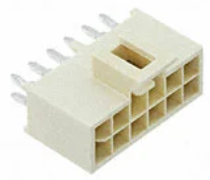

[Samtec IPL1-106 2.54mm](https://www.digikey.ca/en/products/detail/samtec-inc/IPL1-106-01-L-D-K/4365397)

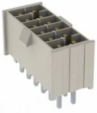

[Molex Mini-fit Sigma](https://www.molex.com/en-us/products/part-detail/1727081002)

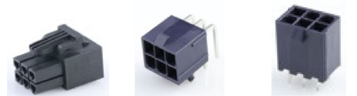

**2-pin Connectors**
[Molex Mini-fit Sigma](https://www.molex.com/en-us/products/part-detail/1727081002)

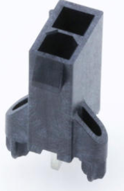

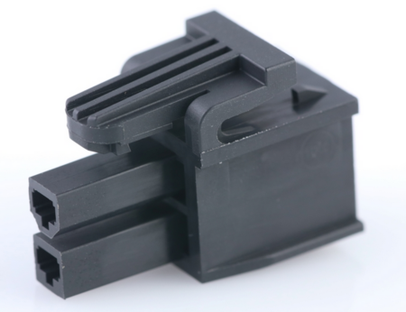

[TE Connectivity 2 pin MATE-N-LOK](https://www.digikey.ca/en/products/detail/te-connectivity-amp-connectors/350986-4/293047) 2 pos 0.25" pin spacing

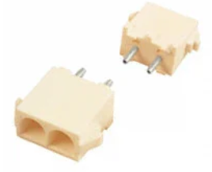

[Molex 00108](https://www.digikey.ca/en/products/detail/molex/0010844022/134541) 2 pos 0.25" pin spacing
(I believe this is the same as the one above, just with a worse datasheet and different manufacturer)

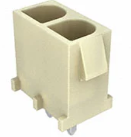

[Wurth Elektronik 66200211122](https://www.digikey.com/en/products/detail/w%C3%BCrth-elektronik/66200211122/4322246)

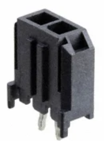

[Wurth Elektronik 66100211622](https://www.digikey.ca/en/products/detail/w%C3%BCrth-elektronik/66100211622/10239710)

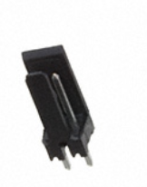

**Decision**

Everything will be Molex Minifit Sigma with the required number of pins, except where idiot proofing through disparate connectors is required and for the 16 pin Junction Board connection because no 16 pin Molex Minifit Sigma exists. Also, the 12 pin fan connector will use the Samtec IPL1 because it's slightly smaller and what the ECU currently uses (slightly bad reason, maybe I'll reconsider).

The 16 pin, 12 pin and one of the 6 pin contactor connectors (for idiot proofing) will use the [Samtec IPL1](https://www.samtec.com/products/ipl1) connector.

There are 2 pairs of 2 pin connectors, and a single Shunt resistor 2 pin connector. Each pair of connectors will be next to each other, so they must be different connectors.

2 pin connector pairs: (supp, dcdc), (MPPT PC, Motor PC).

One of the 2 pin connectors in each pair  will be the [Molex 001108](https://www.digikey.ca/en/products/detail/molex/0010844022/134541).

All other 2 pin, 6 pin, 8 pin will be [Molex Minifit Sigma](https://www.molex.com/en-us/products/part-detail/1727081002).

To sum up:

1. Junction Board - 16 pin [Samtec IPL1](https://www.samtec.com/products/ipl1)
2. Contactors A - 6 pin [Samtec IPL1](https://www.samtec.com/products/ipl1)
3. Contactors B - 6 pin [Molex Minifit Sigma](https://www.molex.com/en-us/products/part-detail/1727081002)
4. Current Sensor - 2 pin [Wurth Elektronik](https://www.digikey.com/en/products/detail/w%C3%BCrth-elektronik/66100211622/10239710)[66200211122](https://www.digikey.com/en/products/detail/w%C3%BCrth-elektronik/66200211122/4322246)
5. Fans - 12 pin [Molex Minifit Sigma](https://www.molex.com/en-us/products/part-detail/1727081002)
6. Masterboard - 8 pin [Molex Minifit Sigma](https://www.molex.com/en-us/products/part-detail/1727081002)
7. Supp - 2 pin [Molex Minifit Sigma](https://www.molex.com/en-us/products/part-detail/1727081002)
8. DCDC - 2 pin [Molex 001108](https://www.digikey.ca/en/products/detail/molex/0010844022/134541)
9. Motor Precharge - 2 pin [Molex Minifit Sigma](https://www.molex.com/en-us/products/part-detail/1727081002)
10. MPPT Precharge - 2 pin [Molex 001108](https://www.digikey.ca/en/products/detail/molex/0010844022/134541)

Connector Counts:
2 pin Molex Minifit Sigma: 2x
2 pin Molex 001108: 2x
2 pin Wurth Elektronik 66100211622: 1x
6 pin Molex Minifit Sigma: 1x
6 pin Samtec IPL1: 1x
8 pin Molex Minifit Sigma: 1x
12 pin Samtec IPL1: 1x
16 pin Samtec IPL1: 1x

4 connector models with 8 Connector parts (including different pin counts) for 10 total connections, with idiot proofing.

Furthermore, because the Supp/DCDC and Motor PC/MPPT PC pairs of 2pos connectors are on opposite sides of the board, it's possible to idiot proof it by not having long enough wires to reach to the other side of the PCB.

I might change my decisions for Samtec IPL1 vs Minifit Sigma on a few of them. The Samtec IPL1 is lightly smaller than Minifit sigma's (by 1.5mm per horizontal pin, which isn't total pins since they have 2 stacked vertically).

Some points might not be clear, for final HVC documentation I'll probably make a nice diagram when it's all nice and brought up with good images of the PCB actually routed.

I'll just vibe the decision, just touch all connectors in battery and rick rubin the decision. All vibes.

> **Krish D** (Dec 2025)
>
> @Christopher Kalitin Below are some points of feedback mixed with technical comments.
> 
> - Can you go into more details how you assigned certain components as 2 pin? Specifically, a justification for why they've been grouped that way would be ideal. It seems that you are referencing previous design choices like how the contactor and pre-charge PCB will have a total of 3 contactors/relays on it, and therefore needs 6 pins (3 x 12V + 3 x GND), therefore referencing that with a picture would make your assignment more clear.
> 
> - Noting how the signals are grouped is something that needs to be documented more clearly since requirements for the junction interface board may change (consider your point from earlier this week to add a supp_lo connection to for the DRD). Additionally, the signals from the master board need to be grouped accordingly in a header that mirrors your choice (since we are focusing on standardizing connectors) and directly influences design for @Michael Lin.
> 
> - "Idiot proofing through disparate connectors.." Just noting this as a typo
> 
> - What is the difference between contactors A and B? (Which one is NEG + DCH board vs POS + LLIM + HLIM + MPPT PC + Motor PC)
> 
> - For idiot proofing why not just make supp and motor PC different? It can be possible to constrain the wire design, but why not just purchase another 2 pos connector?
> 
> - Great job adding connector pictures, embedded links and clarifying the terminology. Good way to start the update!

> **Christopher Kalitin** (Dec 2025)
>
> @Krish D
> 
> - I'll write another update on rationalizing all choices made in this design, maybe you could tell it was really trailing off towards the end.
> 
> - I'll finalize documentation of all connectors in HVC design documentation, probably over winter break.
> 
> - Disparate is one of my favourite words!
> 
> - I don't know exactly what @Samuel Shin is naming both conntactor boards (I assume primary contactor board (PCB) is comedy Aarjav won't let us keep), so A and B is a placeholder.
> 
> - The idiot proofing can be done by limiting the lengths of the wires going to Supp/DCDC and Motor/MPPT Precharge. This simplifies the BOM, and avoids the need for using potentially suboptimal connectors, I trust the ones chosen to be robust and don't want a repeat of the slaveboard-cellboard harnesses last year.

> **Krish D** (Dec 2025)
>
> @Christopher Kalitin Sounds good.
> 
> - I shoudl've google searched disparate first LOL
> 
> - This way of idiot proofing makes sense. Please make sure to note this as integration point that **must be considered during the making of the wire harness**. I'd encourage you to also consider wire routing when the decision is finalized on the placement of the HVC on the control board.

---

# Defining Connectors

**Author:** Christopher Kalitin

**Date:** Nov 2025

**Defining Connectors**

Connectors:
1. Junction Board (16 pin 20 pin)
2. 3x Contactors + 2x Relay (POS, LLIM, HLIM, MPPT PC, Motor PC) (6 pin)
3. 1x Contactor + 1x Relay (NEG, Motor Discharge) (6 pin)
4. Current Sensor (2 pin)
5. Fans (12 pin)
6. Masterboard (8 pin)
7. Supp (2 pin)
8. DCDC (2 pin)

9. Motor Precharge (2 pin)
10. MPPT Precharge (2 pin

Note that the current plan of the contactors is to use Sensata contactors mounted directly to a PCB, this means we have have a single connector going to several contactors. Ie. instead of a 2 pin connector going to each connector we can have a 6 pin connector going to 3 contactors. This applies for relays as well (current plan is for POS, LLIM, HLIM, MPPT PC relay, and Motor PC to be on the same PCB, the primary contactor board (PCB)).

@Samuel Shin This is contingent on using through-hole PCB mounted contactors. If we have the existing control-board mounted contactors, it'll require many more wires. Hopefully Sensata responds soon.

**Wires In Each Connector**

Junction Board:
1. 12 V
2. 12 V Supp
3. GND
4. Can H
5. Can L
6. Dist GND
7. MPPT GND
8. Fault (general)
9. Supp Fault
10. ESTOP 12V In
11. Startup
12. Discharge
13. HVC SWD I/O
14. HVC SWD CLK
15. HVC UART TX
16. HVC UART RX
17. Masterboard SWD I/O
18. Masterboard SWD CLK
19. Masterboard UART TX
20. Masterboard UART RX
Taken from [Battery Interface Options doc](https://docs.google.com/document/d/1ZnLr69jU1ryMSLJ9eH1n_fhDsYKWzfe6zAO6alSrFdw/edit?tab=t.0#heading=h.xz2d9nic3yqc).
Edit: added 12 V supp so we can eliminate Supp connector.
Edit: Added Masterboard connections

Contactors 3x + Relay 2x (POS, HLIM, LLIM, MPPT PC, Motor PC):
- 12V
- POS_GND
- HLIM_GND
- LLIM_GND
- MPPT_PC_GND
- MOTOR_PC_GND

Contactor 1x + Relay 1x (NEG, Motor Discharge):
- NEG GND
- NEG POS
- Toggle Off GND
- Toggle On GND
- Supp 12V

Current Sensor:
- Shunt Pos
- Shunt Neg

Fans:
- Fan Power 4x
- GND 4x
- PWM 4x

Masterboard:
- 3.3 V
- GND
- CAN H
- CAN L
- Fan PWM
- FLT
- HLIM
- LLIM

Supp:
- Pos
- GND
This connection is coming from Junction Board in normal operation. During testing, directly from Supp. So, it has to be the same housing on junction board and HVC.
Edit: Integrated Supp_12V into Junction Board 16 pos connector, so this one is now redundant, but might be useful while debugging so I'm keeping it.

DCDC:
- GND
- 12 V

Motor Precharge:
- Motor Positive
Only one pin required.

MPPT Precharge:
- MPPT Positive
Only one pin required.

> **Krish D** (Dec 2025)
>
> @Christopher Kalitin For the junction interface board I have some questions that I'd like you to make more clear since signal choice will affect connectors on both the HVC and the masterboard.
> 
> **Junction interface board:**
> 
> -Why does dist have it's own GND? What edge case is this accounting for?
> 
> - Shouldn't there be a MB SCLK, SWD, UART TX and UART RX?
> 
> - From the battery interface doc, multiple other signals are mentioned, however don't seem continuous with your choices described in this update regarding signal grouping.
> 
> - Where is the dist_set net? Can you point me towards the Monday update that describes if this header to allowing enabling the dch circuitry with the 3 pin header is neccesary for our application?
> 
> 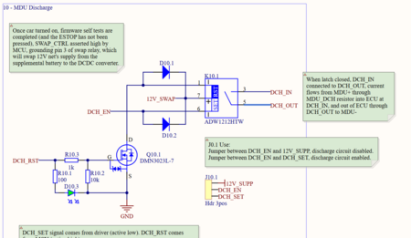
> 
> **Masterboard:**
> - I know you had asked in our slack channel about having the HVC handle fan PWM after taking in temperature data from the masterboard. You mention in your update that there should be fan_pwm connection from the masterboard. Does this mean you no longer see a benefit to the HVC handling this operation?
> 
> **Contactors:**
> 
> - Shouldn't there also be 5 signal traces for lowside actuating the contactors? It isn't clear to me where the contactor control interfaces here since you labelled it as "POS" and "GND". I'm assuming you meant to write 12V shared, POS_-, LLIM_-, HLIM_-, MPPT_PC_-, and Motor_PC_- ("-" indicates low side switched line).

> **Christopher Kalitin** (Dec 2025)
>
> @Krish D
> 
> **Junction board:**
> 
> - Distribution board has it's own ground because it's part of the startup sequence to turn it on. This is the same methodology as having every LV board togglable by the ECU in Brightside. This also delays starting boards until after swap to DCDC.
> 
> - I listed only connections going from the HVC to the junction board. So, masterboard connections and external connections (to the rest of the car) were left out. I did this before we considered mounted the master board on the HVC, changes will have to be made if we do this.
> 
> - Dist_Set would only be on HVC, not going to the junction board, because it's just a jumper.
> 
> Also, I didn't include dist_set in the discharge relay circuitry because I cannot think of a case when we don't want the discharge circuitry to be active. The MCU will always disable it during the startup sequence anyway, even if it was never turned on.
> 
> **Masterboard:
> **
> - I came to the conclusion that safety-critical communication between BMS boards shouldn't be done over CAN. Eg. the masterboard may be seeing 80 C and the HVC won't turn on fans if CAN is down. So, I decided to keep fan PWM on Masterboard.
> 
> I'll better document this decision and other Masterboard-ECU interface points in HVC design documentation.
> 
> **Contactors:
> **
> - Fixed the list to make it clearer, your understanding is correct.

> **Krish D** (Dec 2025)
>
> @Christopher Kalitin
> 
> 1. JB: I see, just a different name compared to the startup_gnd. Makes sense.
> 2. JB: Sounds good. I'll make a signal topology document so that elec system-wide signals and their function/use on each board is made more clear. (Will update in a slack message when I make it)
> 
> 3. JB: Hmm, I didn't consider that logic. Is there a time when we need to bypass it for testing purposes? Consider the example of if the trace from the MCU is experiencing an induced voltage due to bad relay/contactor placement, which drives the latching mechanism high. (I don't know if this is actual possible since an super aggressive power source would create this). Can you do a more deeper analysis to justify this and document it?
> 
> 1. MB: That makes sense. Do consider though that @Aarjav Jain has mentioned that we consider CAN being low to be a fault. Therefore, unless their is a discrepancy between the CAN PWM fan value, and the output from the masterboard's GPIO pin. The operation will be treated the same. (If a fault occurs, HVC or masterboard will drive fan PWM ~100%). I still agree that it makes sense at a design level to have the signals and their ""threshold management" being done by the masterboard and HVC is useful since it makes their roles more distinct, so let's keep it on the masterboard for now. <-  However take this as food for thought.
> 
> 1. Contactors: Look good. Let's aim to make the signal labels as clear as possible and **continuous** as possible between pages. Interpretation should be achievable with what is on the page. I'll keep an eye for this as you get closer to finalizing the schematic.
> 
> Great work so far Chris, keep up the stellar documentation!

---

