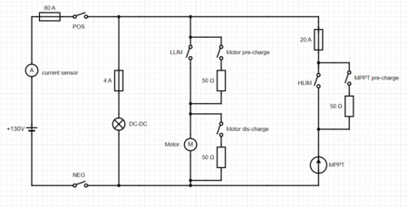
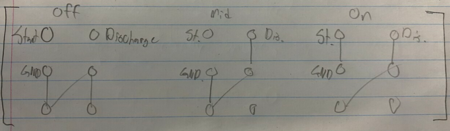
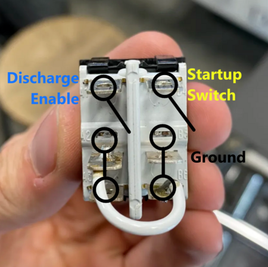
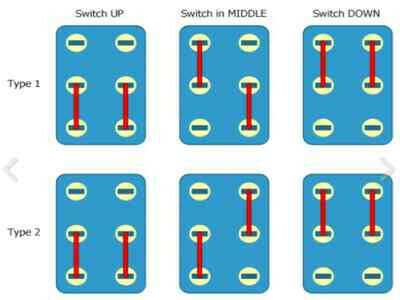
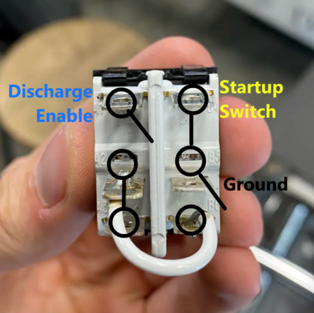
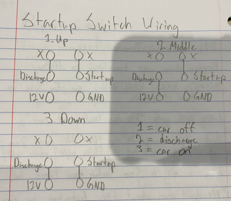
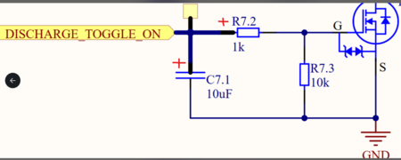
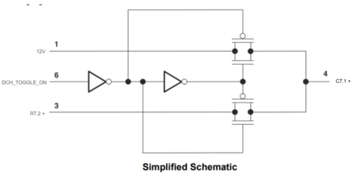

# Untitled

**Author:** Christopher Kalitin

**Date:** 17d

**12V Issue With The Previous Design**

@Krish D Pointed out that the previous design is incorrect because DCH_TOGGLE_ON would be shorted to 12V during the middle state and bottom state of the switch. Meaning we would be always discharging the motor.

Note that if Motor discharge is always on, it's effectively a 50 ohm short between pos and neg of the battery. Schematic taken from [this wiki page](https://wiki.ubcsolar.com/en/subteams/battery/docs/ecu-control-board).

I decided to rework the Discharge Resistor Toggle circuitry so that its input is 0 V instead of 12 V from the startup switch. As described in [this Monday update](https://ubcsolar26.monday.com/boards/9702086049/pulses/18134735438/posts/4850567476).

**Updated Design**

Now that the functionality is the same as the previous car (Default floating, then short DCH to GND, then short Startup to GND), we can use the same wiring as the previous car.

Here's the wiring taken from the [previous update](https://ubcsolar26.monday.com/boards/9702086049/pulses/10044512386?asset_id=2424280792).

---

# Untitled

**Author:** Christopher Kalitin

**Date:** 23d

This is a continuation of testing on V3 Brightside's startup switch.

[Monday Update](https://ubcsolar26.monday.com/boards/9702086049/pulses/10044512386/posts/4494653588) describing switch functionality

[Monday Update](https://ubcsolar26.monday.com/boards/9702086049/pulses/10044512386/posts/4497053922) describing switch rewiring & testing

Connection diagram

Overlayed connection diagram onto Brightside's Startup switch middle position.

More details are found in the updates above, here's a summary:
- The startup switch is a 3 position switch (3PST) (See connection diagram above)
- It toggles the STARTUP_GND_IN and DISCHARGE_12V_IN lines
- When STARTUP_GND_IN goes from floating to GND, the HVC starts up the car
- When DISCHARGE_12V_IN goes from floating to 12V, we begin discharging the motor controller

Switch Positions:
- Position 1 (Up) => Car off
- Position 2 (Middle) => Toggle Motor Controller Discharge On
- Position 3 (Bottom) => Car on

Trace truth table:

To implement this truth table with the 3 position switch, we'll follow this wiring:

Note that the "type" of the switch (Look at the connection diagram at the top of the update again) may be different for the switch we use.

In this case, the middle state is flipped on the vertical axis, so wiring must also be flipped on the vertical axis.

Before connecting wires to the connection, probe it with a multimeter in every state to check which "type" you have.

> **Krish D** (23d)
>
> @Christopher Kalitin  Just want to make this more clear:
> 
> - When the car is on (drawing 3), if Discharge_Toggle_On is connected to 12V, than it will FET controlling the discharge relay will be on. (Capacitor will be fully filled up, and gate voltage = 12V * 10/(10+1) = 10.9V (Vgss(max) = +/-20V and Vth(max) = 1.8, so the FET will definitely be conducting). Therefore as long as the car switch is in the ON position, the SET coil of the relay will be energized.
> 
> - This means that as soon as the car starts, the discharge resistor will be connected with the resistor, however if the MCU asserts the DCH_OFF_GND FET to conduct, than there will be a current return path for BOTH the RST and SET coils in the latching relay. This means that both coils (RST and SET are individual coils with opposing magnetic fields) will be on. The application notes for the relay also explicitly mention that: "You should avoid applying voltages to the SET and RESET coils at the same time. Parallel excitation of both coils can cause maloperation or failure to reliably latch/reset. It’s best to ensure only one coil is energized at a time with a proper pulse before energizing the next." (Got this from Chat GPT by the way)
> 
> TLDR: How can you make sure that the SET and RST coils are not on at the same time?
> 
> CC: @Hemat Wander

> **Krish D** (23d)
>
> [@Christopher Kalitin](https://ubcsolar26.monday.com/users/66779810-christopher-kalitin) A simpler solution You could also use a [SPDT latching relay IC](https://www.digikey.ca/en/products/detail/texas-instruments/SN74LVC1G3157DCKR/562895) (toggled by DCH_TOGGLE_ON) to connect the capacitor to 12V when the switch is moved from OFF-to-MIDDLE-to-ON, and then connected back to the RC circuit when the switch is moved from ON-to-MIDDLE-to-OFF. (refer to image below for where it can be placed)|
> 
> This way, you know that when the car is ON, the SET coil will not be energized, and when the car is turned off, you will still be able to energize the SET coil for long enough using the RC circuitry)
> 
> (Note that the SPDT IC I linked has an decent Rds_on... but we aren't expecting to draw current since it is used for pre-charging a 10uF capacitor)
> 
> CC: [@Hemat Wander](https://ubcsolar26.monday.com/users/66767094-hemat-wander)
> 
> 
> 
> 

---

