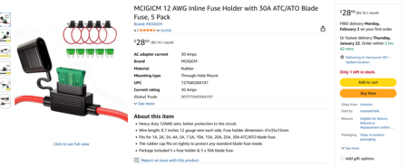
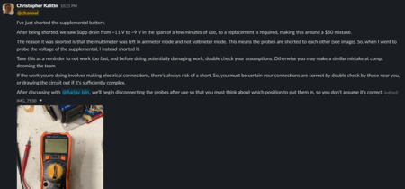

# Untitled

**Author:** Christopher Kalitin

**Date:** 17d

To ensure we don't short Supp while probing its wires directly, we'll buy an inline fuse holder.

This uses the same blade fuses as everything else in the car, so it's interoperable with every other fuse in the car.

Digikey Link:
[https://www.digikey.ca/en/products/detail/mpd-memory-protection-devices/BF353S/8119229?s=N4IgTCBcDaI...](https://www.digikey.ca/en/products/detail/mpd-memory-protection-devices/BF353S/8119229?s=N4IgTCBcDaIEIDEDMBWJBlEBdAvkA)

How I shorted Supp:

> **Hemat Wander** (16d)
>
> @Christopher Kalitin
> One thing to note: there are [multiple sizes of fuses](https://www.littelfuse.com/products/fuses-overcurrent-protection/fuses/automotive-fuses/blade-fuses-shunt) including a larger maxi size and a smaller mini size. We use mostly (if not all) mini's around the car. You might want to check it fits the correct size if you haven't already.

> **Christopher Kalitin** (14d)
>
> @Hemat Wander
> 
> Good point, we need the BF353S, not the standard size BR353
> 
> Correct link:
> 
> [https://www.digikey.ca/en/products/detail/mpd-memory-protection-devices/BF353S/8119229?s=N4IgTCBcDaI...](https://www.digikey.ca/en/products/detail/mpd-memory-protection-devices/BF353S/8119229?s=N4IgTCBcDaIEIDEDMBWJBlEBdAvkA)

> **Krish D** (5d)
>
> @Christopher Kalitin Would you be able to add this to your HVC BOM so we can purchase this alongside the other components?

---

