# Untitled

**Author:** Christopher Kalitin

**Date:** Sep 2025

We replaced the current sensor IC on the distribution board with a spare of the exact same model.

Initial results:
V_out = 1.679 V
V_ref = 1.724 V
V_delta = -0.045 V

While the Control Board is off, the values float to this:
V_out = 1.170 V
V_ref = 1.184 V
V_delta = 0.014 V

The MLX91221 sensitivity value is 25 mV / A, so a -0.045 V delta means we're registering -1.8 A on the current sensor. This is a strange result, but if it's just a constant offset between the values we can subtract this out in firmware.

ADC readings:
V_out:   1655 mV (2054 adc bits)
V_ref:    1656 mV (2055 adc bits)
V_delta: 0.8 mV (1 adc bit)

I'm writing this update in real time as notes, so I've just found a terrible mistake that gave erroneous multimeter readings before. We were using the multimeter in continuity mode, and the continuity mode was registering a voltage.

Now, multimeter on voltage sensing mode (proper values we can trust):
V_out:   1.647 V
V_ref:     1.648 V
V_delta: 0.001

Now we have replaced the current sensor and confirmed it works while there's no current over it (since we're powered by supp currently).

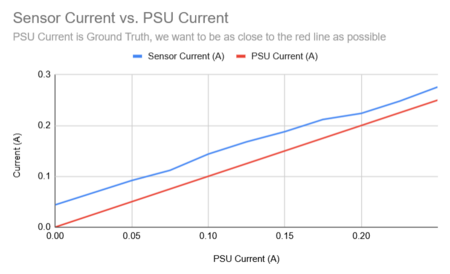

[https://docs.google.com/spreadsheets/d/1cYhZnJEjcnmW1DRI8iqKIOBfocWLhtRU9QVwHDOSeDQ/edit?gid=0#gid=0](https://docs.google.com/spreadsheets/d/1cYhZnJEjcnmW1DRI8iqKIOBfocWLhtRU9QVwHDOSeDQ/edit?gid=0#gid=0)

A few months ago I characterized this current sensor on a breadboard (not on DCDC like it is now) and found that it has a roughly constant 40 mA error (positive error, so it's higher than expected). We can subtract this out in firmware.

Sensitivity = 25 mV / A
Current error = + 0.04 A

Voltage error = 0.025 V/A * 0.04 A = 0.001 V

The voltage reading error is a single millivolt, and one adc bit (Least significant bit) is the equivalent of 0.8 mV. To make it more accurate we need to subtract 1 in firmware.

I actually already did this in this [Monday Update](https://ubcsolar26.monday.com/boards/7524367629/views/162332252/pulses/8628510380) 6 months ago.

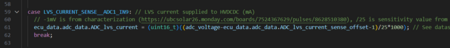

This is literally linked in the code.

> **Aarjav Jain** (Sep 2025)
>
> @Christopher Kalitin What was the mistake "I'm writing this update in real time as notes, so I've just found a terrible mistake that gave erroneous multimeter readings before."? Was it that you were in continuity mode? If so then then why does the next statement say  "Now, multimeter on continuity mode:"?
> 
> When in the flow of the update did you actually replace the current sensor IC?

> **Christopher Kalitin** (Sep 2025)
>
> @Aarjav Jain
> 
> I've updated that section to remove the line break with the next paragraph to make it clear. Also added "Now, multimeter on voltage sensing mode (proper values we can trust):", there was a typo here earlier where I put "continuity mode" instead of "voltage sensing mode"
> 
> Replaced IC immediately, first line of the update.

> **Aarjav Jain** (Sep 2025)
>
> Thanks!
> 
> @Christopher Kalitin How were you probing the voltage?

> **Christopher Kalitin** (Sep 2025)
>
> @Aarjav Jain
> Used the orange multimeter we have in the bay.
> 
> The reason I wrote this Monday update in real time is that I think my preivous updates were far too verbose. In project notes for my own projects it's far fewer words, to the point, and continuously written. For a test like the one in the update above this is a far better way or writing an update imo. Slightly overcorrected by not proof reading.

> **Aarjav Jain** (Sep 2025)
>
> Yup thats ok. Just make sure that you during the test you take the time to write the update well while testing. It feels like a burden because you are in the middle of testing but its worth it! I write my updates like this as well.

> **Aarjav Jain** (Sep 2025)
>
> @Christopher Kalitin
> 
> When I said how I meant what process and other tools were you using to ensure you do not short 2 pins?

> **Christopher Kalitin** (Sep 2025)
>
> @Aarjav Jain Forgot to include this in the update, will marginally increase effort next time.
> 
> I soldered a piece of wire to a pin on the DCDC which we wanted to probe. Alligator to the other end. Then, put electrical tape over it for good measure.
> 
> This was the sketchiest pin to probe. Most other times I just used made to female jumper wires or alligators.
> 
> 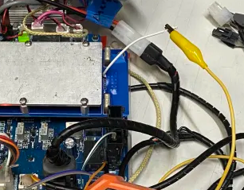

> **Aarjav Jain** (Sep 2025)
>
> @Christopher Kalitin: To confirm which pin was probed?
> 
> 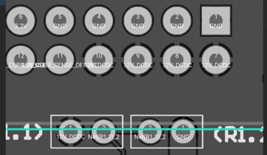
> 
> And can you confirm that the idea here is that the DCDC is off since there is no HV. Furthermore, can you confirm that supp was disconnected from the ECU and that **its terminals were taped up (the connector)?**
> 
> If thats the case then soldering on the wire is safe. Adding on the electrical tape after for good measure is required as well so great that you did that.

> **Christopher Kalitin** (Sep 2025)
>
> LVS CURR SENSE OFFSET is the one we soldered the little wire onto.
> 
> LVS CURR SENSE has a test pin, which we put an alligator on.
> 
> We had to probe both because the current reading of the sensor is a function of the difference between both voltages. Eg. By default it is 1.65 and 1.65 V. But if the reference voltage (called offset in our schematic) is 1.65 and output is 1.7, we get a 50 mV delta which corresponds with a 2 A current reading.
> 
> The supp was plugged in and ECU on for all tests. The sensor needs 3.3 V somehow, and this was sourced from the ECU (just like regular operation).
> 
> DCDC is disconnected from HV. Our goal was to get a nominal default output (~1.65 V on both pins).
> 
> Soldering directly to pads is just a debugging technique, but through hole soldering wires with connections very close to each other is a common industry technique, so I wasn’t too worried. (See image of Faraday Future e-bike BMS)
> 
> 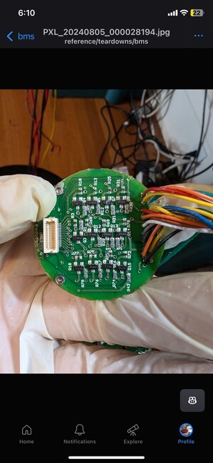

> **Aarjav Jain** (Sep 2025)
>
> @Christopher Kalitin Thanks! Great work with setting this up safely and with a concrete goal in mind!
> 
> One thing I am curious about is in the picture below
> 
> 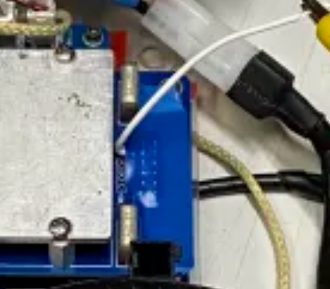
> 
> it looks like the white wire is soldered to **12V_DCDC **beside the resistors in the Altium as opposed to LVS_CURRENT_OFFSET. The 2 x 6 row has nothing soldered onto it. Could you explain this? Also could you point out where the electrical tape is?

> **Christopher Kalitin** (Sep 2025)
>
> @Aarjav Jain
> 
> What looks like a resistor in the image is actually mounting for a DNP through hole resistor. We have two of these resistors forming a voltage divider which outputs to the SC pin on the DCDC.
> 
> Correction: it isn't actually a voltage divider, only one is populated at a time. Read further
> 
> The wire isn't actually connected to a resistor there (there is no resistor), it bends to the right and connects to the back of the DCDC connector to the LVS_CURR_SENSE_OFFSET pin.
> 
> I've labelled both below:
> 
> 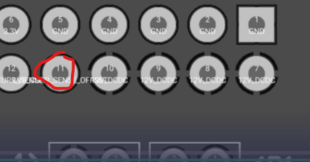
> 
> 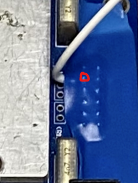
> 
> Now why do we have two DNP resistors?
> 
> Vicor datasheet:
> [https://usw.365.altium.com/librarycomponentsapi/api/v1/References/F239870F-ACB6-4292-8F7E-058931B098...](https://usw.365.altium.com/librarycomponentsapi/api/v1/References/F239870F-ACB6-4292-8F7E-058931B0987E)
> 
> 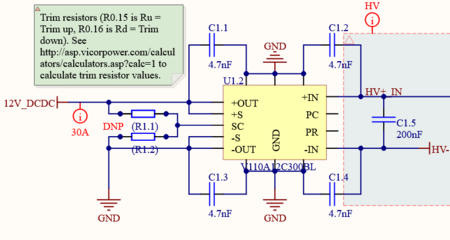
> 
> The datasheet and the note on the schematic tells us that we can use either the pull up or pull down resistors as trim resistors to get a different output voltage than 12 V.
> 
> Calculator to determine output voltage to trim resistor value: [http://asp.vicorpower.com/calculators/calculators.asp?calc=1](http://asp.vicorpower.com/calculators/calculators.asp?calc=1)
> 
> These DNP resistors exist in case we want to trim the output of the DCDC to a value slightly different from 12 V (ie. +/- 1 V). I doubt we would ever want to do this, but it's a good design principle to follow the exact implementation the datasheet tells us to.
> 
> The SC pin that can be connected by either (R1.1) or (R1.2), the value of these resistors determines output voltage.
> 
> Also, the DCDC itself has internal faults. The SC pin is pulled low by the DCDC if there is a fault. DCDC internal faults include input undervoltage, input overvoltage, overtemperature, etc.
> 
> When researching the next DCDC I'll look into this.
> 
> 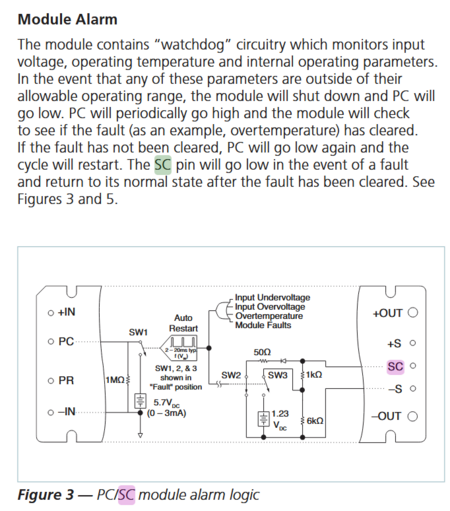
> 
> @Krish D @Samuel Shin @Hemat Wander You all might find this interesting as well

> **Aarjav Jain** (Sep 2025)
>
> @Christopher Kalitin: Very interesting! Looks like there is some FW logic going on here? In that case can we read this PC pin for a fault potentially. How exactly do we reset PC though if it latches?
> 
> Thanks for clarifying the setup and where the white wire is soldered onto.
> 
> How can we use this feature of a DCDC to our advantage for safety?

> **Christopher Kalitin** (Sep 2025)
>
> @Aarjav Jain
> 
> Fixed Datasheet Link: [https://www.mouser.com/datasheet/3/1228/1/ds_110vin-maxi-family.pdf](https://www.mouser.com/datasheet/3/1228/1/ds_110vin-maxi-family.pdf)
> 
> Checking the datasheet again, it looks like the faults are all analog and in hardware, the same way we do over current faulting on ECU rev 2.0.
> 
> PC pin can either be pulled low (<2.3 V) by us to disable the DCDC, or it can be observed to know whenever a fault occurs, but not what type of fault has occurred.
> 
> In the case that the DCDC faults and stops outputting voltage, we won't have any need to read the state of PC because we'll have already ran out of power.
> 
> An idea for the HVC is to automatically switch back to Supp if the DCDC ever fails. I'll brainstorm ideas for implementing this.
> 
> 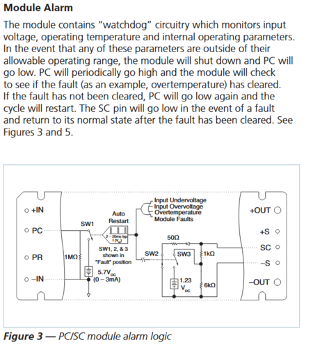

---

# Untitled

**Author:** Christopher Kalitin

**Date:** Sep 2025

We did 4 tests, with the LVS Current Sensor:
1. Record ADC Values of LVS_CURR_SENSE and LVS_CURR_SENSE_OFFSET
2. Take DCDC off and record same values (as a control)
3. Put DCDC back on and probe LVS_CURR_SENSE with a multimeter

4. Still with DCDC on, probe LVS_CURR_SENSE_OFFSET

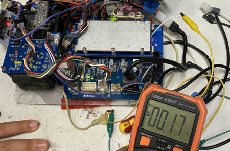

*(Figure 1) Notice the while wire we soldered onto the DCDC to probe LVS_CURR_SENSE_OFFSET.*

The LVS_CURR_SENSE_OFFSET trace does not have a test pin and we did not want to probe it directly with a multimeter, because ~6 months ago this is how I shorted 3V3 and GND on the ECU, bricking it.

To record adc values / voltages we added prints in firmware and flashed the ECU.

Results of test 1 (DCDC on, ADC values):
LVS_CURR_SENSE: 8 mV
LVS_CURR_SENSE_OFFSET: 211 mV

The offset voltage should be ~1.8 V (by the [MLX91221 datasheet](https://usw.365.altium.com/librarycomponentsapi/api/v1/References/E27D921F-27F5-4C77-8757-A7F2D2546201)), and we see 211 mV in the case when the DCDC is connected to the ECU. Already, the current sensor is clearly fried.

Results of test 2 (No DCDC):
LVS_CURR_SENSE: 1793 mV
LVS_CURR_SENSE_OFFSET: 1647 mV

We already see that taking off the DCDC results in a very different voltage than with it on.

Note that without the DCDC on, the both pins should be floating (no pull up or down resistors). The only thing on the trace is a 100 nF capacitor.

The image below shows the raw real-time adc voltage readings we saw after turning on the ECU, and a clear ramp is visible (start at 635 mV, end at 992 mV). A few seconds later, the voltage settles to 1793 mV for LVS_CURR_SENSE, and 1647 for the offset.

We confirmed the voltage is actually ramping (not just an ADC issue) by probing it with a multimeter.

We don't expect any kind of voltage ramp on this trace because it should be float. The 100 nF capacitor for some reason is building up a ~1.8 V potential over itself. I'm not sure of the reason for this, but it at least serves as an exercise for why pull up/down resistors are useful.

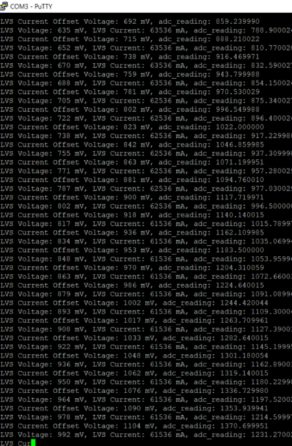

Results of test 3 / 4 (DCDC On, Multimeter on both pins relative to GND):
LVS_CURR_SENSE: ~0 mV
LVS_CURR_SENSE_OFFSET: 170 mV

This test is the same as Test 1, but recording voltages with a multimeter instead of the ADCs. We see the same results, so it's not an issue with the ADCs. Absolute confirmation that the current sensor IC is fried.

Next Steps:

After this analysis, it seems clear that there is no fundamental issue with the implementation of the current sensor on the DCDC. We have used this current sensor on breakboards before so we can narrow down the issue to this specific IC being fried for some reason, and over a year ago (it also wasn't working at 2024 comp).

To regain LVS current sensing on ECU rev 2.0 we can replace the IC (we have extras last I checked ~1 month ago for control board current draw characterization).

It must be decided if this is data we want from the driving day around November. It's not particularly critical to anything except HVC DCDC sizing, for which we have other analogs (our existing assumptions around current draw).

> **Samuel Shin** (Sep 2025)
>
> What happened after TODO? Are we still thinking?

> **Christopher Kalitin** (Sep 2025)
>
> Sorry drunk give me a day didn’t finish in time before class

> **Aarjav Jain** (Sep 2025)
>
> @Christopher Kalitin once you get a chance remember to add what TODOs there are.

> **Christopher Kalitin** (Sep 2025)
>
> Did this earlier and mentioned it in a slack comment.
> 
> Most important todo is determining if we want to put effort into replacing the current sensor before the driving day to get good data for HVC design, or if other HVC tasks should be prioritised.
> 
> I don’t expect replacing the current sensor to be particularly difficult, so we should spend an hour or two doing this to get concrete data for DCDC current capacity requirements.
> 
> CC:

> **Krish D** (Sep 2025)
>
> I agree. I realized we just need to take off the DCDC converter and swapping out the IC isn't terribly difficult at all. Worth the time for sure.
> 
> @Aarjav Jain

> **Aarjav Jain** (Sep 2025)
>
> @Christopher Kalitin @Krish D @Samuel Shin I agree lets replace the IC. What is the model number of the IC? @Christopher Kalitin you said we have the same current sensor IC in the PVA box?

> **Christopher Kalitin** (Sep 2025)
>
> @Aarjav Jain
> 
> MLX91221
> [https://usw.365.altium.com/librarycomponentsapi/api/v1/References/E27D921F-27F5-4C77-8757-A7F2D25462...](https://usw.365.altium.com/librarycomponentsapi/api/v1/References/E27D921F-27F5-4C77-8757-A7F2D2546201)
> 
> I feel like I remember seeing it in either the PVA box or in another parts box we have. Will check tomorrow evening. If we don't have the exact model, another one with the same footprint can be used.
> 
> If we don't have anything that'll work, I have a ACS711ELCTR-25AB-T which has the same pinout except for the lack of a voltage reference output (internal constant 1.65 V).

---

# Untitled

**Author:** Christopher Kalitin

**Date:** Sep 2025

Test plan:

LVS Current sensing stack:
1. Current sensor outputs two voltage, sense voltage and reference voltage
2. STM32 reads voltage and outputs adc bits (0 to 4095)
3. ADC value converted to voltage reading in firmware
4. Voltage converted to current reading in firmware using formula from the datasheet
5. Current data sent in CAN message to TEL board or PCAN
6. CAN message read by sunlink and outputted to Grafana

The failure mode we saw is that the LV current sensor was always outputting 25 A +/- 1 A. The current reading fluctuated a little bit with time but stayed around 25 A. We noticed this after comp when looking at InfluxDB data.

We don't have any insight as to where in the stack the error is occuring, so we will have to work our way down each step to find where we don't get expected values.

First, we will probe the LVS_CURR_SENSE and LVS_CURR_SENSE_OFFSET lines on the ECU and manually (in google sheets) convert the voltage difference between the two to a current reading value.

Current sensor datasheet: [MLX91221KDC-ABF-050-SP](https://usw.365.altium.com/librarycomponentsapi/api/v1/References/E27D921F-27F5-4C77-8757-A7F2D2546201)

The current sensor has a sensitivity of 25 mV / A.

First, we will need current to be drawn from the DCDC, which requires the control board to be in the pack. Previously we derived the [current vs time graph of the control board](https://ubcsolar26.monday.com/boards/9565350285/pulses/9721351653/posts/4389304604) so we know what current to expect.

Second, to test firmware, we need to print intermediate value at every applicable point in firmware. Eg. ADC value, voltage, and current.

Third, we can check if the UART printed value is the same as what is displayed on Grafana (through PCAN on the bay computer). If this is incorrect, we'll consult with Aarjav (resident Sunlink expert) to track down the issue further.

Previous theory on what is wrong, just for future reference:

My intuition is our firmware is the issue.

The LVS current sensor value on Influx from comp is ~25 amps +/- 1 amp, meaning it changed slightly over time.

With a sensitivity of 25 mV / A, this amounts to a 0.625 V error (if we expect 0 A).

Given that the current on influx changed over time, I think it's a firmware
issue and not hardware (from which I would expect a different failure
mode).

> **Aarjav Jain** (Sep 2025)
>
> Nice. @Christopher Kalitin once you get a chance update with the results!

---

# Untitled

**Author:** Samuel Shin - BTM Member

**Date:** Sep 2025

[Link to previous steps](https://ubcsolar26.monday.com/boards/7524367629/pulses/8628510380); for the new design, we want to implement LVS current sensor, and to make sure we understand how it works and why it wasn't working for Brightside BMS (Failure mode), we are continuing this project.

---

