# Untitled

**Author:** Christopher Kalitin

**Date:** Oct 2025

Aarjav and I did a quick 30 minute test to confirm end-to-end discharge relay operation. Our goal was to use a multimeter to probe between ECU GND and ECU Startup Set and only see continuity when we are in the middle state of the startup switch.

This is an end-to-end test using the startup switch, distribution board, and ECU. Before we only used the startup switch.

These were results we got when we were in the middle state of the startup switch (discharge state):

When we probing ECU GND to ECU Startup Set we saw no continuity, but the DMM in continuity mode reported a 1.5 V voltage drop (it automatically went into diode mode).

This result was not what we expected. We wanted continuity between ECU GND and ECU Startup Set when we are in the discharge state (middle state of startup switch). We instead saw no continuity.

Next, we probed ECU GND and ECU Startup Switch relative to the distribution boards GND. We wanted to see that the ECU to Distribution board was not the issue.

*This table shows the state of ECU traces relative to Dist GND (We are probing Dist GND with the black probe of the DMM, and the given ECU trace with the red probe of the DMM).

*From the table above, we see that if we measure relative to Dist GND the state of ECU Startup Switch equals ECU GND when we are in the discharge state (as expected), and is floating when we are in the off state (as expected).

This suggests the ECU GND and ECU Startup Switch are at the same state when we are in the discharge state, as expected. However, as mentioned before, we couldn't get continuity between these two points directly.

This effectively indirectly suggests discharge is working, however we couldn't prove this directly.

A possible next step is to test continuity over the discharge relay itself while the control board is on, getting closer to conditions while driving instead of a very focused test.

A final test we'll do is to check if the motor controller terminals hold 100 V when the car is off, which we'll do when the motor is fixed and back from Mitsuba.

> **Hemat Wander** (Oct 2025)
>
> I'm confused what the purpose of testing the continuity of ECU GND and ECU Startup Switch was. Why not just test the "continuity over the discharge relay itself while the control board is on" first, that seems like the simplest end to end test of if the relay is discharging correctly.
> 
> Also, what do the values in the chart mean? Resistances? Why is there a 6.5 k resistance only?

> **Christopher Kalitin** (Oct 2025)
>
> @Hemat Wander
> 
> Testing continuity over the discharge relay requires the control board being on. We only have ~25 minutes for the test so didn't do this.
> 
> We first used a DMM in *continuity mode* and it reported resistance. Then, with the DMM in resistance mode we got 6.5k ohms from between those two ECU nets and Distribution board GND. This is particularly strange, since we expect all grounds to be shorted to each other.
> 
> 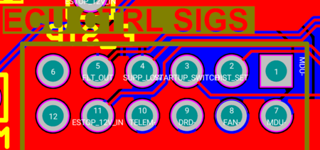
> 
> I've looked at the Altium and it's actually not strange.
> 
> We only had the ECU CTRL SIGS connector on the distribution board plugged in, so Dist GND and ECU GND were not connected. The 6.5k ohm path must have been through one of these LV connections.
> 
> Supp Low and Fault Out are pulled to ground on each PCB through 13k ohms of equivalent resistance each. This gives a net equivalent resistance of 6.5k.
> 
> This perfectly explains the behaviour we were seeing.
> 
> The useful conclusion here is that we rushed into this test while not fulling understanding the system. For a 25 minute test, not a bad result.
> 
> Now that the strange result is accounted for, I can confidently come to the conclusion that the circuitry for closing the discharge relay is all functional. @Aarjav Jain
> 
> ECU:
> 
> 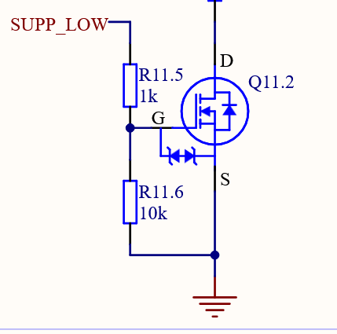
> 
> Dist:
> 
> 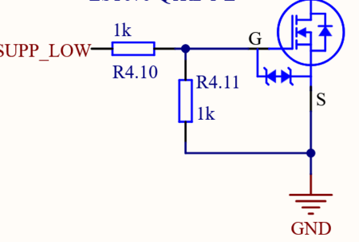
> 
> @Hemat Wander Also, you used a 1k for pulldown on Supp Low and Fault Out on the distribution board while the ECU uses 10k's. This means you form a voltage divider and instead of Supp Low's gate being 3.3 V * (10/11) it is 3.3 V * (1/2) <- basic voltage divider math.
> 
> If 1.65 V is not above Vgs(th), the FET wouldn't be well into the conducting regime and the LEDs would not work.
> 
> I made this same mistake on one of my PCBs and asked Mischa about it on Slack a while ago.

> **Hemat Wander** (Oct 2025)
>
> That's a good catch, considering the old distribution board rev also missed this. According to the datasheet, the max VGS(on) is 1.8V, so we just got lucky with the FETs we got being under that VGS(on). I think PCB checklist includes accounting for this.
> 
> 
> 
> (That or we are running the FETS in resistance mode instead of saturation mode?).
> 
> Also, where did you get the 13k pull down to ground from. Isn't it 11k on the ECU and 2k on the distribution board?

> **Christopher Kalitin** (Oct 2025)
>
> I got 13k between ECU GND and Dist GND. With two of these Req=6.5k.

---

# Untitled

**Author:** Christopher Kalitin

**Date:** Sep 2025

Today we rewired the startup switch.

This is the configuration we used:

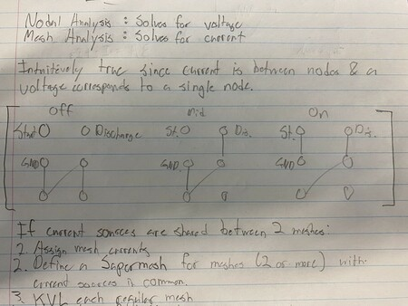

From the previous Monday Update I determined that the middle wiring of the switch was flipped on the vertical axis from what was expected. Ie. instead of top right being shorted, top left was shorted.

This meant that motor discharge did not connect to ground when expected.

While disassembling the connector today I realized that once you take apart the switch and housing portion, if you flip the switch 180 degrees, the middle switch configuration flips as well.

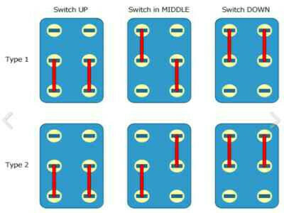

The diagram above illustrates the change that occurs, by flipping the switch portion 180 degrees, we change how the middle portion of the switch works and which contacts gets shorted to which.

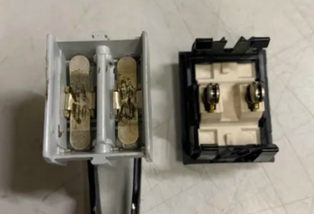

This image shows the housing (left) and switch (right).

This is all to say that when disassembling the switch yesterday I may have put the switch portion (not housing) back in incorrectly (rotated 180 degrees), changing the behaviour of the switch. So, it may have been perfectly fine before and we actually did enter motor discharge (Assuming we were in the middle state for >15 ms, see previous updates).

Regardless, the switch is in a different configuration now so I rewired it (before realized my mistake when reassembling).

These two images show the configuration now

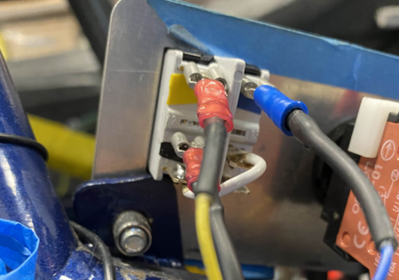

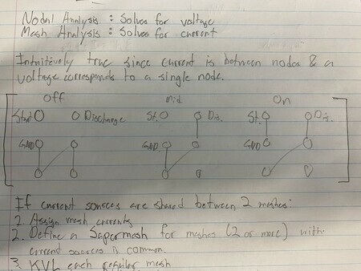

Once the wiring was completed, we could do the test to see how long we're in the middle state of the switch, and if this is >15 ms for motor discharge to occur.

As mentioned in the testing plan 2 Monday Updates ago (the first one in this thread), we hooked up a PSU to the ground terminal of the switch and probed the motor discharge terminal with a oscilloscope (scope negative to PSU GND).

We attempted to flip the switch very quickly, in a single motion. We found that in this case we are in the middle state of 4-6 ms.

Testing data and visualization scripts are available here:
[https://github.com/UBC-Solar/solar_tools/tree/user/CKalitin/startup-switch/projects/startup-switch](https://github.com/UBC-Solar/solar_tools/tree/user/CKalitin/startup-switch/projects/startup-switch)

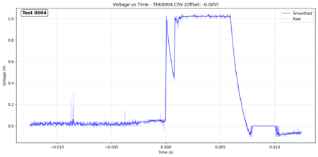

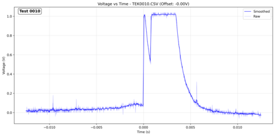

When we did tests while slightly more carefully flipping the startup switch, we saw a 25-50 ms period in the middle state. When flipping the switch this way, we heard two audible clicks for each state change, instead of a single click sound (of the two combined state changes in the 5 ms total time).

So, for further Brightside testing we should get the drivers to carefully flick the startup switch, such that they hear two clicks and not one combined click. In this case the motor discharge relay will have current running through it's coils for long enough to enable motor discharge.

In the future, we either need an RC circuit solution so that the brief current spike can be extended (maybe controlled a FET). Or, we can use a normally closed switch for discharge, that we open whenever we want to drive. These solutions will be explored when designing HVC circuitry.

> **Aarjav Jain** (Sep 2025)
>
> @Christopher Kalitin
> 
> 1. Is the first picture your class notes?
> 
> 2. The point about flipping the inside 180 degrees is very important. That is something that could cause serious damage to the motor or injure someone if they are working near a high voltage motor controller when the car is off (expected to be denergized). **What methods can we use to make sure the switch is put back together correctly? Is there a marking that tells us how to put the switch back together correctly? **In addition, lets formally document the internals of the switch by creating a Wiki page on its inside and how we use its wiring. Do this in the BMS wiki and use your explanations (the media and words are great!).
> 
> 3. Excellent attention to detail for documenting! Using solar-tools, and making a README.md with the monday update is extremely important. Great work and keep it up!
> 
> 4. Sounds good for exploring the circuitry for the HVC. Interested to see what you design!

> **Christopher Kalitin** (Sep 2025)
>
> 1.
> 
> Elec 204 was slightly boring so I took a few minutes to figure out the switch problem (this wasnt taught in the class).
> 
> 2.
> 
> Will write a wiki page on startup, great idea.
> 
> No markings on the switch to make this clear, on Brightside the only solution I see is being aware of it. For V4 we could do away with the 3 position switch and use a different circuit for discharge to eliminate this risk.

> **Krish D** (Sep 2025)
>
> @Christopher Kalitin Great job documenting this properly and getting the diagrams up. When you create that wiki page, feel free to also take the note off of the ECU schematic explaining how it works.
> 
> What do you think should be the next course of action? Is there any other tests to consider?

> **Aarjav Jain** (Sep 2025)
>
> @Krish D Why not keep the note on the schematic still? Or what note are you referring to?

> **Christopher Kalitin** (Sep 2025)
>
> @Krish D
> No next steps to do with this. Sam and I validated with a multimeter on the distribution board startup switch connector that startup switch and discharge enable lines in fact get grounded when we want them to.
> 
> All that's left is redesigning this for HVC, which comes later.
> 
> @Aarjav Jain @Krish D
> I don't think there is any note on the ECU schematic explaining how it works! Since I first heard about startup in term 1 last year it remained mostly a mystery and I'm not sure Mischa pointed us towards any good docs.
> 
> Now, all will be documented in detail in PCB design notes / documentation.

> **Krish D** (Sep 2025)
>
> @Christopher Kalitin @Aarjav Jain I thought it may be worth testing when we get back the motor controller if discharge still works or not. It may be stated that it takes 15ms of current flowing from GND for the DCH latch to connect/disconnect the dch resistor, however it's still worth checking if this occurs properly or not.
> 
> Please correct me as I'm unsure about your wording from the monday update, but did you and @Samuel Shin check if their was continuity across the HV side of the latch with the DCH resistor? (not just DCH_EN - which is showing how long the latch is in contact with the GND path from the startup switch)? If this was done, than the team can definitely proceed with caution going into further testing

> **Christopher Kalitin** (Sep 2025)
>
> No pack in car or control board in pack so we couldn’t test it end to end. We just probed the distribution board connector with a multimeter and got the expected result.
> 
> We should absolutely test if the motor actually discharges when it comes back. Extremely important task, possibly can be done with new recruits.
> 
> On whether or not it takes 15 ms, I mostly trust the data sheet here. When doing circuit design for the HVC we’ll use a very different circuit so I’m not sure this is the most useful test we can do during the next meetings.

> **Krish D** (Sep 2025)
>
> @Christopher Kalitin
> 
> Sounds good. Thanks for noting it's importance!
> 
> For now, can you check if the high voltage side of the latch becomes continuous when flick the startup switch fast vs when you slowly flick the switch to ensure it is in the middle pos for longer than 15ms?

> **Christopher Kalitin** (Sep 2025)
>
> @Krish D
> 
> We could do this on Saturday. It would require the distribution board and control board to be near enough to the car for the wires to reach, we can put it on the trolley.

> **Hemat Wander** (Oct 2025)
>
> @Christopher Kalitin Did you guys ever complete this test?

> **Christopher Kalitin** (Oct 2025)
>
> We did not. If anyone is free right now we could do it now in 30 mins.

---

# Untitled

**Author:** Christopher Kalitin

**Date:** Sep 2025

On Saturday I was not able to complete the startup switch test detailed below where I would have seen on an oscilloscope how long we stay in the middle state of the switch and toggle the motor discharge relay. This is because I discovered that the startup switch wiring is incorrect and by my assessment, we currently never discharge the motor because the motor discharge line never gets pulled to ground.

Switch Model Number:[2644A APEM2](https://www.digikey.ca/en/products/detail/apem-inc/2644LH-2A212000L0/10447877)

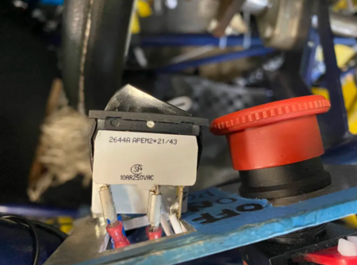

Initial wiring of the switch:

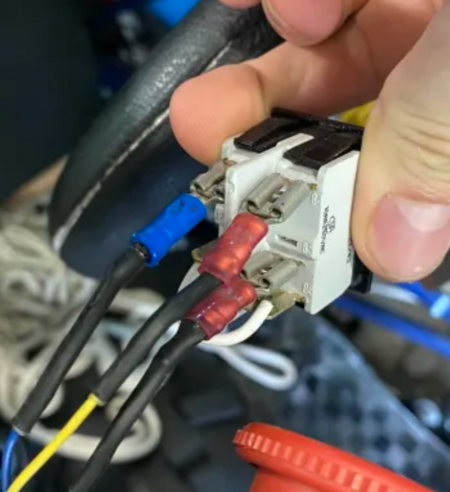

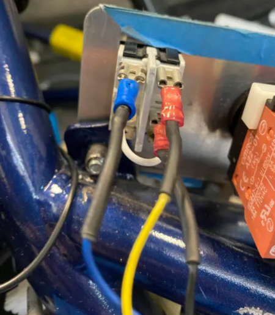

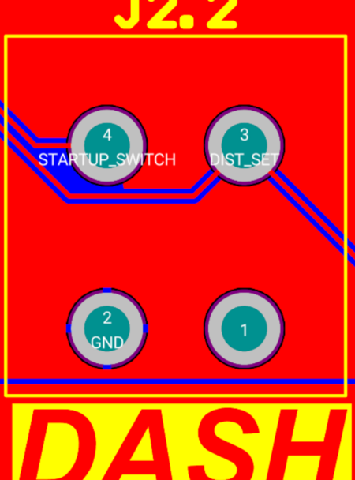

I used the distribution board startup switch connector and pinout to cross reference which wire went to what.

After documenting the initial switch setup, I got a multimeter and observed which contact are shorted in each switch position.

**OFF**

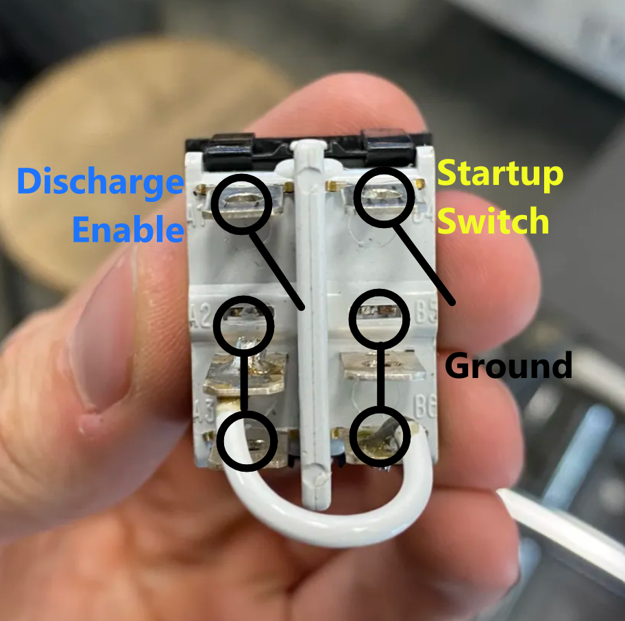

**MIDDLE**

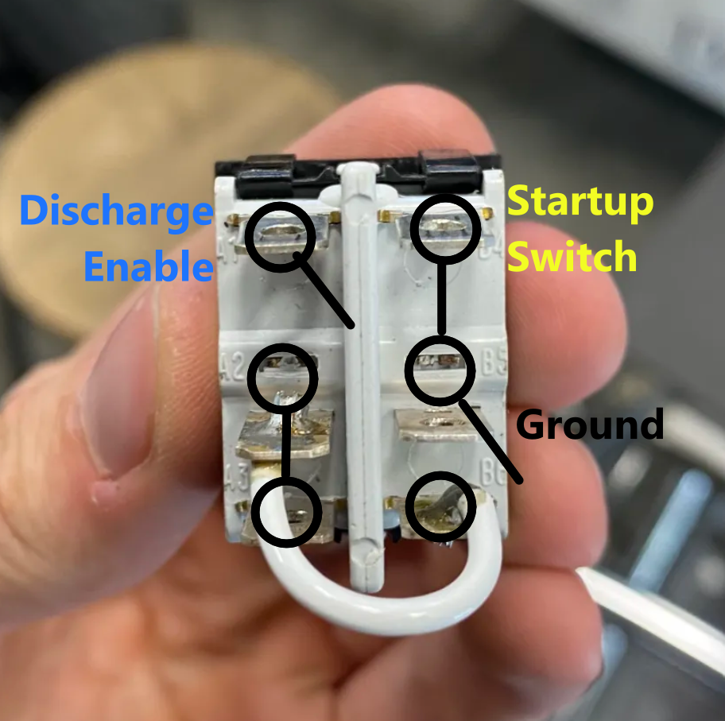

**ON**

Note that the white wire in the image shorts the bottom right contact to the left middle contact.

We see that in the OFF state, both motor discharge and startup are disconnected from ground.

In the middle state startup is connected to ground.

In the ON state startups switch remains connected to ground.

Notice that in none of the states does the discharge enable line get connected to ground, meaning we never discharge the motor. We are never discharging the motor and it is holding its high voltage until it self discharged.

To find the root cause of why this mistake occurred, we can examine the rocker switch we are using.

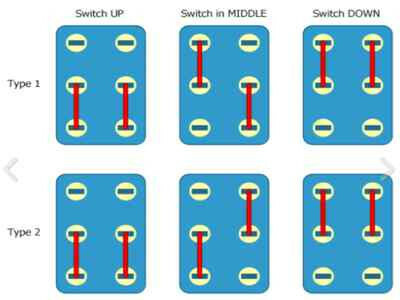

Above is a diagram of the standard states of a DP3T Rocker switch. Notice that if in the MIDDLE state you flip the shorted connections on the vertical axis, we now connect GND to Discharge Enable.

(Because GND shorts to the right bottom contact, which is connected to the left middle contact, which shorts to the top left contact, which is discharge enable).

It could have been a simple mistake by the individual who initially set up the motor discharge circuitry where they didn't fully understand which contacts were being shorted in the middle state.

Finally, here are some images of the internals of the switch:

Note it's called a "Rocker" switch because the armature (right, first image below) "rocks" between states, like a rocking chair.

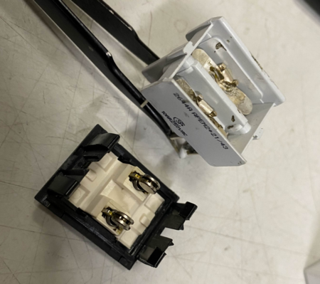

Here's a diagram that might help describe the states of a DP3T rocker switch (bottom left):

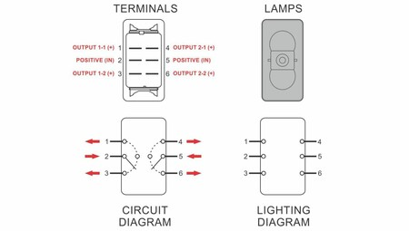

> **Hemat Wander** (Sep 2025)
>
> @Christopher Kalitin
> Wait, I'm a little confused on what the correct wiring would be. So the goal is to have DCH_EN connected to GND while in the middle position and have STARTUP connected to GND while in the on position. So when transitioning from the middle position to the on position we would have to both make DCH_EN go floating and connect STARTUP to GND.
> 
> However, it seems that a rockerswitch only switches one "nets" state at a time. "state" in this case means if its connected to GND or floating. So wouldn't it be impossible to make this circuitry work with a rocker switch?

> **Christopher Kalitin** (Sep 2025)
>
> Yes thats the right goal:
> 
> 1. Both floating
> 
> 2. Discharge to GND, Startup floating
> 
> 3. Discharge floating, Startup GND
> 
> In the middle state, if we flip the switches on the vertical axis (mirror horizontally), we’d have discharge shorted to GND while startup switch is still floating.
> 
> By leveraging the “diagonal” switch state in the middle state we can achieve this.
> 
> Does this make sense?

> **Hemat Wander** (Sep 2025)
>
> Ohhh I see, I didn't consider the effect of the white wire shorting the bottom right to the middle left.
> 
> So, that makes it so when startup gets connected to GND, the bottom right gets disconnected from GND, which thereby disconnects the Left from GND.
> 
> Or at least that's what we would want to happen, but we wired it incorrectly.

> **Christopher Kalitin** (Sep 2025)
>
> Yes exactly

> **Christopher Kalitin** (Sep 2025)
>
> Today we will rewrite the startup switch by this diagram and test the time we spend in the middle state as described by the previous test plan.

---

# Untitled

**Author:** Christopher Kalitin

**Date:** Sep 2025

On V3 Brightside we have a 3 position startup switch.

- Position 1: Everything floating

- Position 2: Discharge Enable circuit grounded

- Position 3: Startup Relay Control circuit grounded

Our discharge relay is a latching relay, which means it needs a 15 ms current pulse to change state. Read more in [ECU rev 2.0 design documentation](https://docs.google.com/document/d/1QM3zkZ5lr_cZ472EEUCi2zeDzIvVOQBL3wgIkjYbXAc/edit?tab=t.0) section 9.

This is an issue because the current only flows through the discharge relay while the Discharge Enable trace is grounded, which is in the middle state of the 3 position startup switch (which the driver flips). If the driver flips the switch too quickly, we won't discharge the motor. This is a safety risk because VDX or PAS members may work with the motor or motor controller in this state.

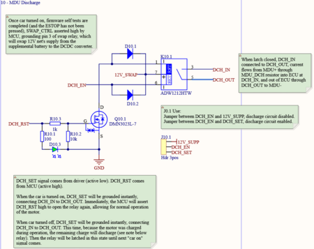

To confirm if this is a significant issue, we'll run a test to find out how long we are in the second position of the startup switch.

We'll use a power supply to apply 5 V to one of the terminals. Then, we'll put an oscilloscope between the other terminal of the startup switch and ground. When the terminals are shorted to each other the oscilloscope will read 5 V, and when disconnected it'll be floating.

A possible failure mode is that when the terminals are disconnected from each other the terminal we're probing remains at 5 V instead of being truly floating. If this is the case, we can put a pull down resistor on the terminal.

> **Aarjav Jain** (Sep 2025)
>
> @Christopher Kalitin. Great attention to detail! Have you made an update on the results of this test?

---

