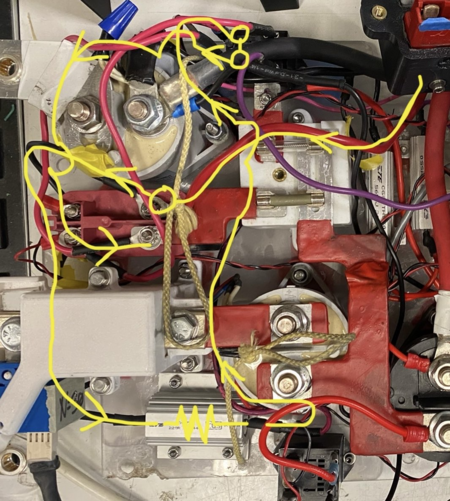
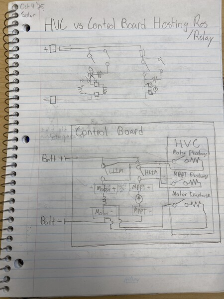
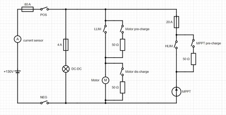
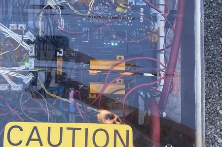

# Untitled

**Author:** Christopher Kalitin

**Date:** Oct 2025

The HVC will have a high voltage section of the PCB and pre/discharge resistors increase routing complexity of the control board. So, we can consider mounting high-power resistors on the HVCs high voltage section.

HVC High Voltage section responsibilities
1. Host DCDC
2. (Potentially) host shunt current sensor uV reading IC
3. Host discharge relay (based on ECU rev 2.0)

This HV section is already significant enough that adding high-power resistors to the HVC is not a massive change.

Benefits of Resistors on HVC:
- Fewer bolts through control board (Less metal near cells, so the risk of those bolts falling in is elimiated)
- Cleaner Control Board Routing
- Integrate relays next to resistors directly onto PCB
- Greater control board packaging efficiency

Cons:
- ~$10-20 more expensive PCB
- Heat could sink into the PCB (Relatively minor since pre/discharge resistors aren't active for long and don't sink too much power)

Because under this concept pre/discharge resistors would be directly mounted to the HVC, we can also integrate the pre/discharge relay's onto the HVC, saving every more space and simplifying routing.

Note that the current discharge relay is already integrated onto ECU rev 2.0 because it's a latching relay, dissimilar from the others.

A common theme in all the pro's for this concept is that they are marginal steps in the direct of an ideal design. This isn't a grand idea that will significantly increase performance, but a marginal step in the direction of the ideal perfect battery pack.

*(Figure 1) MPPT precharge full current path.*

As an exercise, I decided to illustrate the path current takes while we are precharging the MPPTs. Such a convoluted current path as is shown above should be avoided in the next pack, and integrating precharge resistors / relays onto the HVC solves the majority of the problem.

> **Aarjav Jain** (Oct 2025)
>
> @Christopher Kalitin did you see my questions for this change? Not sure if it was in a different monday update?
> 
> `1. Why does moving the resistor from CB to HVC increase the amount of room on the CB?
> 
> 2. Draw out a diagram of having the resistor on the CB vs the HVC with all the relevant wiring. I am having trouble imagining if resistor on HVC is better.

> **Christopher Kalitin** (Oct 2025)
>
> @Aarjav Jain
> 
> I did not see the questions and can't find them in 2 minutes of searching, can you point me towards them.
> 
> Because relays and resistors are integrated next to each other and wires are routed as traces instead of physical harnesses, we can shrink distance margins. Relays on a PCB will also be smaller.
> 
> I'll draw a diagram

> **Christopher Kalitin** (Oct 2025)
>
> Here’s a diagram. The bottom half shows my concept where resistors and relays live on the HVC, and we have wires going across the Control Board to the relevant points (Eg, between LLIM, for a parallel resistor across it).
> 
> The big reason I wanted to move resistors and relays to HVC was to simplify routing. Another way to do this is for Control Board design to be very deliberate with selecting where to place components.
> 
> I’ve attached Hemat’s control board circuit diagram. If our physical design matches this schematic, routing will be extremely simple.
> 
> My design would have more HV current paths around the pack (since HV needs to go to HVC for the resistors). If we follow the schematic, then we just need LV connections from the HVC to the relevant relays.
> 
> Routing advantages from my idea are counteracted by having more HV wires across the control board. Note that these aren’t very high current paths, and their resistance isn’t an issue (they go to an resistor anyway).
> 
> I now think the ideal solution is better BTM routing. We should not have routing as an afterthought like the current design.
> 
> This was a useful exercise thanks for suggesting it.
> 
> 
> 
> 

> **Aarjav Jain** (Oct 2025)
>
> @Christopher Kalitin I have a few comments and questions. These were the ones that were never sent:
> 
> What do you think about first getting the control board dimensions and then planning routing from there. @Deev Shah what general shape can we expect the control board to be. The exact dimensions and even ratio is not important. What is important is that we **start making iterations of the control board layout **similar to how there are iterations of the electrical system. @Christopher Kalitin thoughts on a doc like the Elec system document but for the control board?

> **Krish D** (Oct 2025)
>
> @Christopher Kalitin @Aarjav Jain
> 
> @Deev Shah Will provide the dimensions of the control board by latest Oct 20th (from me asking him in person). From here, whether or not having more components on the control board vs on the HVC will affect wiring complexity can be decided more easily by drawing out potential layouts.
> 
> @Christopher Kalitin Lets keep working on the schematic blocks for now, but continually noting these integration requirements are essential for later stages of your design (routing, layout and connector selection). Therefore, Once the control board dimensions have been given, I agree with [@Aarjav Jain](https://ubcsolar26.monday.com/users/66722948-aarjav-jain) to make a doc that details control board integrations.
> 
> I'll schedule a date to have control board layout DR0 in the next 3 weeks so the requirements for the layout can be decided in further detail.

> **Deev Shah** (Oct 2025)
>
> The shape of the control board should be similar to Brightside (rectangle). For the dimensions I can give you rough dimensions.
> 
> They’ll be in the range of ~w*l= 11*25 inches.
> 
> As
> 
> mentioned, BTM will finalise the pack dimensions by 20th October tentatively.
> 
> Also, I was looking at your ideas for the control board layout. You have placed the batt+ and batt- busbars next to eachother. This might not be the case given the complexity of electrical connections between modules. We can discuss this further during the 25th October meeting.

> **Christopher Kalitin** (Oct 2025)
>
> Here’s the picture of Berkeleys precharge resisotrs mounted on PCB:
> 
> A doc for control board iterations is a very good idea.
> 
> 

> **Samuel Shin** (Oct 2025)
>
> @Christopher Kalitin This looks like it is solderd on, without any screws. If so, vibration of the pack may become an issue with the solder joint not supporting enough support (Resistor is big and a little heavier than other electrical components that usually go on the board). Just a though looking at the picture you sent.

> **Christopher Kalitin** (Oct 2025)
>
> @Samuel Shin
> 
> Yep, we would want to screw it to the PCB and use a conductor that doesn't take mechanical load through the solder joint (eg. wire instead of solid bit of metal).

> **Samuel Shin** (Oct 2025)
>
> Referencing @Aarjav Jain's question as I believe this hasn't been answered:

> **Christopher Kalitin** (Oct 2025)
>
> @Samuel Shin @Aarjav Jain
> 
> We already lift the PCB off the control board. Also, we could put the nut on top and insert the screw from the bottom so that the screws can be arbitrarily long. Ie. the screw is pointing up not down.

---

