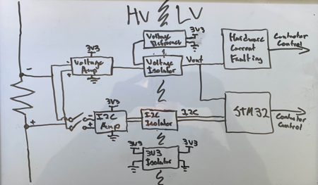
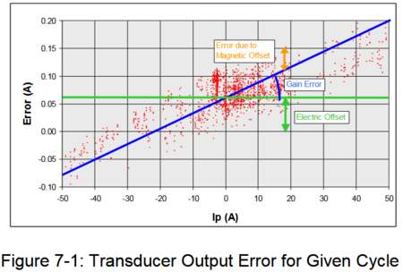
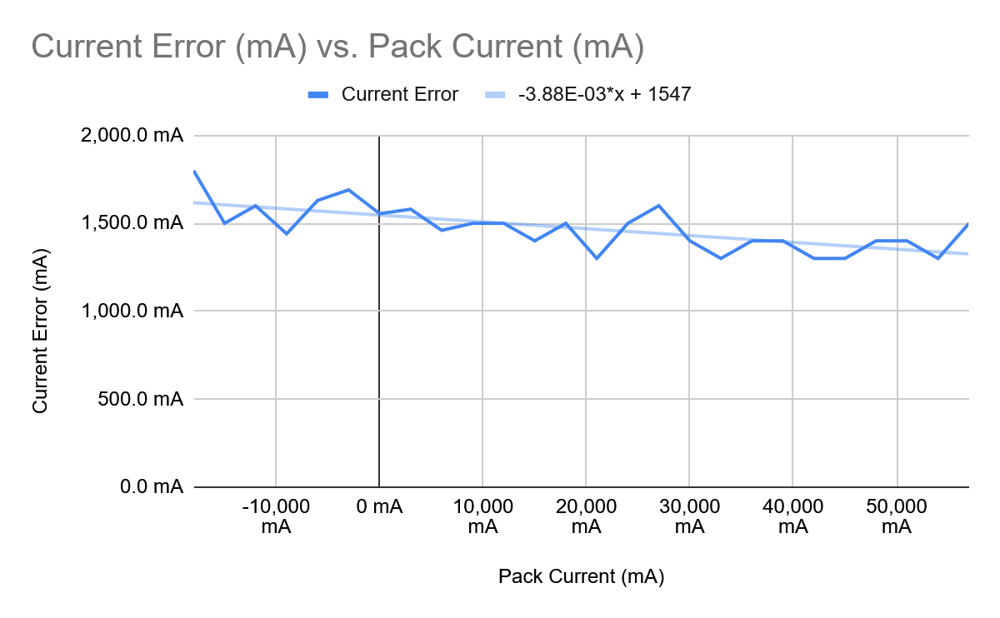
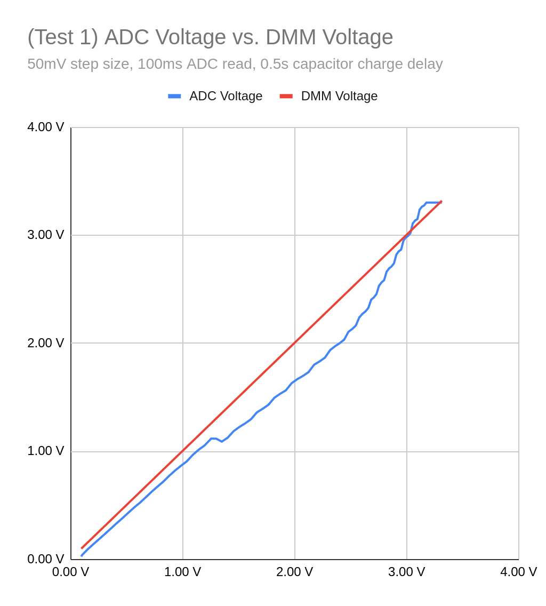
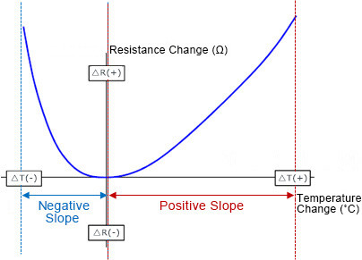
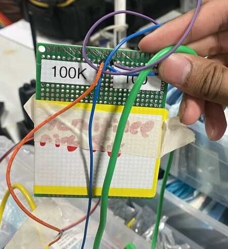
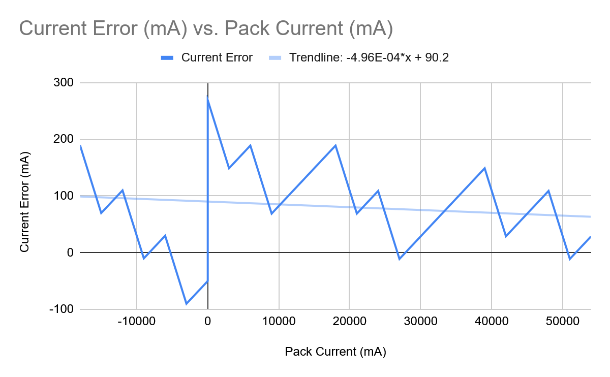

# Current Sensor Test Plan

**Author:** Christopher Kalitin

**Date:** Oct 2025

This update will be written [in the style of Mischa](https://ubcsolar26.monday.com/boards/7524358047/pulses/7524360025), ie. short and like no one except me will get maximum value out of it.

**Current Sensor Test Plan**

For scrutineering we need to inject voltage to simulate current. We'll do the same for characterizing the majority of the range of the shunt current sense amplifier. Using V=IR we know how to translate an injected voltage into a current reading (R = 100 micro ohms). We'll sweep the full range of the sensor (-6 mV to 6 mV) with the voltage divider that'll already be on the [HVC for scrutineering](https://ubcsolar26.monday.com/boards/9702086049/pulses/18164045278/posts/4600660609).

Maybe ohm's law won't be working the day we do the test, so we can also inject current over the shunt resistor with a PSU to get to the exact conditions the shunt resistor will experience. This gets closer to real world condtions but only works in the range of currents we can inject (+/- 3 A with our current PSUs).

The current injection test really isn't that deep, just put the probes over the shunt (with it disconnected from the cells obv) and compare your reading in firmware / grafana (these values are the same and if they aren't you have another project to do) to PSU current then subtract to find error.

Very simple

If any poor soul is reading this in 5 years, read this blog post thats actually just about writing Monday Updates:
[https://ckalitin.github.io/ideas/2025/10/13/managing-technical-teams.html](https://ckalitin.github.io/ideas/2025/10/13/managing-technical-teams.html)

SNR decreases with word count! If I wrote this for people who understand shunts at my level (+/- a bit) or higher it would've been 3 sentences! Maybe even 2!

> **Aarjav Jain** (Nov 2025)
>
> @Christopher Kalitin why does "HVC for scrutineering" link to Mischa's update btw?

> **Christopher Kalitin** (Nov 2025)
>
> @Aarjav Jain Fixed

---

# Untitled

**Author:** Christopher Kalitin

**Date:** Oct 2025

The issue described in [this update](https://ubcsolar26.monday.com/boards/9702086049/pulses/18164045278/posts/4581850114) is not having enough redundant current fault detection methods. I've found a firmware-independent (mostly) way to current fault, adding another redundancy and eliminating the need for a separate analog amplifier (along with the INA228 current sense amplifier which outputs to I2C.

The INA228 has internal fault modes which can be programmed over I2C. If an overcurrent fault is detected by the INA228, it will pull a fault GPIO high. This fault GPIO can be used to open contactors faster than STM32 firmware would be able to. This provides another redundancy (previously with the INA228 we only have pure firmware with I2C readings, see the [previous update](https://ubcsolar26.monday.com/boards/9702086049/pulses/18164045278/posts/4581850114)).

This means we can eliminate the separate analog amplifier discussed in the previous update. I would have implemented something very similar to what Emmanuel did on the PVA - see the [voltage sensing section here](https://wiki.ubcsolar.com/en/subteams/power-and-signals/docs/PVA).

Because the redundant fault is a GPIO that the INA228 pulls high, we need a way to read this on the LV side of the HVC, so need some way to isolate. We can use an optoisolator, like we already do with ESTOP on the HVC.

Final part selection:
- [INA228](https://www.ti.com/lit/ds/symlink/ina228.pdf)(current sense amplifier IC)
- [NEK0303SC](https://www.digikey.ca/en/products/detail/murata-power-solutions-inc/NKE0303SC/1926989?s=N4IgTCBcDaIHIGkCiAGAzOgygYRAXQF8g)(DCDC providing isolated 3V3 and GND)
- [Optoisolator](https://www.digikey.ca/en/products/detail/liteon/LTV-817S-TA1/388451)(to use the fault GPIO on the LV side of the HVC, probably the same one as already is on the HVC for ESTOP isolation)
- [ISO1541](https://www.ti.com/lit/ds/symlink/iso1541.pdf?ts=1760166601559)(I2C isolator)

> **Aarjav Jain** (Oct 2025)
>
> Nice!

---

# Scrutineering

**Author:** Christopher Kalitin

**Date:** Oct 2025

This update is about BTM and scrutineering related concerns with the new shunt-resistor based current sensing method.

**Scrutineering**

The input to the current sense amplifier IC is the voltage over the shunt resistor. The maximum value of this is 6 mV. V=IR, Imax = 60 A, R = 100 uOhms, so V = 60*0.0001 = 0.006 = 6 mV.

We can't use our current method of injecting a current into the current sensor because that would require a power supply that can supply 60 A. We currently get around this by wrapping 30 loops around a hall effect sensor, effectively multiplying observed current by 30, but with a shunt resistor this is impossible.

So, we will have to inject a voltage instead (as all other teams that use shunt resistors do). This means we'll have to inject 6 mV. Because power supplies usually aren't accurate to milli or hundreds of micro volts, we'll need a voltage divider.

Our injected voltage input will be divided by 1000, so we'll be injecting 6 V to simulate 6 mV. This requires a 1M to 1k voltage divider.

A potential failure mode is the resistor being a short (eg. poor soldering), but the INA228 IC that currently is planned to be used can tolerate up to +/- 40 V on input pins, so it's robust to this failure mode.

The voltage divider will be integrated onto the HVC and we'll have two header pins that we can connect our power supply to while doing scrutineering.

**Battery Mechanical Integration**
@Deev Shah

3 primary battery mech integration points:
1. Location of shunt resistor on control board
2. Location of HVC related to shunt resistor
3. Accessibility of voltage injection headers for scrutineering

1. Shunt resistor location

The shunt resistor must be on the low-side of the battery (ie. near the negative terminal, not the positive terminal). This is because it can only tolerate up to 80 V on it's inputs and our voltage goes up to 134 V.

2. HVC Location

The distance of the voltage taps from the shunt resistors should be kept as small as possible. The greatest voltage over on these taps is 6 mV, and the amplifier itself can read around 80 nV. So, this is very susceptible to EMI. Contrast this to our hall effect current sensor which has a default output of 1.8 V - much less susceptible to noise than a 6 mV signal!

So, current sense amplifier IC must be located directly next to the shunt resistor. This means either we need the HVC directly next to the shunt resistor, or we need a little board hosting only the IC that's next to the shunt resistor and an I2C wire from this little board to the HVC.

To lower the number of PCBs I'd like to have the HVC directly next to the shunt resistor.

3. Header pin accessibility.

For scrutineering we'll need to connect a power supply to two header pins on the HVC (as mentioned in the section above). So, there's a spot on the HVC we'll need good access to, which is a consideration for control component placement.

> **Deev Shah** (Oct 2025)
>
> Thanks for making this update! For the battery mech integration points:
> 
> 1. Sounds good, we will make this a requirement for the control board project. A quick question: given its a 100uOhm resistor with 60A max expected current, the wattage might be minimal. So will this resistor be mounted on a pcb or is it like the DCH resistor on Brightside’s control board?
> 
> 2. Sounds good, if it does not affect the current sensing capabilities, from a wire management perspective having the HVC next to the shunt might be the better option. Again, this will be added as a requirement to the control board project.
> 
> 3. I believe this is highly dependent on the HVC layout and header pin placement. We should discuss this further after the control board DR0 this Saturday.
> 
> Another question that I had, have you decided on a specific shunt resistor? If yes, can you link the part so that we can estimate its footprint on the board and connection method?
> 
> CC:

> **Aarjav Jain** (Oct 2025)
>
> @Christopher Kalitin

> **Christopher Kalitin** (Oct 2025)
>
> Here’s the shunt resistor I’ve currently baselined, and will likely go with:
> 
> https://www.digikey.ca/en/products/detail/riedon-products-by-bourns/RSB-500-50/4967074
> 
> It’s a relatively large package and takes all of the current in or out of the pack, it’ll be going on the control board, not HVC.
> 
> Another consideration is that it has a good amount of exposed metal, so we should consider 3d printing an enclosure for safety.
> 
> The INA228 has a max common-mode voltage of 85 V, meaning its inputs cannot be 85 V above GND. What GND means here is not clear, since isolated GND on HVC is not referenced to pack GND. Either way, the pack gets up to 134 V so we cannot put the IC on the high side of the battery.
> 
> https://www.ti.com/product/INA228
> 
> An interesting note about this IC is that apart from meausring the differential voltage over the shunt resistor, it also has a bus voltage measurement pin.
> 
> This means we can monitor an additional voltage with this IC, which could be useful for pre charge check.
> 
> The VBUS measurement pin has a max voltage of 85 V and 200 uV of precision. This is another possibility for doing precharge check.

> **Krish D** (Oct 2025)
>
> @Christopher Kalitin Some notes worth mentioning
> 
> - If your update is building off of ideas previously explained in other updates, can you please link to it so it is clear to the reader what you are referring to?
> 
> - Thank you for explaining the context for the hall effect. Makes it quite clear what point you are trying to make as if you are explaining a story. Keep this up! Adding a diagram here would also be quite beneficial.
> -  From my understanding, this voltage divider will be connected to the output side of the shunt resistor. Will it share the same HV trace or be on a separate net that comes after the isolated section? Can you show a circuit diagram of where the resistor divider circuitry will connect too on the INA228?

> **Christopher Kalitin** (Oct 2025)
>
> Which parts that relied on previous updates weren’t clear? The other Monday update from Tuesday linked to previous updates many times!
> 
> The injected voltage would connect to test points that are on the shunt resistor input. We’re essentially plugging in a power supply + voltage divider instead of the shunt resistor.

> **Aarjav Jain** (Oct 2025)
>
> @Christopher Kalitin when you get a chance can you explain exactly how you will connect the INA228 to ensure the 85V max is met?

> **Aarjav Jain** (Oct 2025)
>
> Also @Christopher Kalitin we can try to get this sponsored or get them to send a sample.
> 
> CC: @Krish D

> **Christopher Kalitin** (Oct 2025)
>
> Will email the company for a sponsorship before buying.
> 
> The 85 V max is the reason we put it on the low side.
> 
> Googling a little, I’ve found that because the HV half of the HVC is effectively floating relative to the battery (through the isolated DCDC), it’s voltage will slowly float to a value dependent on what it’s connected to. So, our isolated ground would float to 85 V so we might be fine with it on the high side.
> 
> I don’t actually understand this mechanism so an easier way to ensure were within the 85 V max is putting the IC on the low side of the battery, so our max voltage is around 0 instead of 134.

> **Krish D** (Oct 2025)
>
> @Christopher Kalitin If you can provide an diagram for how the voltage divider is connected, that would be appreciated.

> **Aarjav Jain** (Oct 2025)
>
> @Christopher Kalitin could you do some research for typically how are shunt + amplifier methods protected from EMI in a battery or other similar applications? Im worried that the 6mV is going to get destroyed by noise.
> 
> Additionally, what are @Krish and @Christopher Kalitin thoughts on getting a protoype of this current sensing pathway and putting it in our **current pack** to test current reading?

> **Krish D** (Oct 2025)
>
> @Aarjav Jain Prototypes are always beneficial, and we will definitely have to do one since this will be the team's first time use a shunt.
> 
> With our current pack however:
> - I think it will be challenging to get it setup since it will involve us having to cut up some 6AWG wire to solder in series with the shunt.
> 
> - Additionally, if you also mean to integrate this shunt with the ECU, you have to be mindful that there are no pins we can use (please double check for me) on the ECU that can be used for I2C digital communication. This means that @Christopher Kalitin's leading option, INA228, can not be used for prototyping. Therefore unless the shunt current sensor circuitry has an **isolated & analog** output, it becomes more difficult to make edits to our current pack design.
> 
> - What load is going to be used to get ~60A out of the battery and therefore over the shunt resistor? You might think we can just do some voltage injections via a resistor divider on a breadboard, however this wouldn't be testing the amplification circuitry properly (if it is on the analog output).
> 
> I'd suggest that @Christopher Kalitin decides what the process will look like to test this in our current pack. If the integration required for this test isn't time consuming (more than 2 weeks) and is* low risk* for the ECU, than I don't see why not.

> **Aarjav Jain** (Oct 2025)
>
> Also
> 
> : What do you think about having backup ports for hall effect’s to be plugged in in case there are deep issues with using the shunt resistor. Also, other than precision, could you remind me why use a shunt resistor? Cool name does NOT count. Is this used in industry?
> 
> I edited this. I said this before:
> 
> “reconsider using a Hall effect by comparing complexity and price. It doesnt seem very clean that we need isolation for this current sensing and the precharge check. “

> **Christopher Kalitin** (Oct 2025)
>
> [@Aarjav Jain](https://ubcsolar26.monday.com/users/66722948-aarjav-jain)
> 
> 1.
> 
> See this update on hall vs shunt:
> [https://ubcsolar26.monday.com/boards/9702086049/pulses/18164045278/posts/4566779461](https://ubcsolar26.monday.com/boards/9702086049/pulses/18164045278/posts/4566779461)
> 
> In
> short, every single accuracy (Note accuracy != precision!) failure mode of hall effect current
> sensors is felt less by shunt current sensors (eg. resistivity chaging
> as a function of temperature is less extreme than hall voltage changing
> with conductor width which changes with temperature).
> 
> Tesla uses shunt resistors and has since the Model S:
> [https://service.tesla.com/docs/Model3/ServiceManual/en-us/GUID-7597B911-B0D7-4D04-B9A7-8A10938FB237....](https://service.tesla.com/docs/Model3/ServiceManual/en-us/GUID-7597B911-B0D7-4D04-B9A7-8A10938FB237.html)
> [https://www.ebay.com/itm/304520074196](https://www.ebay.com/itm/304520074196)
> 
> Interesting to note that their sensing PCB is directly mounted onto the shunt resistor. If noise ends up being a very big problem for us, we can change the position of the sensing circuitry in a second revision.
> 
> I'll include I2C test point we could solder to for this possibility (now I2C goes from shunt to HVC, instead of raw 6 mV).
> 
> Implementing a shunt current sensor is also the most fun technical problem on HVC, everything else is well known from ECU.
> 
> In case shunt doesn't work, I'll break out from GPIOs with ADCs on HVC.
> 
> 2.
> 
> I found this thread on minimizing shunt resistor noise (not quite for our use case but similar):
> [https://www.eevblog.com/forum/projects/minimizing-noise-when-using-shunt-to-measure-current/](https://www.eevblog.com/forum/projects/minimizing-noise-when-using-shunt-to-measure-current/)
> 
> With small probes it shouldn't be too bad, and RC filters will be on the HVC to prevent AC noise.
> 
> @Krish D @Aarjav Jain
> 3.
> 
> If we were to test the shunt current sensor, we'd use a breadboard + breakouts board for the ICs. HVC schematic should be done by the end of next month so we currently don't have time to do this. If there's a worst case scenario where the circuitry fundamentally doesn't work, we have 2 months of slack in the summer (given current timelines) in which we can test.
> 
> For characterization, we'll inject voltages and could inject up to 3 A to characterize the low range.

> **Aarjav Jain** (Oct 2025)
>
> "Interesting to note that their sensing PCB is directly mounted onto the
> shunt resistor. If noise ends up being a very big problem for us, we can
> change the position of the sensing circuitry in a second revision." What is the sensing PCB in our case and can we follow this as well? @Christopher Kalitin
> 
> Why do we need to inject 3A?

> **Christopher Kalitin** (Oct 2025)
>
> In our current setup there are ~5cm leads from shunt to the circuitry on the HVC
> 
> I believe this is a similar length of leads as Waterloo’s design from what I remember at comp.
> 
> I’m not concerned with noise destroying the signal to the point where we can’t drive given other teams at comp have similar setups. The issue is just with accuracy - with extra time in the summer there’s a fun campaign of characterisation testing to be done here.
> 
> 3 A is the max of our PSUs, ideally we’d inject 60 A but we have no equipment in our bay for this.

> **Aarjav Jain** (Oct 2025)
>
> @Christopher Kalitin When you get a chance write an update on how we can completely test the current sensing method. I will let you define 'completely' here. Additionally, define the testing procedure along with the tests.

> **Christopher Kalitin** (Oct 2025)
>
> @Aarjav Jain
> 
> Update: [https://ubcsolar26.monday.com/boards/9702086049/pulses/18164045278/posts/4629141958](https://ubcsolar26.monday.com/boards/9702086049/pulses/18164045278/posts/4629141958)

---

# Untitled

**Author:** Christopher Kalitin

**Date:** Oct 2025

@Aarjav Jain @Krish D
A few major design decisions for the HVC need to be made at this point, this update will detail them so we can discuss the tradeoffs in the comments on Monday so future Solar members will have this extra context.

1.
Using an I2C current sense amplifier eliminates 2 layers of redundacy for current faulting on HVC.

Our current BMS has 3 redundant ways to have a current fault:
1. Firmware sees an ADC reading out of range (essentially what reading an I2C packet would do),

2. Analog watchdog on the STM32 detects an out of range ADC reading (This eliminates our while loop in firmware as an issue, ie. if the chip is stalled we'll still fault)

3. Hardware current faulting circuitry (comparators that check if the voltage output of our current sensor is out of range)

Switching to a purely I2C shunt current sense amplifier would eliminate two of our redundancies because the current sensor output would not be an I2C packet, not a voltage we can put into a hardware current faulting circuit or STM32 ADC.

2.
An option for adding another completely separate faulting circuit is using our existing hardware current faulting circuitry (with minor changes), and supplying it with a voltage amplifier.

This way, we have 2 separate ICs that are giving us a current reading. First, the INA228 sending an I2C packet, and second the amplifier giving us a voltage that is proportional to current over the shunt resistor.

The voltage amplifier output can go both to hardware current faulting circuitry and an ADC pin on the STM32.

The voltage amplifier would also need a voltage reference IC so we can deal with negative currents. Eg. instead of a range of -1 V to 1 V corresponding to -60 A to 60 A, we would get 1 V to 3 V.

3.
I2C current readings are redundant if we have a voltage amplifier + voltage reference. So, we can eliminate the higher precision I2C current readings (800 uA) and go purely with the lower precision amplifier circuitry (est. ~10 mA precision).

800 uA current readings are clearly an MMR not an MVP. So, I think we should go with the voltage amplifier + reference method and use the STM32's ADC for current readings, we won't get as precise readings but strategy will still be happy.

The I2C current sense amplifier circuitry is pretty much already researched and ready for quick implmentation (<2 hours of my work), so I want to keep it on the HVC but make it togglable via a header pin. This way, a minimum viable HVC will not be delayed by an MMR, but we'll have the ability to implement a higher precision current sensing method in the future without redesigning the board.

Note that this solution means we could have 4 redundant current fault mechanisms (not including main pack fuse):
1. I2C current reading
2. STM32 current reading
3. STM32 Analog Watchdog
4. Hardware current faulting

> **Christopher Kalitin** (Oct 2025)
>
> Here's what the circuit would look like:
> (Note the squiggle in the middle showing isolation of the LV from the HV side of the PCB)
> 
> 

> **Krish D** (Oct 2025)
>
> Great high level analysis Chris.
> 
> Regarding the image you sent, note as well that you would need to create a way to isolate the 3v3 power supply to voltage amplifier and I2C amplifier using an isolated power supply, like is used on the U0.2 of the [PVA](https://ubc-solar.365.altium.com/designs/44197CB3-E292-43B7-A17C-38DABCDCCD9A?variant=[No+Variations]&activeDocumentId=E_PAS_PVA1.1.SchDoc&activeView=SCH&location=[1,91.31,-112.89,123.65]#design), a DC-DC converter IC.
> Additionally, I2C requires pullups on the SD and SCL lines, so there is even more of a need for an isolated power net to act as pull-up before the I2C isolator is also a must.
> 
> Also I highly recommend that if a SPI version of the I2C amplifier exists, to use this instead. In my experience working with both protocols, I2C happens to be more buggy and prone to noise despite the pull ups. This also allows you to use an existing SPI to Iso SPI transformer setup that we've already implemented if you are concerned about complexity in implementing.
> 
> Some feedback:
> 
> - I appreciated the attention to detail with regard to adding a bias voltage to the voltage amplifier since to STM32 can not take in negative voltages. Great catch!
> - Can you add indents and markers for new points you are making? It was a bit difficult to read the update since you had sub-points on parent point 1
> 
> - Characterizing noise of the shunt current sensor due to current spikes is a must for the Cascadia. The only reason the analog watchdog was implemented was due to the fact that sustained current spikes are being read. This is worth noting as an integration test to determine how many out of window measurements will result in a fault.
> 
> I hope to see some more points regarding how this would affect scrutineering and what physical factors (accessibility to certain points of the control board) need to be noted for BTM.

> **Christopher Kalitin** (Oct 2025)
>
> Yep I was baselining the use of the same isolated DCDC used for the INA228 current sense amplifier, the diagram is wrong there.
> 
> Didn’t know PVA did this, I’ll look at the circuit.
> 
> I2C has also been buggy in my experience, but isoSPI would require an LTC6820 to drive a transformer to AC, then a transformer to DC, then another LTC6820. Much more complicated system. I2C is buggy but isoSPI introduces a good amount of complexity. I’ll look further into this maybe there are more elegant implementations.
> 
> Will add indents and better section markings, this update does look worse on mobile than on my PC an hour ago.
> 
> Agreed on noise characterisation, was reading Mischas old update on this earlier.
> 
> Scurtineering update is coming next

---

# Untitled

**Author:** Christopher Kalitin

**Date:** Oct 2025

Currently leaning towards using the INA226 digital current sense amplifier to sense voltage over a 1 milliohm shunt resistor.

Factors to consider include:
- Communication protocol / interface (ie. does it just amplify the voltage or does it have an integrated ADC)
- Voltage sensing range
- Voltage sensing precision (and hence current sense precision)

I considered these ICs:
- MAX17261 (Waterloo uses this)
- INA4290 (amplifier, no internal ADC)
- LTC2946
- INA226

The INA4290 is an amplifier so we would not be properly isolated from the HV shunt resistor without a further IC and we would have to use the STM32s ADC (see previous update for the low precision & accuracy of this). We'd need an IC to isolate I2C signals as well, so extra components for isolation are required in any case.

Since it only amplifies voltage, when current is entering the pack a negative voltage would be returned, which the STM32 can't read. We'd also be limited to around 50x amplification. With a 12 bit ADC with a 3.3 V max value, we get 0.8 mV precision post-amplifciation, which is 16 uV pre-amplification.

V/R = I, so with a 1 milliohm shunt resistor we get 16 mA of current reading precision. Not bad, but we can do about the same with a hall effect current sensor and can do much better with shunts.

The LTC2946 has an adjustable full-scale range (FSR) for its ADC which outputs over I2C. In the +/- 100 mV mode we get a least significant bit (precision) value of 25 uV. This corresponds to 25 mA precision. Even worse!

One of its potential advantages is it has a max input voltage of 100 V and an internal shunt regulator. This means if battery voltage was below 100 V, it could power itself and we wouldn't have to give it an isolated 3V3 supply. Sadly no digital current sense amplifiers with internal shunt regulators and voltage ranges above 134 V exist.

Although we won't be able to use this capability, it means we won't have to worry about transient voltages or voltage spikes. It's rated for ~100 V!

The INA226 also has an adjustable full-scale range (FSR). In its +/- 81.92 mV range we get a precision of 2.5 uV, V/R = I gives us a current precision of 2.5 mA. Amazing value, for reference on ECU rev 2.0 the precision is 140 mA.

The INA226 also has a max input voltage of 40 V, fairly safe from ESR.

We'll need to communicate with this IC over I2C, and will need an additional IC for isolating I2C from the MCU and current sense amplifier, the ISO 154X appears suitable (Waterloo uses the ISO1641).

We'll also need an IC to give it an isolated 3V3 source. Aden - a Waterloo electrical lead I met at comp - said they use an isolated 3V3 converter that sources voltage from their "normal" LV 3V3. The SN6501 looks good for our use case.

I chose a 1 milliohm resistor because of the ADC range of the current sense amplifiers. V / I = R. Our max current is 60 A, and one of the FSR ranges for the INA226 is 81.92 mV. 81.92 mV / 60 A = ~1.3 milli ohms. With a 1 milliohm resistor we get a max current of 81.92 A, which is 25% our expected max current of 60 A.

To do scrutineering with these setup we'll have to inject a voltage of ~60 mV into the current sense line with the current sensor unplugged. To do this I'll add a 1M - 10k voltage divider onto the HVC. This divides voltage by ~100x, so we'll be able to use a standard power supply. Eg. a 10 V input would be seen as 100 mV by the digital current sense amplifier.

ICs I'll likely use:
- Digital current sense amplifier: [INA226](https://www.ti.com/lit/ds/symlink/ina226.pdf?ts=1760167655129&ref_url=https%253A%252F%252Fwww.ti.com%252Fproduct-category%252Famplifiers%252Fcurrent-sense%252Fdigital-power-monitors%252Fproducts.html) (now INA228, see comment)

- I2C isolator: [ISO154X](https://www.ti.com/lit/ds/symlink/iso1541.pdf?ts=1760166601559)
- 3V3 isolator: [SN6501](https://www.ti.com/product/SN6501#params) (now NKE0303SC, see comment)

> **Christopher Kalitin** (Oct 2025)
>
> The SN6501 doesn't actually do the job I want, it's meant for use in isolated power supplies, not as an isolator itself.
> 
> The NKE0303SC is ideal for our use case.
> [https://www.digikey.ca/en/products/detail/murata-power-solutions-inc/NKE0303SC/1926989?s=N4IgTCBcDaI...](https://www.digikey.ca/en/products/detail/murata-power-solutions-inc/NKE0303SC/1926989?s=N4IgTCBcDaIHIGkCiAGAzOgygYRAXQF8g)
> 
> It is an isolated DCDC converter with a 3.3V input and 3.3V output, requiring a capacitor and inductor on its output to get low enough ripple (5 mVpp).
> 
> I looked at a few other options, but not many exist below the 1 W class. We'll likely be drawing on the order of a milli amp and the NKE0303SC is sized for 303 mA, so this is slightly not ideal.
> 
> An interesting alternative is the R1SX-3.33.3, which is slightly cheaper and looks like a PCB on top of a plastic interface to the PCB (ie. not a full sealed package), didn't know they made them like this.
> [https://recom-power.com/pdf/Econoline/R1SX.pdf](https://recom-power.com/pdf/Econoline/R1SX.pdf)

> **Christopher Kalitin** (Oct 2025)
>
> My decision in baselining the use of a 1 milli ohm shunt resistor was a mistake. This results in P = I2R = 60^2 * 0.001 = 3.6 W of power loss. Average power during an FSGP lap is 1 kW, so this is increasing power consumption by 0.36%, which is a non-trivial amount.
> 
> The driving factor behind the choice of a 1 milli ohm resistor was that if we went any lower we would not be using the full range of the digital current sense amplifier's ADC and would sacrificing some precision.
> 
> With 2.5 mA precision, even increasing this by 10x isn't a huge concern, but there's a better way.
> 
> The INA228 has a 20 bit ADC with two ranges, +/- 40.96 mV and +/- 163.84 mV, corresponding with precisions of 78.125 nV and 312.5 nV respectively. With a 100 micro ohm resistor, we would have a max voltage of 60 mV, which means either using purely the +/- 163.84 mV range or swapping between both ranges in firmware in real time while current is changing.
> 
> The INA228 allows use of a 100 uOhm instead of a 1000 uOhm shunt resistor while becoming more precise (the beauty of more ADC bits). Power draw is now 0.36 W instead of 3.6 W.
> 
> INA228 datasheet:
> [https://www.ti.com/lit/ds/symlink/ina228.pdf?ts=1760212206725&ref_url=https%253A%252F%252Fwww.ti.com...](https://www.ti.com/lit/ds/symlink/ina228.pdf?ts=1760212206725&ref_url=https%253A%252F%252Fwww.ti.com%252Fproduct%252FINA228)
> 
> V/R = I
> V_precision/R_shunt = I_precision
> 78.125 nV / 100 uOhm = I_precision
> 0.000000078125 V / 0.0001 Ohm = 0.00078125 A = 781.25 uA precision
> 
> ECU rev 2.0 current sense precision is 140 mA, this new design gives 0.78125 mA.
> 
> 140 mA / 781.25 uA = 179.2
> 
> With a 100 micro ohm shunt resistor and the INA228, I'll increase current sensing precision by 17,900%.
> 
> Note that decreasing power consumption by 10x and precision by 4x from the previous shunt resistor circuit if merely a function of choosing a different IC with greater precision, this doesn't particularly increase cost (maybe ~$10 for a lower resistance shunt).
> 
> Here's a list of shunt resistors on Digikey:
> [https://www.digikey.ca/en/products/detail/riedon-products-by-bourns/RSB-500-50/4967074](https://www.digikey.ca/en/products/detail/riedon-products-by-bourns/RSB-500-50/4967074)
> 
> The 100 micro ohm model costs $66.67:
> [https://www.digikey.ca/en/products/detail/riedon-products-by-bourns/RSB-500-50/4967074](https://www.digikey.ca/en/products/detail/riedon-products-by-bourns/RSB-500-50/4967074)

> **Aarjav Jain** (Oct 2025)
>
> @Christopher Kalitin.
> 
> 1. "The INA226 also has a max input voltage of 40 V" Did you mean ESD?
> 
> 2. Why do we need 2.5mA of precision? What is the precision requirement? What easier options does that open up for us? What about using 2 hall effects? One for higher current one for lower? Were these options considered?
> 
> 3. Could you draw out **clearly **what the path for the connections and ICs looks like? You have a lot of details but lets put those on a 'canvas' so to speak and see how this all connects, what needs isolation and why. This motivates the Control board and HVC drawings.

> **Krish D** (Oct 2025)
>
> @Christopher Kalitin  Great update, here are some notes I took from reading this:
> 
> - I2C isolators exist. Checkout [this](https://www.ti.com/product/ISO1540) one from TI with an rated isolation of 2.5kV!
> -  The attention to detail regarding the negative voltage reading, which is something the STM32 can not read, is a good thing to note. Great job noting this!
> 
> - INA4290: Common mode maximum of 120V, we definitely can't use it. I was able to figure out how you got a 50x amplification factor, however it's not immediately clear from your update. Can you explain this further? (I'm also going to assume 16mA/V is the actual current accuracy we'd be getting with the 500x amplification version of the IC)
> - LTC2946: Justifying calculations?
> - INA226: Isn't this only for 36V common mode input? Can you provide more details on what FSR means here? Since this IC requires a high side and low side shunt, where would this be mounted in the control board?
> - INA228: The maximum current input is 5mA. Why would the NKE not work here if it sized for 303mA? Has an 85V common mode input for the Vin+/- pins. How do you intend to design around this Why was a shunt resistor with a 25W power rating chosen? If P=(I^2)*R =  60^2 * 100^10^-6 = 0.36W. Assuming you are using the full range version, you could also use the calculation of P=IV = 60*(163.84) = 9.83W. Therefore using a shunt resistor that is AT LEAST 10W tolerant + safety factor of 5W is reasonable, right?

> **Christopher Kalitin** (Oct 2025)
>
> @Aarjav Jain
> 
> First, I've realized we can't as easily do hardware current faulting with a shunt. I'll write an update on this later, but since the output to the LV side of the HVC is an I2C packet, we can't use existing circuitry on ECU rev 2.0.
> 
> 1.
> This is common-mode range, not max voltage.
> 
> The INA228 has a common-mode range of -0.3 to 85 V. Common mode range is the max difference between the positive and negative differential sensing lines. We expect V = IR = 60 * 0.0001 = 0.006  V = 6 mV.
> 
> 2.
> Last I checked with Strategy the requirement was ~100 mA.
> 
> With shunt's, it's important to note that the difficulty between 25 mA of precision and 800 uA of precision is not big. It's all about specing the shunt resistor slightly differently and using a different IC of the same series (INA228 vs 226).
> 
> Two hall effects isn't required, as we could just use two ADC sensing different ranges with an amplifier circuit. Such a circuit would be similar precision to a shunt resistor, but with the accuracy issues associated with a hall effect (a shunt is just V=IR, so high accuracy).
> 
> 3.
> At a high level:
> 
> shunt resistor -> digital current sensing amplifier -> I2C Isolator -> MCU
> 
> Because the digital current sense amplifier needs power, we need to use the NKE0303SC DCDC converter to power it.
> 
> @Krish D
> 
> That's the I2C isolator I decided on!
> 
> "Common mode maximum of 120V, we definitely can't use it."
> Common-mode voltage is the difference between each terminal of the shunt resistor, which should be ~6 mV, so we can use it.
> 
> We can't use the 500x amplifier because we'd be attempting to sense 25 V with an STM32! 50x is the greatest amplification option we could use (0 to 2.5 V).
> 
> Vprecision = 25 uV, R = 1 milliohm, V/R = I = 25 uV / 0.001 ohms = 25 mA.
> 
> Common-mode vs full scale range is also something I was confused about. My understanding is common-mode range is max allowable voltage before damaging the IC, full-scale range is the ADC sensing range. I don't think a high-side and low-side shunt are **requirements**, but just a typical application.
> 
> The NKE0303SC does work for us, it's just far bigger than we'll need. There could be a solution that has a lower current rating that is cheaper, but I couldn't find one.
> 
> The shunt was chosen for it's resistance, not power rating. If the power rating of a shunt resistor is greater than 0.36 W, then the only two relevant variables are cost and resistance (100 micro ohms required).
> 
> Your P=IV calculation was incorrect because the voltage in that equation is the drop over the resistor (6 mV), hence why we use P=I2R! We only need to size for 0.36 W, and the smallest power rating I saw was ~5 W, a 15x factor of safety.
> 
> Very good questions

> **Krish D** (Oct 2025)
>
> @Christopher Kalitin Ah. Thanks for clarifying the common mode voltage range as a term, good to know!
> 
> When deciding on shunt, let's look for something cheaper with not as high of a power rating then.
> 
> P=IV : Dumb mistake on my part, thanks for correcting this!

---

# Hall Effect Current Sensor Error

**Author:** Christopher Kalitin

**Date:** Oct 2025

**Hall Effect Current Sensor Error
**

I found [this great paper](https://www.iconopower.com/v/lem/coulometry.pdf) which characterized a hall effect current sensor.

The two types of error are gain error and offset error. Gain is the slope of the current error as a function of current. Offset is a constant error.

Because we have roughly equal current flowing into and out of our battery (arrays and motor), the gain error cancels out if we integrate to find total energy. We overestimate current coming out and overestimate current going out, so it nets out to zero.

Offset error is more of an issue because it does not cancel out, it compounds with time and not as a function of input current. So, whether we're drawing 1 A or 100 A for 60 s, the net error is the same.

This is more of an issue at low currents where an error of 0.1 A is a greater proportion of total current (10% vs 0.1% for 1 A or 100 A).

The paper also mentions error as a function of temperature, which we can consider characterizing for our next current sensor.

Importantly, the terms of the error are the same as what we found when [characterizing our HASS-100S](https://ubcsolar26.monday.com/boards/7524367629/pulses/7524367868/posts/3902002110) hall effect current sensor a year ago. Notice the graph above has a constant error term and gain error (negative slope, instead of the paper which saw a positive slope).

*This graph is also from our [current sensor characterization project](https://ubcsolar26.monday.com/boards/7524367629/pulses/7524367868/posts/3774039039).*

Another type of error is linearity error. ADCs also experience linearity error, which you can see in the graph above. These errors are more difficult to model (it's not a line y=mx+b), and hall effect devices are subject to this error in some proportion. Linearity error is usually minimal, but is a failure mode if we choose a hall effect current sensor.

**Shunt Current Sensor Error**

Shunt current sensors use a shunt resistor in series with the main load path, and look at the voltage drop over it (V=IR).

Because shunt resistors are resistors, their resistance varies with temperature.

This should be fairly minor, and we'll be able to adjust for this error with a degree 2 polynomial in firmware using the thermistor output from the cell boards. We just need to adjust for ambient temperature, and don't need extreme precision, so a dedicated thermistor on the shunt resistor is not needed.
[Here's a nice article](https://www.knick-international.com/en/blog/shunt-resistor-versus-hall-effect-technology/) on sources of error for shunts vs hall effect.

Hall effect current sensors also suffer from temperature changes due to the conductor experiencing the hall voltage expanding. Shunt resistors suffer less from temperature than Hall's.

Shunt current sensors don't suffer from:
- temperature as much as Hall's
- EMI of other current paths near it
- reference voltage fluctuations

Overall, it shunt current sensors have fewer precision failure modes than hall effect current sensors.

> **Hemat Wander** (Oct 2025)
>
> @Christopher Kalitin
> 
> I remember we we're discussing how other teams at comp did scrutineering with a shunt resistor, as I assume it would be a little more complicated than with being able to have a separated component for which we can decide the connection.
> 
> I believe we said something like we can just modify the voltage reading of the ADC going to the chip, and so we don't have to actually shove current through the shunt resistor. Either way, just another consideration.

> **Christopher Kalitin** (Oct 2025)
>
> @Hemat Wander
> 
> Yep, scrutineering can't be done in the same way because we would have to put 60 A through the shunt resistor. We'll have to inject a uV voltage with a voltage divider either on an external board or built into the HVC.
> 
> We could easily make a 1M - 1k voltage divider to divide PSU voltage by 1000. Putting this on the HVC with two header pins could be an elegant implementation.
> 
> In contrast, Waterloo has this ugly voltage divider perf board:
> [https://ckalitin.github.io/solar/2025/07/09/fsgp-team-insights.html](https://ckalitin.github.io/solar/2025/07/09/fsgp-team-insights.html)
> 
> 

> **Aarjav Jain** (Oct 2025)
>
> @Christopher Kalitin
> 
> 1. How will we do scrutineering with a shunt resistor? Can you describe the **exact **implementation and process?
> 
> 2. What is the accuracy of using a shunt resistor?
> 
> 3. Are there certain ratings we need to look for the resistors?
> 
> 4. What *is* linearity error and where does it come from?
> 
> Feedback: You did quite a bit of reading and learning for the 2 different options and came to a conclusion which is great. However, I encourage you to give a summary of the section you wrote. Ex. you mentioned details about the Hall Effect Sensor. Then after, give a summary of what points are important and why are they important (what does this all tie back to and lead to). Additionally, explain the goal of the update. At the end when you say "there are fewer precision errors" it sounds as if that is the sole reason for going with shunt resistor current sensing. Explain *why *you are talking about what you are talking about.

> **Christopher Kalitin** (Oct 2025)
>
> @Aarjav Jain
> 
> 1.
> For scrutineering instead of a current supply and external extra current sensor, we'll unplug the shunt from the HVC and replace it with a power supply + voltage divider (with the divider integrated into the HVC). Then, we show the scrutineers our voltage divider resistance values and fault settings and demonstrate. This is the same as Waterloo.
> 
> 2.
> I found no explicit accuracy value for shunts, but every single accuracy failure mode that hall effect current sensors see impacts shunts far less. Eg. temperature where hall effect sense lines expand more than the resistance the shunt changes.
> 
> Also, with greater precision we have more ability to characterize the accuracy error. One of the issues characterizing Brightside's current sensor was that we reached the limit of precision and couldn't increase accuracy further.
> 
> This is why the accuracy graph looked like this, instead of a more straight line (I could only work in increments of 140 mA):
> [https://ubcsolar26.monday.com/boards/7524367629/pulses/7524367868](https://ubcsolar26.monday.com/boards/7524367629/pulses/7524367868)
> 
> 
> 
> 3.
> Power (Must be >0.36 W which we dissipate), resistance (100 micro ohms), cost (Hopefully ~$50 each, similar to HASS-100S hall effect we have now).
> 
> 4.
> All error arises from one physics principle or another. When the law causing the error is non-linear, we get linearity error. Eg. resistance changes exponentially with temperature, so this is a non-linear type of error.
> 
> 5.
> Good feedback, these updates were written directly after my research mostly as notes so I can optimize more for the reader and conveying purpose. The best way to fix this I think is a summary section at the top, then all technical details & notes.

---

