# DCDC

**Author:** Christopher Kalitin

**Date:** Jan 6

**DCDC ****Test Results**

The goals of testing were:
1. Operate at 46 W (nominal power)

2. Record temperature vs time for 10 minutes

3. Derive efficiency for one point

4. Operate at our full HV voltage range

5. Plot Efficiency vs. Current

6. Plot Output Voltage vs. Current

The last 2 goals serve to recreate performance graphs from [the datasheet](https://www.power.com/design-support/design-examples/rdr-85slr-46-w-dc-dc-converter-solar-racing-car-using-innoswitch3-aq-900-v-powigan).

[Testing data spreadsheet](https://docs.google.com/spreadsheets/d/1ppIUuNVFHrE4kxHu8hYvxWLMagOhAPkGQVVrrkbQVtM/edit?gid=20239919#gid=20239919)

**Test Setup**

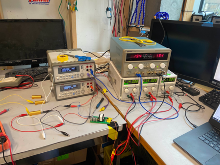

The testing setup follows the description in the [test plan](https://ubcsolar26.monday.com/boards/9702086049/pulses/10794893055/posts/4787142170).

Note all exposed HV Connections were taped to prevent shorts. You can see this on the right side of the DCDC, on the red wire coming off the HV side, and on the purple wire coming off of it.

The pins for the voltage input / output were very small, so male-to-male jumpers were used. These didn't cause any thermal issues.

**Test Data**

25 data points were obtained between 12.8 and 54.5 W output power and 80 to 150 V input. Note the DCDC's nominal ratings at 46 W (80 W max), and 100-150 V.

To vary the load, and hence current, combinations of 3x 10 ohm, 2x 25 ohm, and 1x 3 ohm resistors were used. Note that the exact resistance used never matched what was observed with R=V/I because of contact resistance (maybe alligator clips). This is shown in [columns H to J of the first page in the spreadsheet](https://docs.google.com/spreadsheets/d/1ppIUuNVFHrE4kxHu8hYvxWLMagOhAPkGQVVrrkbQVtM/edit?gid=0#gid=0).

**Goal 1: Operate at 46 W (nominal power)
**
We operated up to 54.5 W, so goal 1 was achieved.

**Goal 2: ****Record temperature vs time for 10 minutes**

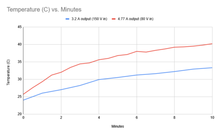

I tested two cases at different power levels. The terminal temperature of the 4.77 A output 80 V input case (reasonable worst-case for our car) was ~40 C after 10 minutes.

We didn't see far worse thermal performance at greater than nominal current, so we may be able to operate at greater than 46 W (maybe with added cooling).

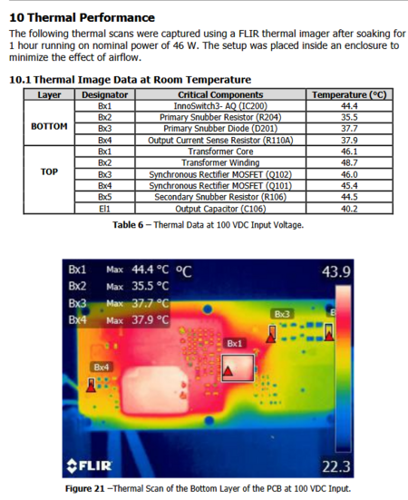

Power Integrations performed a similar test in an enclosed environment and at room temperature (we were in the bay with the bay door open, as maybe ~15 C). After an hour they got 44.4 C on the Switching IC. This appears to align with our values.

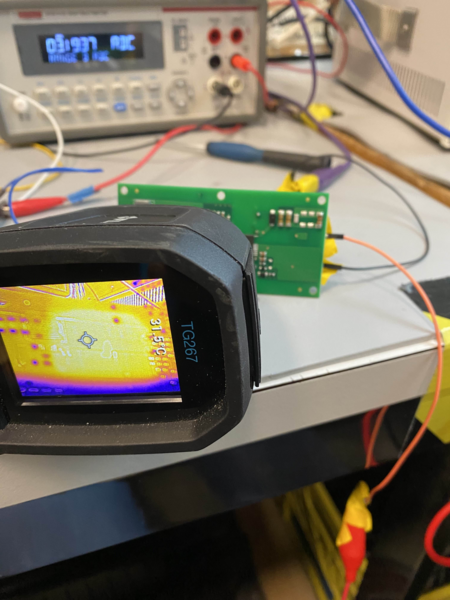

The test setup involved pointing our thermal camera towards the IC on the back of the DCDC (the expected hot spot). It was kept in a constant position to ensure we were recording the same point every time.

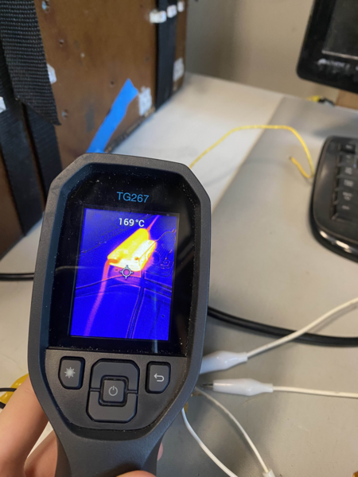

At the end of the highest power test, the 3 ohm resistor got to 230 C. Pay closer attention to resistor power next time.

Interesting, while monitoring current throughout the entire test, it didn't appreciably increase (resistance decreases with temperature, so this is partly what I expected).

**Goal 4: Operate at our full HV voltage range**

The DCDC outputted 54 W at 80 V input and 150 V input. Success.

**Goal 3/5: Plot Efficiency vs. Current
**
First, I'll show the efficiency graph from the datasheet for what I expected.

Note Load% is output current over 46 W (nominal power).

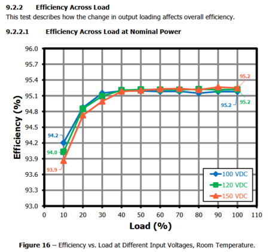

We got this:

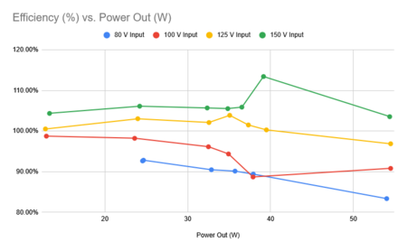

This graph does not follow the same trend as the efficiency plot from the data sheet at all, and most of the efficiencies we got were above 100%.

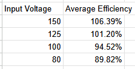

A clear downward trend in efficiency is seen as input voltage decreases.

Notably, operating below the rated 100 V input minimum gets us far lower efficiency at ~90%. This is expected as it's outside the listed nominal range of the DCDC.

**Why Did The Efficiency Test Fail?
**

I suspect our current measurements were inaccurate.

P_in
= P_out is always true and P=IV is also always true. This leaves us 4
variables, current and voltage on the input and output.

Output
voltage was almost always 11.9 +/- 0.05 V, and input voltage was tested
with 2 different multimeters are returned values +/- 0.3 V (the other
multimeter was not our usual orange handheld DMM, and seems less
trustworthy).

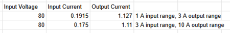

The Keithley 2110 DMM ammeter mode appears untrustworthy to me because it gave very different current readings when we manually set the range to the 1 A mode, 3 A mode, or 10 A mode.

This is shown in the table above, with up to a 10% difference.

If we are to repeat this test, the accurate of the DMMs must be investigated.

**Goal 6: Plot Output Voltage vs. Current**

This test matched expected values from the datasheet fairly closely. We were around 11.98 V most of the time, dropping at higher power.

Note that I only tested voltage once at 54 W (for all input voltage values, 80 to 150) instead of 4 individual times like all other power levels.

This means the data declining to 11.9 V at 54 W isn't completely trustworthy because I only got 1 datapoint and copy and pasted it for the rest of the 54 W cases.

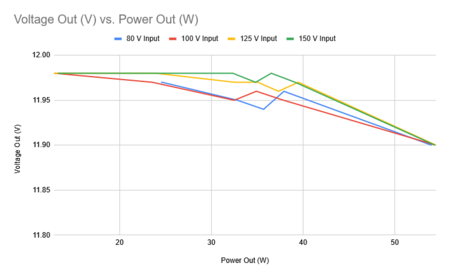

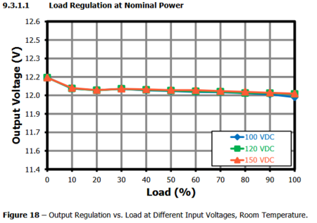

**Next Steps**

1. Email Power Integrations about using the DCDC at 90 V
2. Email PI about how long we can expect to run at >46 W, thermal and efficiency concerns.

I don't believe we should look for another DCDC or repeat this testing as HVC testing is far more important.

> **Aarjav Jain** (Jan 12)
>
> @Christopher Kalitin why would we want to use the DCDC at 90V anyways?
> 
> Overall thanks for the thorough testing!

> **Christopher Kalitin** (Jan 12)
>
> Minimum voltage of the pack is 86.4 V. 2.7*32=86.4

> **Krish D** (20d)
>
> @Christopher Kalitin Just to be clear, what will determine if we are to use this DCDC or not?

> **Aarjav Jain** (14d)
>
> @Christopher Kalitin: In other words: What specifically do you want to ask PI about when you say "Email Power Integrations about using the DCDC at 90 V"?

> **Christopher Kalitin** (13d)
>
> 1. Is it reasonable to use the DCDC at ~90 V and up to 5 A out of the box?
> 
> 2. What changes should be made to get higher efficinecy at 90 V input? (From your email chain with them the immediate path forward on DCDC modifications is not clear)
> 
> 3. Is the max temperature really 50 C? If their test was at 25 C ambient and got to 40 C, I don’t think our DCDC will stay below 50 C during comp (much higher ambient temperature in Kentucky).
> 
> 4. What’s up with these connectors?

> **Christopher Kalitin** (3d)
>
> 5. Heat sink
> 
> Link datasheet in v4 BOM

---

# DCDC Test Plan

**Author:** Christopher Kalitin

**Date:** Dec 2025

**DCDC Test Plan**

**PSU Selection**

First, we need Power Supplies with isolated outputs (so negative isn't shorted to ground) and that have ~150 V isolation voltages (so when wired in series, the input voltage to a given PSU can be higher than 0 V).

From the datasheets

* PSU units means how many independent power supplies are in an individual piece of equipment.

I'll use 3 XT 30-2's in parallel with an additional PS280. I'll start at 120 V (all at max voltage) as 120 V is in the 100-150 V nominal range of the Power Integrations DCDC.

**Parallel Diodes**

I'll also need to connect diodes in parallel with each power supply connection to ensure no PSU will ever have negative voltage over it, damaging the internal polarized capacitors.

For example, imagine we have two power supplies in series at 30 V each but only the first one is on. PSU 1 will try to push current through PSU 2, but PSU 2 is disabled so it's acting as an open circuit. So, PSU 2's positive terminal will stay at 0 V, but its negative terminal will be brought up to 30 V by PSU 1.

To prevent -30 V experienced over the terminals of PSU 2, we add a diode in parallel so the voltage over PSU 2 is limited to the forward voltage of the diode.

We have the [S5JB R5G diode](https://www.digikey.com/en/products/detail/taiwan-semiconductor-corporation/S5JB-R5G/7358544) in stock in the Proto Crate. It has a max voltage of 600 V, max current of 5 A, and forward voltage of 1.1 V. It's suitable for our purposes, but it is an SMD component so I'll have to solder leads to it.
**
Equipment**

- XT 30-2 PSU
- PS280 PSU
- 2x 2110 5 1/2 Digital Multimeter
- Handheld orange multimeter
- Power Integrations DCDC
- Alligator clips
- Electrical Tape
- Thermal Camera
- S5JG R5G Diodes
- Spare wire + wire stripper + soldering iron

**Wiring**

**
Instructions**

1. Wire the equipment as shown in the wiring diagram above. Any open connections should be wrapped with electrical tape.
2. Disconnect the DCDC and probe PSU output voltage, to ensure it's 120 V
3. Disconnect resistors from DCDC, then connect DCDC to HV input. Probe DCDC output to ensure its 12 V.
4. Connector one resistor, record current + input voltage + output voltage.
5. Repeat for 2 and 3 connected resistors (turning everything off in between).
6. While doing the above, watch the DCDC with the thermal camera and note its temperature.

CC: @Krish D @Aarjav Jain @Hemat Wander

> **Christopher Kalitin** (Dec 2025)
>
> I wired up the PSUs in series and got the expected result.
> 
> Note the diode wiring in the first image is incorrect.
> 
> Also, the PS280 PSU (on top) has a series mode built in, so presumably has the parallel diodes built in.
> 
> 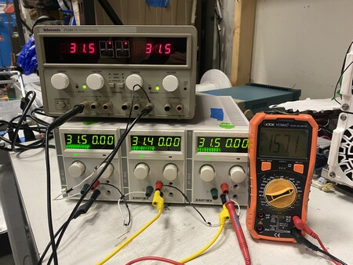
> 
> 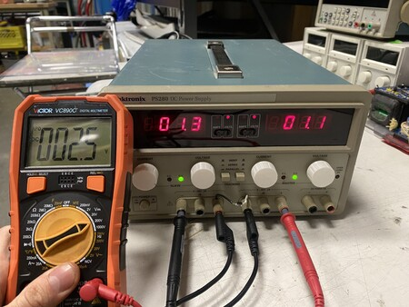

> **Hemat Wander** (13d)
>
> @Christopher Kalitin
> 
> I'm a little confused on what the purpose of the diodes was in this case? Why would we expect any power supply to have a negative voltage supplied to it?

> **Christopher Kalitin** (13d)
>
> @Hemat Wander
> 
> The negative voltage is a result of supplying ~30 V into the negative terminal, while the positive terminal is ~0 V (as it's connected to the high-side of your circuit, which has ground supplied by the PSUs).

> **Hemat Wander** (13d)
>
> @Christopher Kalitin
> 
> Ok I see, so if one of the power supplies was off by accident, we would expect the positive terminal to stay at 0V while the negative terminal goes up to whatever supply behind it is at. Why would we expect the positive terminal to stay at 0V and not be at 0V relative to the negative terminal?

> **Christopher Kalitin** (12d)
>
> @Hemat Wander
> 
> Consider the case in which you connected your array of series power supplies to a circuit and the most positive terminal has some positive voltage.
> 
> A power supply turned off can be treated as an open circuit (note this is different from a power supply set to output 0 V, which is a wire).
> 
> Now, if the most positive power supply is off, then the most positive terminal is floating relative to the rest of the power supplies.
> 
> Except, we have a circuit connected between it and GND, which will pull it to GND. Otherwise, you'd have a circuit that is on (eg. a resistor burning power) with no power source, an impossible situation.

---

# DCDC Test Plan Exploration

**Author:** Christopher Kalitin

**Date:** Dec 2025

**DCDC Test Plan Exploration**

Goals:
1. Operate DCDC at 3.83 A (46 W at 12 V, the listed nominal power)
2. Record temperature vs time for 10 minutes while operating at this output current
3. Record input current & voltage and output current & voltage to derive efficiency
4. Operate it at our full HV voltage range

Extras:
1. Plot Efficiency vs. Current
2. Plot Output Voltage vs. Current

At a high-level, the following equipment is required:
1. HV Source (Either out battery or series PSUs)
2. LV Load (Parallel high-power resistors)
3. Temperature measurement (thermal camera)
4. Voltage and Current Measurement on Input and Output (DMMs)

**HV Source**

For the HV Source we can either use some of our 6 power supplies wired in series, or use the Motor Anderson connector to source voltage from our battery.

Pros / Cons of using series PSUs:
1. Must only use isolated output PSUs (check datasheets) (ie. GND can't be tied to negative output)
2. Best to only use PSU of the same model (so we'd be limited to 3 in series, up to 90 V)

[Here's a link](https://electronics.stackexchange.com/questions/735004/can-you-connect-isolated-power-supplies-in-series) on using PSUs in Series.

Pros / Cons of using our pack:
1. May have to charge it
2. Motor Anderson connector will require an alligator to wire connection, and lots of electrical to ensure no short occurs
3. Risk of shorting our pack

Overall, I'd prefer using Power Supplies for the benefit of safety and not potentially risking our pack. This is only possible if we have at least 4 power supplies with isolated outputs.

If a power supply does not have an isolated output, that means it's negative terminal is connected to ground. This means if we connect the positive output of one battery to another, we're just shorting 30 V to ground.

Side note: This is how all PC ATX Power Supplies operate, and is why you can't use PC PSUs to get higher voltage than they're designed for. This is an issue you have to worry about if you need 24 V for stepper motors for your IGEN Capstone Project.

**DMMs for Current / Voltage Measurement**

Voltage measurements can be taken with our orange hand held multimeter in the bay. Extreme care must be taken when working on the HV-side of the DCDC to not short anything.

Current measurements will be taken with our [Keithley 2110 5-1/2 Digital Multimeters](https://assets.testequity.com/te1/Documents/pdf/keithley/2110-ds.pdf), here is the [reference manual](https://download.tek.com/manual/2110-901-01(C-Aug2013)(Ref).pdf).

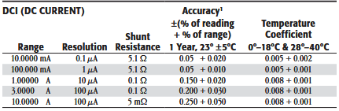

A fun note is that it uses a shunt resistor for current sensing.

Also the DMM has a thermocouple sensing feature, which @Luke Santosham might have found interesting for Motor RTD characterization.

The ammeter mode is rated for AC voltage, so we will have no issue putting ~100 V into it. There are two current sense inputs, one with a 3 A RMS 250 V fuse and the other with a 10 A RMS 250 V fuse.

We will manually be recording values in a spreadsheet and won't be doing any fancy SCPI Python scripting as it's not required here.

Note that even if we use our pack as the HV source, we can't use it's current sensor because it's precision is 140 mA. Our HV-side input current will be ~0.38 A (because P in = P in, and P = IV, and the voltages are different on both sides). So, we'll not nearly have enough precision for any meaningful efficiency number.

**Parallel Load Resistors**

High-Power Resistor Inventory:
- 5x 10 Ohm 50 W
- 3x 25 Ohm 50 W
- 1x 3 Ohm 50 W
- 1x 330 Ohm 50 W
- 3x others with poor labels

Note all power ratings are above our DCDC's power rating, so high current won't be a problem (aside from heating).

Our output voltage is 12 V and V/I = R so we can find the number of parallel resistors we need to achieve a particular output current.

3x 10 Ohm resistors in parallel gets us 3.33 Ohms. 12 V / 3.33 Ohms = 3.6 A.

If we want to get even closer, we can use 2x 10 Ohms and 3x 25 Ohms for an equivalent resistance of 3.125 Ohms and a current of 3.84 A, almost exactly the 3.8333 A rated output of the DCDC.

**Open Items**

Before proceeding, I just need to figure out if our PSUs have isolated outputs.

If so, we'll string PSUs in series. If not, we'll use our pack as the HV source.

> **Aarjav Jain** (Dec 2025)
>
> @Christopher Kalitin: What is the DCDC converter you wanted to use for the HVC previously? We can order that and test it against this one. It will require some extra setup, however.
> 
> CC: @Krish D

> **Christopher Kalitin** (Dec 2025)
>
> Listed in [this update](https://ubcsolar26.monday.com/boards/9702086049/pulses/18080997270/posts/4682602026).
> 
> 1. [0RQB-D0W12LG](https://www.digikey.ca/en/products/detail/bel-power-solutions/0RQB-D0W12LG/7597087) - $112.80
> 2. [TEP 150-7212UIR](https://www.mouser.ca/ProductDetail/TRACO-Power/TEP-150-7212UIR?qs=amGC7iS6iy%2BW5rbcsmqluA%3D%3D&utm_source=OEMSecrets&utm_medium=aggregator&utm_campaign=TEP+150-7212UIR&utm_term=TEP+150-7212UIR&utm_content=TRACO+Power) - $300.85 (in stock on Mouser, not Digikey)
> 
> The cost is non-trivial, so we can compare against our current DCDC if we want something to compare against.

> **Aarjav Jain** (Dec 2025)
>
> Seems expensive because the power rating is super high. No other < 100W options? 6A * 12V = 72W as reference.

> **Christopher Kalitin** (Dec 2025)
>
> @Aarjav Jain
> 
> If I remember the search correctly, there were many options down at ~5 A. Most DCDCs are well oversized for their application.
> 
> Efficiency is more what I was optimising for in the search.

> **Aarjav Jain** (Jan 5)
>
> @Christopher Kalitin would these DCDCs, when operating a much lower than its max power output, still be more efficient than DCDCs operating near their max power output?

> **Christopher Kalitin** (Jan 6)
>
> @Aarjav Jain
> 
> Efficiency approaches a limit as power goes to the nominal power rating.
> 
> So, operating at lower load% results in lower efficiency. This is why we want our DCDC to have a reasonably low nominal power rating, eg. using a 20 A rated DCDC results in far lower efficiency for us.
> 
> Image from [PI datasheet](https://www.power.com/design-support/design-examples/rdr-85slr-46-w-dc-dc-converter-solar-racing-car-using-innoswitch3-aq-900-v-powigan):
> 
> 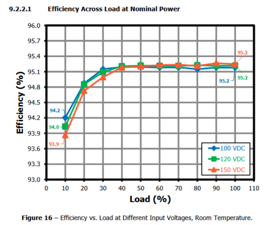

---

# Untitled

**Author:** Aarjav Jain - Electrical Director

**Date:** Dec 2025

PI DCDC Converter Tracking Number: [887167298104](https://www.fedex.com/fedextrack/?trknbr=887167298104&trkqual=2461027000~887167298104~FX).

It will arrive at ECE Stores **This Saturday. **Most likely pick-up will be available on Monday Dec 21st.

ECE Stores - MCLD 1032
2356 Main Mall
Vancouver, BC V6T 1Z4
Canada
VANCOUVER, BC, CA
V6T1Z4

CC: @Krish D @Christopher Kalitin

---

# Untitled

**Author:** Aarjav Jain - Electrical Director

**Date:** Dec 2025

@Christopher Kalitin : Power Integrations has shipped their DCDC kit. To re-iterate this is the goal of us getting this converter. For more context see [this post](https://forum.digikey.com/t/new-powigan-design-kit-brings-95-efficiency-to-solar-race-cars/59352).

For more information about the sample DCDC see their page [here](https://www.power.com/design-support/design-kits/rdk-85slr-reference-design-kit).

**Next Steps**

CC: @Krish D

> **Christopher Kalitin** (Dec 2025)
>
> @Aarjav Jain
> 
> Considering we could have a usable DCDC, the best path forward is to do acceptance testing on it to see if it's suitable. If has a reasonable efficiency (>90%) and a high enough current limit (3 A minimum), I think we should go with it.
> 
> HVC testing seems to be the long-lead item for timelines, so more effort should be dedicated on this versus more thought on a DCDC if we have one that works.
> 
> Assuming it arrives around Janurary, DCDC testing will take place during HVC bringup and HVC firmware work.
> 
> In short:
> - Test the PI DCDC
> - If suitable (>90% efficiency, >3 A), use it and continue HVC testing
> - If not, look for a replacement

> **Aarjav Jain** (Dec 2025)
>
> @Christopher Kalitin sounds good! Lets do testing on the PI DCDC. When you get a chance, could you make an update here that explains those tests and the resources needed so I can order it if necessary.

> **Krish D** (Dec 2025)
>
> @Aarjav Jain Exciting!
> 
> It's worth noting that this DCDC does not come with a metal heat sink. Definitely worth looking into if a heat sink is necessary & how it will be mounted. I'd wager that we *may* need to make a custom PCB to properly mount a heat sink to the PCB and mount it to the HVC.
> 
> @Christopher Kalitin Once you've made an update regarding the testing the DCDC converter, can you please book a check-in meeting with me, @Aarjav Jain, and @Deev Shah  to discuss timelines and integration notes in more detail?

---

