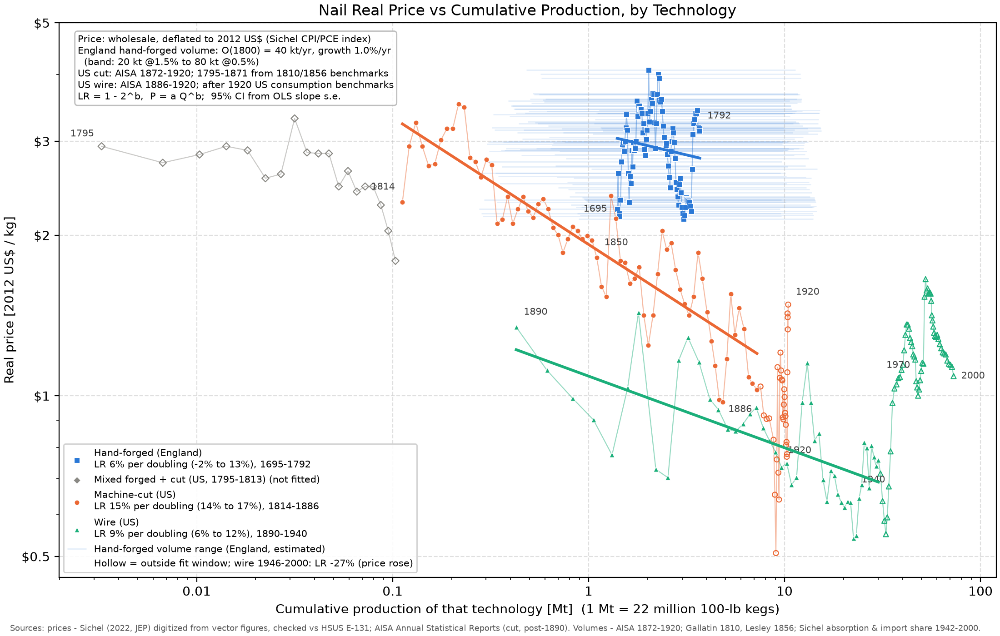
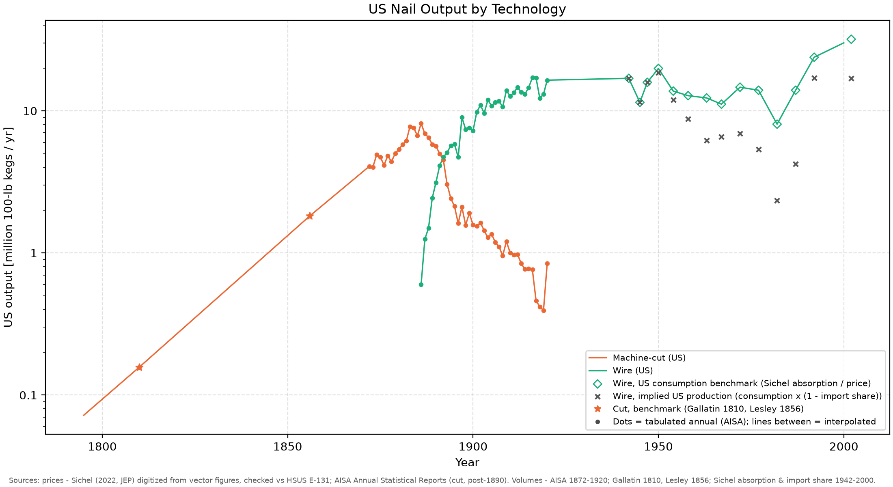

# Nail learning curves by production technology, 1695–2000

This project plots the real price of nails against cumulative production. Each production technology gets its own curve, and it is fitted with Wright's law:

```
P = a · Q^b          LR = 1 − 2^b
P  = real wholesale price            [2012 US$ / kg]
Q  = cumulative output of that tech  [Mt = 10^9 kg]  (1 Mt ≈ 22.05 million 100-lb kegs)
a  = price at Q = 1 Mt               [2012 US$ / kg]
b  = log-log slope d(ln P)/d(ln Q)   [-]
LR = fractional price drop per doubling of Q  [-]
```



## Results (central case)

| Technology | Fit years | Doublings of Q | Learning rate | 95% CI | Confidence |
|---|---|---|---|---|---|
| Hand-forged (England) | 1695–1792 | 0.7–2.1 (assumed) | **~6%** (4–11% across volume scenarios) | −2% to 13% | Low. The volume data is estimated, and the CI includes 0 |
| Machine-cut (US) | 1814–1886 | 6.0 | **15%** | 14–17% | High. The sensitivity grid gives 14.4–16.1% |
| Wire (US), mechanization era | 1890–1940 | 6.1 | **9%** | 6–12% | High. Volumes are tabulated to 1920; 1920–42 is interpolated |
| Wire (US), post-WWII | 1946–2000 | 0.8–1.1 | **−27%** (−52% on a US-production basis) | −47% to −10% | The real price *rose*. This is not a learning effect |

What the numbers show:
- **Hand-forged nailmaking was a mature craft.** It had been practised for centuries, so a whole 18th century of English output added only about 1–2 doublings to cumulative experience. The real price was flat to slightly lower. Wright's law predicts close to no movement, and that is what the data shows.
- **Cut nails (water/steam-powered cutting and heading machines) had the steepest curve.** Over 6 doublings the real price fell from $2.31/kg in 1814 to $1.03/kg in 1886.
- **Wire nails started below where cut nails ended.** In 1890 wire cost $1.35/kg, which is about $0.009 per 2" nail. That is roughly 40% below a cut nail, because there are 150 wire nails/lb against 85 cut nails/lb. Wire then learned at a shallower 9% down to its trough (about $0.55–0.75/kg in the 1930s–40s).
- **After 1946 the real price rose with cumulative output.** The rise tracks steel and labour costs and import competition, not accumulated experience. Sichel (2022) also finds falling multifactor productivity in this period.
- Part of each learning-era decline is cheaper inputs, not experience. Iron fell in price in 1821–60 and steel in 1881–1930. Sichel's decomposition attributes the largest share of both declines to multifactor productivity, with materials second. The LRs above are therefore *price* learning rates, not cost-net-of-inputs rates.

## Data: what was used and how it was checked

### Prices
| Era | Series | Source |
|---|---|---|
| 1695–1792 | English hand-forged, Greenwich Hospital purchases | Beveridge (1939) via Sichel (2022) |
| 1795–1813 | Philadelphia "mixed" (forged + cut) | Cole (1938) via Sichel |
| 1814–1889 | Cut nails (Cole; NY; Treasury 1849; Duncannon Iron Co.) | HSUS 1975 Series E‑131, via Sichel |
| 1890–1920 (cut) | Cut nails from store, Philadelphia (Duncannon / E.L. Hand) | AISA Annual Statistical Reports for 1899 (p.28), 1907 (p.40), 1910 (p.45), 1920 (p.86) |
| 1890–2000 (wire) | Wire 8d Pittsburgh → BLS PPI | HSUS E‑131 / BLS, via Sichel |

- **Where the prices come from.** Sichel's replication spreadsheets are login-gated. His PDF figures are native vector graphics, so `scripts/digitize_sichel.py` reads every plotted vertex directly from the drawing paths. The year of each vertex comes from its x-coordinate, and the value comes from the log-axis gridlines.
- **Validation.** 77 of 79 overlapping years of digitized wire prices match my own transcription of HSUS E‑131 within 3% (median ratio 1.0003). Cut and mixed prices match to the cent.
- **Two HSUS errors found.** HSUS E‑131 gives $8.60 for 1918 and $8.52 for 1919. The AISA Pittsburgh averages are $3.50 and $3.41, and Sichel's figure uses ≈$3.59 and $3.52. The HSUS values are transcription errors.
- **Deflator.** Nominal prices are converted to 2012 dollars with Sichel's index (UK CPI before 1784, US CPI 1784–1928, PCE after), recovered year by year as his real ÷ nominal ratio.
- **One vertex dropped.** Sichel's 1890 cut-nail point is the link point of his matched-model splice, not a price. Its implied deflator is 36, against about 20.5 in neighbouring years. I replaced it with the HSUS 1890 cut price ($2.00/keg).

### Volumes
| Technology | Years | Source | Quality |
|---|---|---|---|
| Cut (US) | 1872–1889 | AISA Report for 1889, p.77 | tabulated |
| Cut (US) | 1890–1920 | AISA Report for 1920, p.56 | tabulated |
| Cut (US) | 1810 | Gallatin's 1810 Treasury report: 410 naileries, 15,727,914 lb (French 1858, p.18) | benchmark |
| Cut (US) | 1856 | Lesley, *Iron Manufacturer's Guide*: 81,462 gross tons | benchmark, "approximate" |
| Cut (US) | 1795–1871 | log-linear between the benchmarks; before 1810, extrapolated back at 3–8%/yr | estimate |
| Wire (US) | 1886–1889 | AISA trade estimates (1889 revised in Swank 1892) | estimate |
| Wire (US) | 1890–1920 | AISA Report for 1920, p.56 | tabulated |
| Wire (US) | 1942–2002 benchmarks | Sichel domestic absorption (2012$, Fig A1) ÷ Sichel real price | derived |
| Hand-forged (England) | 1695–1792 | scenario: ~50k West Midlands nailers c.1800, Smith's 800–2,300 nails/day | **assumed** |

- **Checking the absorption-to-volume conversion.** Sichel's absorption value ÷ his price reproduces AISA tonnage to within 1–2% in 1872–1882. In 1899–1914 the residual is about 8%, which matches AISA-reported exports. That makes the quotient a valid volume proxy after 1920.
- **Which basis is used after 1920.** The central case uses US consumption. The alternative, US production = consumption × (1 − import share), inherits a source break in Sichel's import-share series: it drops from 70% in 1987 to 29% in 1992. That break shows up as a 4× jump in implied US output (see the output chart). The 1890–1940 wire fit is the same under either basis.
- **Why hand-forged volumes can't be pinned down.** If output grows exponentially at rate g with a long prior history, the stock is Q(t) = O(t)/g. The *number of doublings* over 1695–1792 then depends only on g: 0.7 doublings at g = 0.5%/yr and 2.1 at 1.5%/yr. The output level O₁₈₀₀ only shifts the curve sideways. The light-blue horizontal bars on the chart show the x-range between the low and high scenarios.



## Known gaps
- **1921–1941 wire volumes are interpolated** between the 1920 AISA figure and the 1942 benchmark. The Depression trough is missing, so cumulative output around 1930–40 is overstated by roughly 10%. That moves the wire LR by less than 1 point.
- **No tabulated series exists for English hand-forged output.** That LR should be read as "near zero, bounded by 4–11%", not as a point estimate.
- **Geography changes between technologies.** Hand-forged prices are English (London purchases); cut and wire prices are US. Each technology's experience is counted within its own geography, starting from its own first year.

## Reproduce
```
pip install numpy pandas matplotlib pymupdf
python run.py                       # digitize → model → outputs/*.csv, *.png
python model.py                     # scenario table + cut-nail sensitivity grid
python charts/learning_curves.py    # charts only
```
Outputs: `outputs/nail_learning_table.csv` (one row per year × technology), `outputs/learning_rate_fits.csv` (every fit under every scenario).

## References
- Sichel, D. (2022). "The Price of Nails since 1695: A Window into Economic Change." *JEP* 36(1); NBER WP 29617 and data appendix.
- U.S. Census Bureau (1975). *Historical Statistics of the United States, Colonial Times to 1970*, Series E‑131.
- American Iron and Steel Association. *Annual Statistical Reports* for 1883, 1885, 1888–90, 1898–99, 1907–1910, 1920 (scans at archive.org).
- Swank, J. M. (1892). *History of the Manufacture of Iron in All Ages*, p.450–451.
- French, B. F. (1858). *History of the Rise and Progress of the Iron Trade of the United States*, p.18.
- Lesley, J. P. (1859/1866). *The Iron Manufacturer's Guide*, statistics section.
