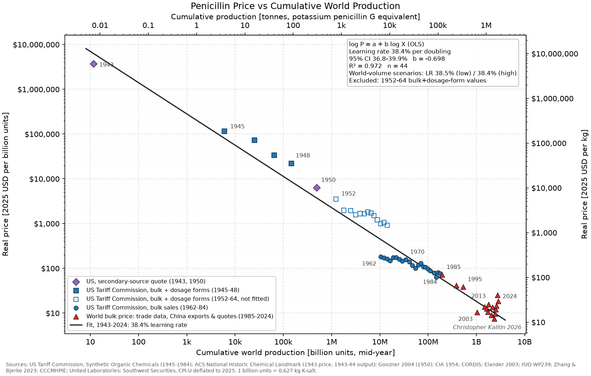

# Penicillin learning curve, 1943–2024

**Result: penicillin's real bulk price fell about 38% for every doubling of cumulative world
production (95% CI 36.8–39.9%, R² = 0.97, n = 44 price points, 1943–2024).** That covers
roughly 28 doublings and about a 200,000× real price decline, from $20 per 100,000 units in
1943 to about $6–25 per billion units today. The rate is about twice the ~20% typical of
solar modules and batteries. It is also not constant. Measured within each era it is 33%
(1943–50), 20% (US bulk market, 1962–84) and 35% (global/China, 1985–2024). The
whole-history slope is steeper than any single era because of step-downs *between* eras.

## Charts (`outputs/`)

| file | what it shows |
|---|---|
| `learning_curve/price_vs_cumulative_world.png` | Main chart: real price vs cumulative world production, with the fit |
| `learning_curve/price_vs_cumulative_us.png` | US-only version, one consistent source (US Tariff Commission), 1943–1984: **41.1%** (CI 38.6–43.4%) |
| `learning_curve/learning_rate_by_era.png` | Separate fits for the three eras |
| `learning_curve/price_vs_cumulative_world_1985_2024.png` | Zoom on 1985–2024: world prices by source type, with low/high cumulative-volume ranges and the era fit |
| `timeseries/price_vs_year.png` | Real (solid) and nominal (faded) price vs year |
| `timeseries/production_vs_year.png` | US annual output (reported) and world output (estimated, with scenario band) |

Tables: `outputs/fit_summary.csv` (every fit), `outputs/price_points.csv` (every price point
with its x-values), `outputs/derived_series.csv` (annual production series).

## Method

**Wright's law (experience curve)**

    P(X) = P0 · (X / X0)^b          fitted as   log10 P = a + b · log10 X   (OLS)
    LR   = 1 − 2^b

    P   = real bulk price                              [2025 USD per billion units, $/BU]
    X   = cumulative production, mid-year              [BU]
    P0  = price at reference cumulative volume X0      [$/BU]
    b   = experience exponent                          [dimensionless]
    LR  = learning rate, price drop per doubling of X  [fraction]

Central fit: b = −0.698 → LR = 1 − 2^(−0.698) = 38.4%.

**Units.** 1 BU (also "BOU") = 10⁹ international (Oxford) units of penicillin activity. That is
0.60 kg of sodium penicillin G (1,667 U/mg) or 0.627 kg of potassium penicillin G, the traded
"industrial salt" (1,595 U/mg). World tonnages are converted at 1,595 BU per tonne.

**Inflation.** CPI-U, 2025 dollars. CNY quotes are converted at annual-average FX.

**Cumulative convention.** X_t = Σ_{s<t} q_s + q_t/2 (mid-year). This matters when output
grows 350× in two years (1943→1945). An end-of-year convention gives 39.4%.

## Data: what is measured and what is estimated

### US, 1943–1984 (measured)
The backbone is 35 annual editions (1945–48, 1953–79, 1981–84) of the US Tariff Commission's *Synthetic Organic
Chemicals*. These report US production, sales quantity and sales value for penicillin. I read
the numbers from the narrative text (1945–1964) and from the scanned tables (1965–1984).
Details in `data/sources.md`.

Three basis breaks were found and handled:

1. **Bulk vs dosage forms (the big one).** Through 1964, penicillin sales value includes
   packaged dosage forms (vials, tablets). From 1965 it is bulk only. In 1964 the two are
   $89/BU (all forms) vs $15.7/BU (feed-grade bulk procaine penicillin): 5.7× apart. When the
   ingredient was expensive (1945–48: $1,600–6,500/BU nominal) packaging was a small share,
   so those years stay in the fit. 1952–1964 all-forms values are plotted as hollow squares
   and excluded. Bulk prices come from the "procaine penicillin G, for other uses"
   (feed-grade) row for 1962–64, penicillin G salts for 1965–68, and all natural
   penicillins for 1969+.
   *Robustness:* including the 1952–64 points gives 39.3%. Fitting the all-forms series
   alone (1945–64) gives 39.2%.
2. **Semisynthetics.** From 1965 the "penicillins" total mixes in ampicillin and similar
   drugs. These are priced 5–10× higher per unit and made *from* penicillin G. Prices use
   natural penicillin (G/V) rows only.
3. **Units → pounds (1976+).** Converted with factors calibrated on 1974–75, the last years
   reported both ways: 659 BU per 1,000 lb (production) and 617 BU per 1,000 lb (sales),
   ±4%.

Gaps: 1944 has production but no price. The 1949–51 volumes are not digitised, so production
is interpolated geometrically. 1950 has a secondary-source price (Goozner: $282/lb). The 1980
price is missing. The 1953–59 headline totals may leave out feed-grade output, as the 1960–61
headlines did (feed added ~15–18% in those two years). A log-scale x-axis barely registers
this.

### World, 1943–2025 (estimated)
No continuous world series exists. **The price data is market-wide throughout; none of it is
a single plant's cost.** World output is built from a few absolute anchors:

| year | anchor | source |
|---|---|---|
| 1946 | world = 1.10 × US (UK + Canada) | assumption |
| 1953 | 606,000 BU = US 372,000 + Soviet bloc 113,100 + rest ≈25% | SOC, CIA 1954, assumption |
| 1985 | 11,000 t | EU CORDIS |
| 1995 | 36,380 t (26,400 t Pen G + 9,980 t Pen V) | Elander 2003 |
| 2019–25 | 60,000 t (quoted range 50–70 kt) | Chinese industry reports |

Between anchors: world = US (reported) + rest of world (log-interpolated) for 1953–84, and
log-linear after 1985. A low/high scenario moves every anchor together. It changes the
learning rate by only ±0.1 point (38.5% / 38.4%), because anchor errors of ±20–60% are small
next to 28 doublings.
*Cross-check:* the estimate gives 1.56 Mt cumulative through 2020. An industry source (Bio
Based Press) gives ~2 Mt of penicillin G, so the world series may run ~20% low. That shifts
X, not the slope.

### World prices, 1985–2024
These are trade prices and Chinese quotes: ISID/Bart et al. ($24/BU in 1985, $6 in 2003),
Zhang & Bjerke (~$18 early 1990s), Elander market value/volume (1995), Chinese export unit
values (2011–13), domestic quotes (2009, 2016, 2017), a Chinese top-5 producer's average
selling price (United Laboratories 2020–22), and Wind market quotes (2023–24). They are
mixed kinds and noisy: VAT treatment varies, some are single months, and the market is
cyclical (the 2003 dumping collapse, 2017–18 environmental shutdowns, COVID).
Continuity check: the 1985 world price ($24/BU) matches the last US Tariff Commission bulk
unit values (1983–84: $24.6–24.8/BU).

## All fits (`outputs/fit_summary.csv`)

| fit | n | LR | 95% CI | R² |
|---|---|---|---|---|
| **World cumulative, central (1943–2024)** | 44 | **38.4%** | 36.8–39.9% | 0.972 |
| World cumulative, low / high volume scenario | 44 | 38.5% / 38.4% | — | 0.970 / 0.974 |
| US price vs US cumulative (1943–1984) | 28 | 41.1% | 38.6–43.4% | 0.965 |
| Era: wartime scale-up (1943–1950) | 6 | 32.6% | 28.0–36.9% | 0.986 |
| Era: US bulk market (1962–1984) | 22 | 20.4% | 17.0–23.6% | 0.870 |
| Era: global / China (1985–2024) | 16 | 35.3% | 21.5–46.6% | 0.626 |
| Robustness: drop 1943 quote | 43 | 39.2% | 37.2–41.0% | 0.962 |
| Robustness: drop 1943 + 1950 quotes | 42 | 38.9% | 36.9–40.9% | 0.960 |
| Robustness: include 1952–64 dosage-form values | 57 | 39.3% | 37.6–40.9% | 0.961 |
| Robustness: end-of-year cumulative | 44 | 39.4% | 37.7–41.0% | 0.970 |

The OLS confidence intervals assume independent residuals. Annual price series are
autocorrelated, so the true uncertainty is wider. A better read of the real uncertainty is
the spread across eras and variants: **roughly 35–41% over the full history, 20–35% within
any one era.**

## Interpretation

- **Why is it so steep?** Early on, most of the cost was yield. Surface culture in bottles
  gave way to submerged deep-tank fermentation (Pfizer, 1944). Strains were improved
  (cantaloupe NRRL 1951, then X-ray and UV mutants), corn-steep liquor and precursor feeding
  were added. Today's harvest titers are 40–50 g/L (Elander 2003). Fleming-type surface
  cultures are commonly cited at a few units/mL, around 1 mg/L; I did not verify that
  figure here. That is roughly a 10⁴× titer gain, the same order as the ~10⁴× nominal price
  drop from 1943 to 1970 ($200,000 → $18.8 per BU). This matches the "10,000×" in *The
  Origins of Efficiency*.
- **Why do the eras differ?**
  - 1962–84 at 20% is a mature US market. US cumulative volume grew 14× while nominal price
    stayed flat at $15–25/BU and inflation did the work.
  - The step down after 1985 is a location and scale shift. Production moved to China,
    where capacity reached ~100 kt against ~60 kt of demand. By 2003 Chinese product was
    selling below cost (ISID: "below 40 percent of the actual cost of production"). Part of
    the 1985–2003 decline is therefore overcapacity pricing, not learning.
- **Price ≠ cost.** Everything here is a market price. The 1940s–50s decline also includes
  margin compression after wartime licensing opened the market. The 2000s include dumping.
  A pure cost curve would likely be somewhat shallower in those two windows.

## Biggest remaining gap
The 1949–1961 bulk price. The FTC's *Economic Report on Antibiotics Manufacture* (1958) has
it, but no accessible digitisation was found (Internet Archive `b32172357` is
lending-restricted; HathiTrust blocks automated access). Adding it would replace the hollow
1952–64 points with real bulk prices and tighten the join between the wartime and 1960s eras.

## Reproduce

    pip install numpy scipy pandas matplotlib
    python run.py                       # all tables + charts
    python charts/learning_curve.py     # just the learning-curve family
    python derived.py                   # print price points, fits, cumulative tonnage
